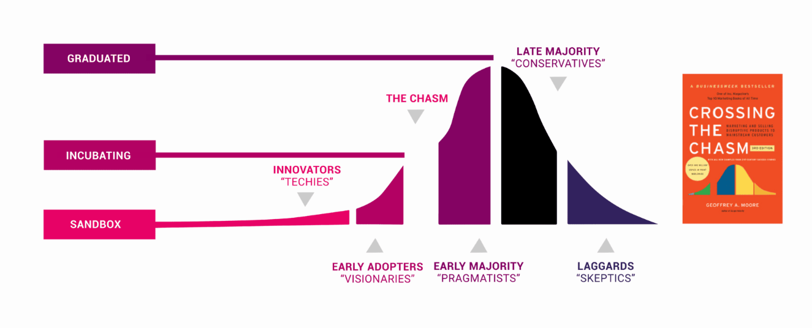

---

## Cloud Native 아키텍쳐

- **Monolithic Architecture**: 전통적인 애플리케이션 아키텍처로, 모든 기능이 하나의 코드베이스에 통합되어 있어 배포와 확장이 어렵고, 장애 발생 시 전체 시스템에 영향을 미침. tight coupling이라고도 함.
- **Microservices Architecture**: 애플리케이션을 작은 독립적인 서비스로 분리하여 개발, 배포, 확장이 용이하도록 함. 각 서비스는 독립적으로 배포되고, 서로 통신하여 전체 애플리케이션을 구성함. loose coupling이라고도 함.

- **Cloud Native Application의 특징**
   - **Resiliency**: 시스템이 장애에 강하고, 빠르게 복구할 수 있는 능력.
   - **Agility**: 빠르게 변화하는 요구사항에 유연하게 대응하고, 빠르게 배포할 수 있는 능력.
   - **Operability**: 시스템을 쉽게 운영, 관리, 모니터링, 유지보수할 수 있는 능력.
   - **Observability**: 시스템 내부 상태를 로그, 메트릭, 트레이싱 등을 통해 외부에서 파악할 수 있는 능력.

- **Cloud Native Pattern**
   - **Self Healing**: 시스템이 장애를 감지하고 자동으로 복구하는 패턴.쿠버네티스에서 ReplicaSet는 예를들어 Pod가 죽었을 때 자동으로 새로운 Pod를 생성하여 장애를 복구하는 패턴.
   - **Application Automation**: Ansible(서버 안에서 패키지 설치하고 설정을 마무리)나 Terraform(IaC인프라를 코드로 관리)와 같은 도구는 상태를 저장하지 않지만, 쿠버네티스는 상태를 저장하고 관리합니다.

| 항목             | **Terraform**                  | **Ansible**                        |
| -------------- | ------------------------------ | ---------------------------------- |
| **주요 목적**      | 인프라 **프로비저닝** (서버, 네트워크 등 생성)  | 서버 설정 및 **구성 관리** (설치, 배포 등)       |
| **사용 언어**      | 선언형 (HCL)                      | 절차형 + 선언형 (YAML)                   |
| **작동 방식**      | 상태 기반 (State 파일을 통해 인프라 상태 추적) | 상태 비저장 (idempotent하지만 상태는 저장하지 않음) |
| **에이전트 필요 여부** | 에이전트 없음                        | 에이전트 없음 (SSH 사용)                   |
| **주 용도**       | 클라우드 인프라 생성/관리 (AWS, GCP 등)    | 서버 설정, 애플리케이션 배포, 패치 작업 등          |
| **대표 기능**      | VPC, EC2, DB, 로드밸런서 생성 등       | 패키지 설치, 서비스 재시작, 파일 복사 등           |
| **학습 난이도**     | 상대적으로 명확하지만 HCL 문법 학습 필요       | YAML 기반으로 익숙하면 빠르게 사용 가능           |
| **기타 특징**      | 인프라의 ‘현재 상태’를 기준으로 동작          | 플레이북 기반, 순서대로 실행됨                  |

## Cloud Native 실천 방식
클라우드 환경에 **최적화된 애플리케이션을 빠르고 안정적으로 개발·운영하는 방식**

  - **CI/CD** : (Countinuous Integration/Deployment): 코드 변경 사항을 자동으로 빌드, 테스트, 배포하는 프로세스. Jenkins, GitLab CI/CD, GitHub Actions 등이 사용됨. Countinous Delivery라는 것이 배포가능한 상태가 사람에 의하여 트리거 되는것과 달리 Continuous Deployment는 배포까지 완전 자동화 되는것을 말함. "Delivery over deployment", "Delivery first with Deployment".항상 배포 가능한 상태를 유지하는 것이 우선.
  - **Service Mesh**: 마이크로서비스 간의 통신을 관리하고 보안, 모니터링, 로깅 등을 제공하는 인프라 계층. Istio, Linkerd 등이 대표적임.
  - **API Gateway**: 마이크로서비스 간의 API 요청을 관리하고 라우팅, 인증, 모니터링 등을 제공하는 서비스. AWS API Gateway, Kong, NGINX 등이 사용됨
  - **Auto Scaling**: 시스템이 부하에 따라 자동으로 확장되거나 축소되는 패턴.
  - **Secure by Default**: 기본적으로 안전하게 설계되어 있어, 보안 설정을 최소화해도 안전한 상태를 유지하는 패턴. zero trust 모델을 따르며, 최소 권한 원칙(Least Privilege)을 적용합니다. Mutual authentication이란 서버와 클라이언트가 서로 인증하는 방식으로, 보안성을 높이는 데 사용됩니다.
  - **Speed / Efficiency and Cost** :발자들이 빠르게 애플리케이션을 개발하고 배포할 수 있도록 지원합니다. 또한, 클라우드 리소스를 효율적으로 사용하여 비용을 절감할 수 있습니다. 예를들어,interflorace. 'scale to zero'는 사용하지 않을 때 리소스를 자동으로 해제하여 비용을 절감하는 패턴입니다.
  - **Service Deiscovery**: 마이크로서비스가 동적으로 생성되고 삭제되는 환경에서 서비스의 위치를 자동으로 찾는 방법. Enviroment Variables and DNS가 쿠버네티스에서 사용됨.

### 클라우드 네이티브 아키텍쳐의 4요소
- Microservices: 애플리케이션을 작은 독립적인 서비스로 분리하여 개발, 배포, 확장이 용이하도록 함.
- Containerization: 애플리케이션과 그 종속 항목들을 컨테이너로 패키징하여, 다양한 환경에서 일관되게 실행할 수 있도록 함.
- DevOps: 개발(Dev)과 운영(Ops)을 통합하여, 소프트웨어 개발과 배포의 속도와 품질을 향상시키는 문화와 실천
- Continuous Delivery: 코드 변경 사항을 자동으로 빌드, 테스트하고, 프로덕션 환경에 배포하는 실천 방식. 이를 통해 릴리스 주기를 단축시키고, 생산성을 높이며, 배포 시의 위험과 복잡성, 다운타임을 줄일 수 있습니다.

### Auto Scaling
Auto Scaling은 시스템이 부하에 따라 자동으로 확장되거나 축소되는 패턴입니다. 이를 통해 리소스를 효율적으로 사용하고, 비용을 절감할 수 있습니다. 예를 들어, 웹 애플리케이션의 트래픽이 급증할 때 자동으로 인스턴스를 추가하여 부하를 분산시키고, 트래픽이 감소할 때는 인스턴스를 줄여 비용을 절감할 수 있습니다. 

- **Reactive AutoScaling**: scale according to workload. 시스템의 부하가 증가하거나 감소할 때 자동으로 리소스를 조정하는 방식. 예를 들어, CPU 사용률이 80%를 초과하면 새로운 인스턴스를 추가하고, 20% 이하로 떨어지면 인스턴스를 제거하는 방식. latency(지연 시간)을 고려하지 않는다면 좋은방식.
- **Scheduled AutoScaling**: 특정 시간에 리소스를 조정하는 방식. 예를 들어, 매일 오전 9시에 트래픽이 증가할 것으로 예상되면, 해당 시간에 맞춰 인스턴스를 추가하는 방식.
- **Predictive AutoScaling**: 머신러닝을 사용하여 미래의 부하를 예측하고, 이에 따라 리소스를 조정하는 방식. 예를 들어, 지난 7일간의 트래픽 패턴을 분석하여 다음 주의 트래픽을 예측하고, 이에 맞춰 인스턴스를 미리 추가하는 방식.
- **Vertical Scaling**: 기존 인스턴스의 리소스를 늘리는 것. 예를 들어, 서버의 CPU나 메모리를 업그레이드하는 것.
- **Horizontal Scaling**: 새로운 인스턴스를 추가하여 용량을 늘리는 것. 예를 들어, 웹 서버의 인스턴스를 추가하여 트래픽을 분산시키는 것.
- **Cluster Autoscaler** : 쿠버네티스 클러스터의 노드를 자동으로 추가하거나 제거하는 기능. pod가 실패했을때 적절한 노드를 찾아 새로운 노드를 추가하거나, pod가 더 이상 필요하지 않을 때 노드를 제거합니다. 이를 통해 클러스터의 리소스를 효율적으로 관리할 수 있습니다.
- **Horizontal Pod Autoscaler (HPA)**: 쿠버네티스에서 Pod의 수를 자동으로 조정하는 기능. CPU 사용률, 메모리 사용량, 사용자 정의 메트릭 등을 기반으로 Pod의 수를 늘리거나 줄입니다. 예를 들어, CPU 사용률이 80%를 초과하면 Pod의 수를 늘리고, 20% 이하로 떨어지면 Pod의 수를 줄이는 방식입니다.
- **Vertical Pod Autoscaler (VPA)**: 쿠버네티스에서 Pod의 리소스 요청과 제한을 자동으로 조정하는 기능. Pod의 CPU와 메모리 사용량을 모니터링하고, 필요에 따라 리소스 요청과 제한을 조정합니다. Pod의 resource request/limit 값을 조정. 예를 들어, Pod의 CPU 사용량이 지속적으로 90%를 초과하면 CPU 요청을 늘리고, 사용량이 10% 이하로 떨어지면 CPU 요청을 줄이는 방식입니다.
- **KEDA** : Event Driven Autoscaling을 지원하는 쿠버네티스 확장 기능으로, 다양한 이벤트 소스(예: Kafka, RabbitMQ, Azure Queue, PostgreSQL 쿼리 등)를 기반으로 Pod의 수를 자동으로 조정합니다. Scale to zero를 지원.
KEDA는 HPA 위에 올라타는 방식이지만, 사용자는 그것을 직접 의식할 필요 없이 KEDA CRD(ScaledObject, ScaledJob 등) 만 정의하면 됨.

## Serverless
서버 관리 없이 코드 실행에 집중할 수 있는 컴퓨팅 모델. 
- Event driven 으로 작동
- Code exectution : 코드 실행을 위한 서버 관리가 필요 없으며, 사용자는 함수 단위로 코드를 작성하고 실행할 수 있습니다.
- Autoscaling으로 scale to zero로 작동함.
- 대표적으로 AWS Lambda, Azure Functions, Google Cloud Functions 등이 이에 해당함. 쿠버네티스에서는 FaaS로 Knative, OpenFaas가 있음. 

- **FaaS(Function as a Service)**란 개발자는 서버를 관리할 필요 없이 함수 단위로 코드를 작성하고 실행할 수 있습니다. 
- **CloudEvents** : Cloudevents는 이벤트 중심의 아키텍처를 지원하는 오픈 소스 프로젝트로, 이벤트를 생성, 전송, 처리하는 데 필요한 표준을 제공. CNCF가 호스트. Knative Eventing은 쿠버네티스에서 이벤트 중심의 애플리케이션을 구축할 수 있도록 지원합니다.
- **vendor lock-kin** : 서버리스 플랫폼에 종속되어 특정 클라우드 제공업체의 서비스에 의존하게 되는 현상. 이는 다른 클라우드 제공업체로 이전하기 어렵게 만들 수 있습니다. 

## CNCF (Cloud Native Computing Foundation)
CNCF는 클라우드 네이티브 기술의 발전과 표준화를 위해 설립된 오픈 소스 소프트웨어 재단.
"Make Cloud Native Computing Ubiquitous"라는 목표 아래, 클라우드 네이티브 애플리케이션의 개발, 배포, 운영을 지원하는 다양한 프로젝트를 호스팅하고 있습니다. CNCF는 Kubernetes, Prometheus, Envoy 등과 같은 주요 오픈 소스 프로젝트를 관리하며, 클라우드 네이티브 생태계의 상호 운용성을 높이고, 개발자들이 다양한 플랫폼에서 클라우드 네이티브 기술을 쉽게 사용할 수 있도록 합니다.

- the chasm : Early adopters, Early majority사이의 균열 단계. Incubated -> Graudated. 적절한 기능, 세큐리티, 퍼포먼스등을 만족할수 있는가가 검토되는 단계.
- Innovators(techeis) -> Early Adopters(visionaries) -> Early Majority(pragamatistics) -> Late Majority(conservatives) -> Laggards(Skeptics)

- **Technical Oversight Committee(TOC)** : CNCF의 기술적 방향과 프로젝트의 품질을 관리하는 위원회로, CNCF 프로젝트의 기술적 결정과 정책을 수립합니다. CNCF 프로젝트의 성숙도를 판단함.

- **SIG(Special Interest Groups)** : CNCF의 특정 기술 영역에 대한 관심 그룹으로, 각 SIG는 특정 기술 영역에 대한 지식 공유와 협업을 촉진합니다. SIG는 CNCF 프로젝트의 기술적 방향과 정책을 논의하고 결정하는 역할을 합니다.

- **Technical Advisory Group(TAG)** : CNCF의 기술적 자문 그룹으로, CNCF 프로젝트의 기술적 방향과 정책에 대한 자문을 제공합니다. sandbox제안서의 기술적 검토와 지원을 담당합니다. sandbox에서 incubation 단계로 넘어가기 위한 기술적 검토를 수행합니다.

- Elections and Voting : CNCF는 프로젝트의 기술적 방향과 정책을 결정하기 위해 투표 시스템을 운영합니다. 

- **CNCF 프로젝트** : CNCF는 다양한 오픈 소스 프로젝트를 호스팅하며, 이들 프로젝트는 클라우드 네이티브 애플리케이션의 개발, 배포, 운영을 지원합니다. CNCF 프로젝트는 크게 Sandbox, Incubating, Graduated로 분류됩니다.
  - **Sandbox**: 초기 단계의 프로젝트로, 실험적이거나 새로운 아이디어를 테스트하는 데 사용됩니다.
  - **Incubating**: 프로젝트가 활발히 개발되고 있으며, 커뮤니티와 생태계가 형성되고 있는 단계입니다.
  - **Graduated**: 프로젝트가 안정적이고, 커뮤니티와 생태계가 충분히 성장한 단계입니다.

대표적인 CNCF 프로젝트
| 프로젝트              | 설명                                                                                                |
| ----------------- | ------------------------------------------------------------------------------------------------- |
| **Kubernetes**    | 컨테이너 오케스트레이션 플랫폼. 배포, 스케일링, 롤백 등 자동화                                                              |
| **Prometheus**    | 시계열 기반의 모니터링 및 경고 시스템. Pull 기반 데이터 수집                                                             |
| **Envoy**         | 고성능 서비스 프록시. 서비스 메시의 데이터 플레인 역할                                                                   |
| **gRPC**          | 고성능 오픈소스 RPC 프레임워크. HTTP/2, protobuf 기반                                                           |
| **Fluentd**       | 로그 수집 및 전송기. 다양한 입력/출력 플러그인 지원                                                                    |
| **Helm**          | Kubernetes용 패키지 관리자. Chart 단위로 애플리케이션 배포 자동화                                                      |
| **OpenTelemetry** | 분산 추적, 메트릭, 로그 등 관측성 데이터를 수집·전송하는 통합 프레임워크                                                        |
| **Grafana**       | 시각화 도구. Prometheus 등과 연동하여 대시보드 제공                                                                |
| **Kubecost**      | Kubernetes 클러스터의 자원 사용 및 비용을 모니터링하고 최적화                                                           |
| **Falco**         | 런타임 보안 도구. K8s 및 클라우드 네이티브 환경에서 이상 징후 탐지                                                          |
| **Argo**          | Kubernetes에서 워크플로우, GitOps 기반 배포, 롤백 등을 지원하는 도구군 ※ Argo Workflows, Argo CD, Argo Rollouts 등 포함 |
| **Linkerd**       | 경량 서비스 메시. 트래픽 제어, 보안(mTLS), 관측성 기능 제공                                                            |
| **Istio**         | 기능이 풍부한 서비스 메시. 트래픽 라우팅, 보안, 모니터링, 인증 등 제공하는 인프라 계층                                               |
| **KubeScape**    | Kubernetes 클러스터의 보안 취약점을 분석하고 모니터링하는 도구입니다. NSA(National Security Agency)와 CISA(Cyber Infrastructure Security Agency)와 협력하여 개발되었습니다. |

### References
- https://github.com/CNCF
- https://www.cncf.io/
- https://landscape.cncf.io/

# Open Standards

## OCI (Open Container Initiative)
컨테이너 표준 형식과 런타임을 정의하는 산업 표준.
OCI (Open Container Initiative)는 컨테이너 이미지와 런타임의 표준화를 목표로 하는 프로젝트입니다. 
Image-spec(Buildkit, buildah, Podman), Runtime-spec(runc,kata container, fire cracker,gvisor), Distribution-spec(docker registry HTTP API protocal. Dockerhub) 등 3가지 사양을 정의합니다.
OCI는 컨테이너 이미지의 형식과 런타임 인터페이스를 정의하여, 다양한 컨테이너 기술 간의 호환성을 보장합니다. OCI는 컨테이너 생태계의 상호 운용성을 높이고, 개발자들이 다양한 플랫폼에서 컨테이너를 쉽게 사용할 수 있도록 합니다.

 - runc: OCI에서 정의한 컨테이너 런타임의 구현체로, 컨테이너를 실행하는 데 필요한 기본적인 기능을 제공합니다. Docker, containerd, CRI-O 등 다른 런타임들도 내부적으로 runc를 호출해서 컨테이너를 실행합니다.

## CNI(Container Network Interface)
컨테이너 네트워크를 관리하기 위한 표준 인터페이스.
쿠버네티스에서는 Node를 `Not Ready`에서 `Ready` 상태로 변경하는 것도 이것을 따르고 있음.

## Container Storage Interface (CSI)
**Kubernetes**컨테이너 스토리지 시스템과 쿠버네티스 간의 표준 인터페이스.
- Rook : 쿠버네티스에서 스토리지 시스템을 관리하기 위한 오픈 소스 프로젝트

## Container Runtime Interface (CRI)
**Kubernetes**가 다양한 컨테이너 런타임과 통신하기 위한 인터페이스.
kubelet은 CRI플러그인을통해, 컨테이너 런타임(containerd, ciro-o, kata containers, firecracker)과 상호작용합니다. 
 - CRI-O, containerd : CRI를 구현한 컨테이너 런타임으로, Kubernetes와의 통합을 위해 설계되었습니다.

## SMI(Service Mesh Interface)
서비스 메시의 표준 인터페이스로, 다양한 서비스 메시 구현체(Istio, Linkerd 등) 간의 상호 운용성을 제공합니다. SMI는 서비스 메시의 기능을 표준화하여, 개발자들이 서비스 메시를 쉽게 사용할 수 있도록 합니다. 

 ##  Cloud Native Security 4요소
클라우드 네이티브 환경에서 보안을 강화하기 위한 4가지 핵심 요소입니다.
계층적인 구조로 구성되어 있으며, 각 요소는 서로 연결되어 있습니다.
- Cloud
- Clusters 
- Containers
- Code

