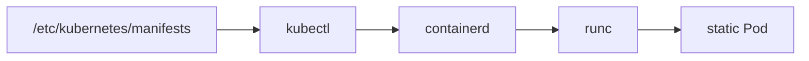
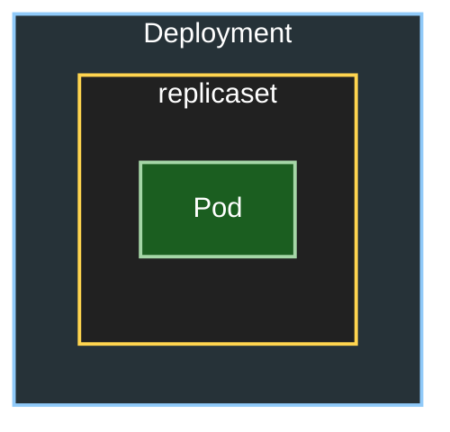
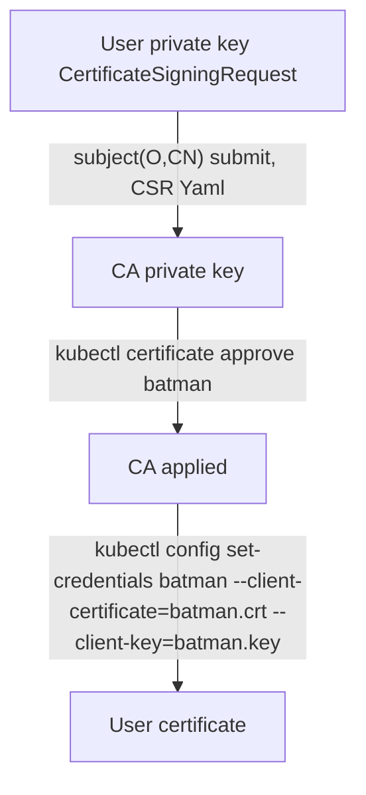

# Kubernetes
2014년 Google Borg에서 개발한 오픈소스 컨테이너 오케스트레이션 플랫폼입니다.

Kubernetes는 컨테이너화된 애플리케이션을 자동으로 배포, 확장 및 관리하기 위한 오픈소스 플랫폼입니다. Google에서 개발하였으며, 현재는 Cloud Native Computing Foundation(CNCF)에서 관리하고 있습니다. Kubernetes는 컨테이너 오케스트레이션을 위한 표준으로 자리 잡았습니다.
콘테이너 오케스트레이션에 OpenShift(k8s제공), Docker Swarm, HashiCorp Nomad가 있었으나 이제는 k8s가 주류. 

## Terminology

1. CRDs (Custom Resource Definitions)
  - Kubernetes에서 기본적으로 제공하지 않는 리소스를 정의할 수 있는 방법입니다. CRD를 사용하면 Kubernetes API에 새로운 리소스 유형을 추가할 수 있습니다. 이를 통해 사용자 정의 리소스를 생성하고 관리할 수 있습니다.
ArgoCD와 같은 도구는 이러한 CRD를 활용하여 GitOps 방식으로 Kubernetes 리소스를 관리합니다.
  - Argo Workflows CRD 예시
```yaml
apiVersion: argoproj.io/v1alpha1
kind: Workflow
```


2. Cold Start
  - Kubernetes에서 Pod이 처음 시작될 때, 컨테이너 이미지가 로드되고 초기화되는 과정을 의미합니다. 이 과정은 시간이 걸릴 수 있으며, Pod이 준비 상태가 되기까지의 시간을 포함합니다.


3. k3s
  - Kubernetes의 경량화 버전으로, 리소스가 제한된 환경(예: IoT 디바이스, 엣지 컴퓨팅 등)에서 Kubernetes를 실행할 수 있도록 설계되었습니다. k3s는 불필요한 기능을 제거하고, 단순화된 아키텍처를 가지고 있어 설치와 운영이 용이합니다. 또한, ARM 아키텍처를 지원하여 Raspberry Pi와 같은 저사양 디바이스에서도 실행할 수 있습니다.

4. 오브젝트와 인스턴스
  - Kubernetes의 정의내용은 etcd에서 등록되어 관리됨.
  - Kubernetes는 etcd에 등록되어있는 내용에 따라서 Pod을 작성하는데, etcd의 데이터베이스에 오브젝트(Object) 정보로써 등록되어있는것을, 인스턴스(Instance)로 리소스를 작성한다는 의미로 오브젝트와 인스턴스라는 용어를 쓰기도 한다.


5. kubeadm
   - Kubernetes 클러스터를 설치하고 관리하기 위한 도구로, 클러스터의 초기화, 노드 추가, 업그레이드 등을 지원합니다. kubeadm은 Kubernetes의 공식 설치 도구 중 하나로, 클러스터를 쉽게 설정할 수 있도록 도와줍니다.
   - 본격적으로 Kubernetes를 구축할경우에는 물리적인 머신 혹은 가상머신을 필요한 만큼 준비하여 Ubuntu등 Linux 배포판을 설치한 후, Master node에는 kubernetes와 CNI, etcd를, Worker node에는 Docker등 컨테이너엔진과 Kubernetes, CNI를 설치할 필요가 있으나, 이것을 kubeadm을 사용하여 자동화할 수 있음.
   - IPv4/IPv6 Dual Stack 클러스터 구성 시에는 kubeadm init 명령에 `--service-cidr` 플래그로 IPv4와 IPv6 CIDR 블록을 모두 지정해야 합니다. 예: `--service-cidr=10.96.0.0/12,2001:db8::/32`


## Kubernetes 아키텍쳐

1. Low Level Container Runtime
   - runC : 컨테이너 런타임. 컨테이너를 실행하는데 필요한 기능을 제공. 리눅스의 컴포넌트와 상호작용(namespace, cgroup 등). Docker Inc에서 OCI (Open Container Initiative)라는 컨테이너 기술표준화 프로젝트 커뮤니티에 기부함. (비슷한 기술 C run, Kata Containers, gVisor 등)


2. High Level Container Runtime(Container Engine)
   - containerd : Docker내에서 사용됨. CNCF에 기부된 graduated project. 전체의 컨테이너 라이프사이클 운영, 컨테이너 이미지 pull과 저장 관리. runC와 상호작용.
   - cri-o : Kubernetes에서 사용되는 컨테이너 런타임 인터페이스(CRI) 구현체. containerd와 유사한 기능을 제공하며, Kubernetes와의 통합을 위해 설계됨. 쿠버네티스에 특화된 경량 컨테이너 런타임.runc와 같은 저수준 런타임을 사용해 컨테이너를 실행.

3. kubelet
    - Kubernetes의 컴포넌트로, 워커 노드에서 컨테이너를 실행하고 관리하는 역할을 함(실제로는 Control Plane에도 상호작용을 위해 존재하고 있음) 
    - kubelet은 컨테이너 런타임과 상호작용하여 Pod을 생성, 업데이트, 삭제함. kubelet은 Kubernetes API 서버와 통신하여 클러스터 상태를 보고함. Pod의 Spec을 기반.
    - `/etc/kubernetes/manifests`디렉토리를 모니터링하여 request를 받을수있음
    - Static Pod
      - kubelet이 관리하는 Pod. API를 통하여 생성되는 것이 아니라 kubelet이 파일을 읽어 Pod을 생성함. Static Pod은 kubelet이 시작될 때 자동으로 생성됨. 



### Control Plane

Control Plane은 Kubernetes 클러스터의 중앙 관리 컴포넌트로, 클러스터의 상태를 유지하고 관리하는 역할을 합니다.

#### Static Pod
Static Pod은 kubelet이 관리하는 Pod으로, Control Plane의 일부로 동작합니다. Static Pod은 kubelet이 시작될 때 자동으로 생성.
1. kube-scheduler
    - Kubernetes의 스케줄러로, Static Pod를 시작`/etc/kubernets/manifests` 
    - etcd를 참조하여 Pod을 워커 노드에 할당하는 역할을 함. Pod의 리소스 요구사항, 노드의 상태, 정책 등을 고려하여 최적의 노드를 선택함. 스케줄링 알고리즘을 사용하여 클러스터의 리소스를 효율적으로 활용함.

2. etcd
    - Kubernetes의 분산 키-값 저장소로, 클러스터의 상태 정보를 저장함. Source of Truth. etcd는 클러스터의 모든 리소스 상태를 저장하고, 이를 통해 클러스터의 일관성을 유지함. Production setup으로써 홀수의 노드로, 5개를 권장함.
    - RAFT(Reliable Asynchronous Fault Tolerance) 합의 프로토콜을 사용하여 일관성을 유지하도록함.

3. kubernetes api
    - Kubernetes의 API 서버. RESTful API를 통해 클러스터의 리소스를 관리함. 
    - kubectl, kubelet, kube-proxy 등과 상호작용함. API 서버는 etcd와 통신하여 클러스터 상태를 읽고 쓰는 역할을 함. API 서버는 인증, 권한 부여, 감사 로깅 등의 기능을 제공함.etcd에 데이터를 저장하는 역할.

#### Control Plane의 다른 구성요소

1. kube-controller-manager
    - Kubernetes의 컨트롤러 매니저로, 클러스터의 상태를 유지하고 관리하는 역할을 함. 여러 컨트롤러(예: ReplicaSet, Deployment, Node 등)를 실행하여 클러스터의 상태를 지속적으로 모니터링하고 조정함. 각 컨트롤러는 특정 리소스 유형에 대한 상태를 관리함.

2. kube-proxy
    - DaemonSet로써 모든 클러스터의 인스턴스로써 존재(Static Pod제외) Normal Pod로 시작함(Static Pod로 시작하지 않음)Kubernetes의 네트워크 프록시로, 클러스터 내에서 Pod 간의 네트워크 통신을 관리함. 
    - TCP, UDP, SCTP 프로토콜을 지원하며, Service의 IP와 포트를 Pod의 IP와 포트로 매핑함. 

3. coreDNS
    - Kubernetes의 DNS 서버로, 클러스터 내에서 서비스 디스커버리와 DNS 해석을 제공함. Pod과 Service의 DNS 이름을 관리하고, 클러스터 내에서 네트워크 요청을 올바른 Pod으로 라우팅함. CoreDNS는 kubelet과 통신하여 DNS 레코드를 업데이트함. CoreDNS는 플러그인 기반으로 확장 가능함.

4. cloud-controller-manager
    - 클라우드 제공업체와 통합하기 위한 컨트롤러 매니저로, 클라우드 환경에서 Kubernetes 클러스터를 운영할 때 사용됨. 클라우드 리소스(예: LoadBalancer 등)를 관리하고, 클라우드 API와 상호작용함.


## ImagePull policy 
imagePullPolicy는 Kubernetes에서 컨테이너 이미지를 가져오는 정책을 정의합니다. 이 정책은 컨테이너가 시작될 때 이미지가 어떻게 처리되는지를 결정합니다. 

### imagePullPolicy의 세 가지 옵션
- IfNotPresent: 기본값입니다. 로컬에 이미지가 없을 때만 이미지를 가져옵니다. 로컬에 이미지가 있는 경우, 이미지를 다시 가져오지 않습니다. 
- Always: 컨테이너를 시작할 때마다 항상 이미지를 다시 가져옵니다. 최신 이미지를 사용하고자 할 때 유용합니다. 만약 digest 이미지가 캐쉬로써 로컬에 존재한다면 그것을 사용합니다. 그외의 경우, 레지스트리에서 이미지를 가져옵니다.
- Never: 이미지를 절대 가져오지 않습니다. 로컬에 이미지가 있어야만 컨테이너를 시작할 수 있습니다. 로컬에 이미지가 없으면 컨테이너 시작이 실패합니다.

> deployment, stateful,pod에서 특별히 정히되어 있지 않는한, IfNotPresent가 기본값으로 설정되어 있습니다.
{: .prompt-info }

> 프로덕션 환경에서 컨테이너를 배포할 때 :latest 태그를 사용하지 않는 것이 좋습니다. 이는 실행 중인 이미지의 버전을 추적하기 어렵고, 적절히 롤백하기도 더 어렵기 때문입니다.대신, v1.42.0과 같은 의미 있는 태그나 다이제스트를 지정하세요.
{: .prompt-tip }


### 기본 imagePullPolicy
  - imagePullPolicy 필드를 생략하고, 컨테이너 이미지에 **다이제스트(digest)**를 지정한 경우, imagePullPolicy는 자동으로 IfNotPresent로 설정됩니다.
  - imagePullPolicy 필드를 생략하고, 컨테이너 이미지의 **태그가 :latest**인 경우, imagePullPolicy는 자동으로 Always로 설정됩니다.
  - imagePullPolicy 필드를 생략하고, 컨테이너 이미지의 **태그를 지정하지 않은** 경우, imagePullPolicy는 자동으로 Always로 설정됩니다.
  - imagePullPolicy 필드를 생략하고, 컨테이너 이미지에 **:latest가 아닌 태그**를 지정한 경우, imagePullPolicy는 자동으로 IfNotPresent로 설정됩니다.


### Image Pull Policy 설정 방법
  - 컨테이너의 imagePullPolicy를 Always로 설정합니다.
  - imagePullPolicy를 생략하고, 사용할 이미지 태그를 :latest로 지정합니다. 이 경우 쿠버네티스가 파드를 제출할 때 정책을 Always로 설정합니다.
  - imagePullPolicy와 이미지 태그를 모두 생략합니다. 이 경우 쿠버네티스가 파드를 제출할 때 정책을 Always로 설정합니다.
  - AlwaysPullImages 어드미션 컨트롤러(admission controller)를 활성화합니다. 모든 파드 생성 시 imagePullPolicy를 강제로 Always로 설정하여 보안성과 일관성을 강화합니다.


## Kubernetes 리소스

| 리소스          | 설명                                                                                        |
| :-------------- | :------------------------------------------------------------------------------------------ |
| **Pod**         | 컨테이너와 볼륨을 세트로 구성하는 가장 기본적인 실행 단위                                   |
| **ReplicaSet**  | Pod의 수를 관리하는 리소스                                                                  |
| **Service**     | Pod에 접근하기 위한 네트워크 엔드포인트                                                     |
| **DaemonSet**   | 워커 노드별로 1개의 Pod를 생성하여 배포하는 리소스                                          |
| **Deployment**  | ReplicaSet과 Pod를 포함하는 상위 리소스로, Pod의 배포와 업데이트를 관리                     |
| **StatefulSet** | 상태를 가진 애플리케이션(예: 데이터베이스)의 Pod을 관리하며, 고유 ID와 영구 스토리지를 제공 |
| **CronJob**     | 주기적으로 Pod을 실행하는 리소스                                                            |
| **Job**         | 일회성 Pod을 실행하는 리소스                                                                |
| **ConfigMap**   | Pod에서 사용할 설정 정보를 저장하는 리소스                                                  |
| **Secret**      | Pod에서 사용할 비밀 정보를 저장하는 리소스                                                  |

> 클러스터에서 유니크한 리소스 : Namespace, Node, PV, StorageClass, CRD
{: .prompt-info }


- Manifest
Kubernetes에서 리소스를 정의하는 YAML 파일.
Manifest는 리소스단위로 기재하는 것이 일반적임.

```yaml
apiVersion: #API Group, API version
kind: # 리소스 종류 (예: Pod, Service, Deployment 등)
metadata: # 리소스의 메타데이터
    name: # 리소스의 이름
    namespace: # 리소스가 세분화된 DNS 호환 레이블
    labels: # Pod의 경우 label을 지정해두는 것으로 Deployment에서 Pod을 선택할 수 있음
spec: # 리소스의 사양
```

- kubectl
Kubernetes 클러스터와 상호작용하기 위한 커맨드라인 도구입니다. kubectl을 사용하여 리소스를 생성, 업데이트, 삭제, 조회할 수 있습니다. kubectl은 Kubernetes API 서버와 통신하여 클러스터의 상태를 관리합니다.

- `--dry-run=<none|client|server>`
  - 리소스를 실제로 생성하지 않고, 어떤 작업이 수행될지를 미리 보여줍니다.
  - `none`:dry-run 없이 그냥 실행한다는 뜻.
  - `client`: 실제 Kubernetes API 서버에는 아무 요청도 하지 않고, 클라이언트 측에서만 검증합니다.로컬에서 문법 오류나 리소스 형식만 확인합니다.YAML 문법이나 리소스 정의의 유효성만 클라이언트에서 확인할 때 사용해요.
  - `server`: API 서버에 요청을 보내서 실제로 리소스를 만들었다면 어떤 결과가 나오는지를 서버에서 시뮬레이션해요.리소스를 실제로 적용하지는 않지만, 서버 측에서 검증을 수행합니다.클러스터 설정이나 리소스 제약 조건(예: 네임스페이스, API validation 등)까지 체크하고 싶을 때 사용해요.

- `--rm` 
  - 명령어 실행 후 리소스를 자동으로 삭제합니다.
  - 예: `kubectl run my-pod --image=nginx --rm`는 `my-pod`를 생성하고, 명령어 실행 후 Pod을 삭제합니다.

- `-o <output-format>`
  - 출력 형식을 지정합니다.
  - `json`: JSON 형식으로 출력.
  - `yaml`: YAML 형식으로 출력.
  - `wide`: 추가 정보를 포함한 출력.

```shell
kubectl top #클러스터에서 가장 리소스를 많이 사용하는 노드와 Pod을 확인할 수 있습니다.

kubectl api-resources #클러스터에서 사용 가능한 모든 API 리소스를 나열합니다.

kubectl explain <resource-type> # 특정 리소스의 구조와 필드를 설명합니다.

kubectl describe <resource-type> <resource-name> #특정 리소스의 상세 정보를 출력합니다.

kubectl get <resource-type> <resource-name> #특정 리소스의 정보를 가져옵니다.

kubectl apply -f <manifest-file> # YAML 파일을 사용하여 리소스를 생성하거나 업데이트합니다.


kubectl patch <resource-type> <resource-name> -p <patch-data> #리소스의 일부 필드를 수정합니다.`-p`: 패치 데이터를 JSON 형식으로 지정합니다.
# `kubectl patch deployment my-deployment -p '{"spec":{"replicas":3}}'`는 `my-deployment`의 복제본 수를 3으로 변경합니다.

kubectl replace --force -f <manifest-file> #기존 리소스를 새로운 manifest 파일로 교체합니다. --force: 강제로 교체합니다. 리소스가 존재하지 않으면 새로 생성합니다.
```


### Pod
Pod은 Kubernetes에서 가장 기본적인 실행 단위로, 하나 이상의 컨테이너를 포함할 수 있습니다.
Pod은 컨테이너와 볼륨을 세트로 구성하여, 동일한 네트워크 네임스페이스를 공유합니다. Pod 내의 컨테이너는 서로 localhost를 통해 통신할 수 있으며, Pod 내에서 실행되는 모든 컨테이너는 동일한 IP 주소를 공유합니다.

- sidecar
  - Pod 내에서 실행되는 보조 컨테이너로, 주 컨테이너의 특정  보완하거나 지원하는 역할을 합니다.
  - 예: 로깅, 모니터링, 프록시 등의 기능을 수행하는 컨테이너.
- emptyDir
  - Pod 내에서 공유되는 임시 저장소로, Pod의 모든 컨테이너가 접근할 수 있는 디렉토리입니다.
  - Pod이 삭제되면 해당 디렉토리의 내용도 삭제됩니다.
- flat network
  - 모든 Pod이 동일한 네트워크 공간에 위치하여 서로 직접 통신할 수 있는 구조입니다.
  - Pod 간의 통신이 IP 주소를 통해 이루어지며, 별도의 NAT(Network Address Translation) 없이도 서로 접근할 수 있습니다.
  - Kubernetes에서는 CNI(Container Network Interface)를 사용하여 flat network를 구현합니다.
- IPv4/IPv6 Dual Stack
  - Kubernetes 1.16부터 베타 기능으로 도입되어 1.23부터 GA(Generally Available)로 안정화된 기능입니다.
  - 클러스터에서 IPv4와 IPv6 주소를 동시에 사용할 수 있도록 지원하는 네트워킹 기능입니다.
  - Pod과 Service가 IPv4와 IPv6 주소를 모두 할당받을 수 있으며, 두 프로토콜 간의 상호 운용성을 제공합니다.
  - 클러스터 구성 시 `--service-cluster-ip-range`에 IPv4와 IPv6 CIDR 블록을 모두 지정해야 합니다.
  - 예: `--service-cluster-ip-range=10.96.0.0/12,2001:db8::/32`
  - CNI 플러그인(Calico, Cilium, Flannel 등)이 Dual Stack을 지원해야 하며, 각 CNI마다 설정 방법이 다릅니다.
  - Service의 `ipFamilies` 필드를 통해 IPv4, IPv6 또는 Dual Stack 모드를 선택할 수 있습니다.
  ```yaml
  apiVersion: v1
  kind: Service
  metadata:
    name: my-dual-stack-service
  spec:
    ipFamilies: [IPv4, IPv6]  # Dual Stack 모드
    ipFamilyPolicy: PreferDualStack
    selector:
      app: my-app
    ports:
    - port: 80
  ```
  - Pod의 네트워크 인터페이스에 IPv4와 IPv6 주소가 모두 할당되어, 외부 서비스와의 다양한 네트워크 환경에서 호환성을 제공합니다.
- restart policy
  - Always: Pod이 종료되면 항상 재시작합니다. 기본값입니다.
  - OnFailure: Pod이 비정상적으로 종료되면 재시작합니다.
  - Never: Pod이 종료되면 재시작하지 않습니다.
- Init Containers
  - Init Containers는 Pod이 시작되기 전에 실행되는 특별한 컨테이너입니다.
  - 주 컨테이너가 시작되기 전에 필요한 초기화 작업을 수행합니다.
- Phase
  - Pod의 상태를 나타내는 필드로, 다음과 같은 값이 있습니다:
    - Pending: Pod이 생성되었지만 아직 실행되지 않은 상태입니다.images가 다운로드되거나, 리소스가 할당되기 전에 발생합니다.
    - Running: Pod이 실행 중인 상태입니다.
    - Succeeded: Pod이 성공적으로 실행을 마친 상태입니다.
    - Failed: Pod이 실행 중 오류가 발생하여 실패한 상태입니다.
    - Unknown: Pod의 상태를 알 수 없는 상태입니다.

```yaml
apiVersion: v1
kind: Pod
metadata:
    name: my-pod
    labels:
        app: my-app
spec:
    containers:
        - name: my-container
          image: nginx:latest
          ports:
            - containerPort: 80
```


```shell

- `kubectl run <pod-name> --image=<image-name> --port=<port>`
  - 새로운 Pod을 생성합니다.
  - `--image`: 사용할 컨테이너 이미지 지정.
  - `--port`: Pod에서 노출할 포트 지정.
  - kubectl run은 자동으로 label을 추가하고, Pod을 생성합니다.
  
- `kubectl logs <pod-name> -c <container-name> -p`
  - pod의 로그를 가져옵니다.
  - `c`: 복수의 컨테이너가 있는 Pod에서 특정 컨테이너의 로그를 가져옵니다.
  - `-p`: 이전의 컨테이너 instance의 로그를 가져옵니다. 컨테이너가 재시작된 경우 유용합니다.

- `kubectl port-forward <pod-name> <local-port>:<pod-port>`
  - 로컬 머신의 포트를 Pod의 포트로 포워딩합니다.
  - 예: `kubectl port-forward pod/my-pod 8080:80`는 로컬 머신의 8080 포트를 Pod의 80 포트로 포워딩합니다.

- `kubectl expose pod/<pod_name> --port=<port> --type=<service_type>`
  - Pod을 서비스로 노출합니다.
  - `kubectl expose pod/my-pod --port=80 --type=NodePort`
  - Pod의 80 포트를 NodePort 서비스로 노출합니다.

```


### Namespace

Namespace는 Kubernetes 클러스터 내에서 리소스를 그룹화하고 격리하는 방법입니다. Namespace를 사용하면 동일한 클러스터 내에서 여러 환경(예: 개발, 테스트, 프로덕션)을 분리할 수 있습니다.
- 기본으로, 쿠버네티스의 pod은, 네트워크 네임스페이스를 사용한다.
RBAC(Role-Based Access Control)와 함께 사용하여, 특정 네임스페이스에 대한 액세스를 제어할 수 있습니다. 네임스페이스는 리소스의 이름 충돌을 방지하고, 리소스를 논리적으로 그룹화하는 데 유용합니다.
- 만약에 네임스페이스가 삭제된다면, 네임스페이스안에 있는 모든 리소스도 같이 삭제된다.

- 주요 네임스페이스
  - default: 네임스페이스를 지정하지 않았을 때 리소스가 가는 곳 (프로덕션에서는 피하세요).
  - kube-system: 핵심 쿠버네티스 컴포넌트용 (여기에 사용자 앱을 배포하지 마세요!).예: kube-dns, kube-proxy, controller-manager, scheduler 등
  - kube-public: 클러스터 전체에서 공개적으로 읽을 수 있는 데이터용.
  - kube-node-lease: 	각 노드의 "heartbeat" 정보를 저장하는 Lease 객체 관리용 각 노드(Node)가 클러스터에 "살아 있음"을 알리기 위한 메커니즘입니다. 이는 노드의 상태를 주기적으로 갱신하여 컨트롤 플레인이 노드가 여전히 실행 중인지 확인할 수 있게 합니다.


```shell
kubectl create namespace <namespace-name> # 새로운 네임스페이스를 생성합니다.
kubectl delete namespace <namespace-name> # 특정 네임스페이스를 삭제

kubectl get all --all-namespaces # 모든 네임스페이스의 모든 리소스를 나열합니다.
kubectl get all -A

kubectl -n <namespace> run pods : 특정 네임스페이스에서 파드를 실행합니다.
kubectl --namespace <namespace> run pods : 특정 네임스페이스에서 파드를 실행합니다.

kubectl config set-context --current --namespace=<your-namespace> : 현재 컨텍스트의 네임스페이스를 설정합니다.
```

### Deployment & ReplicaSet
Deployment는 Kubernetes에서 애플리케이션을 배포하고 관리하기 위한 리소스입니다. Deployment는 ReplicaSet을 생성하고 관리하여, Pod의 복제본을 유지합니다. 
ReplicaSet은 Pod의 수를 관리하고, Pod이 실패하거나 삭제되면 새로운 Pod을 생성하여 애플리케이션의 가용성을 유지합니다. Deployment는 Rolling update, Rollback 등의 기능을 제공하여 애플리케이션의 배포를 쉽게 관리할 수 있도록 합니다.

- 디플로이먼트 이미지를 변경하는경우, Kubernetes는 다음과 같은 과정을 수행합니다(Rolling Update)
  1. 새로운 ReplicaSet을 생성합니다.
  2. 기존 ReplicaSet의 Pod을 점진적으로 새로운 Pod으로 교체합니다.
  3. 새로운 Pod이 준비되면, 기존 Pod을 삭제합니다.
  4. 모든 Pod이 새로운 버전으로 업데이트되면, 이전 ReplicaSet은 자동으로 제거됩니다.

- 디플로이먼트를 특정버전으로 롤백했을경우
  1. 원래 ReplicaSet 재사용. 이전에 사용되었던 ReplicaSet(롤백 대상 버전의 ReplicaSet)이 다시 활성화됩니다.
  2. 최신 버전으로 설정. 이 ReplicaSet이 현재 최신 버전으로 업데이트되며, 해당 ReplicaSet의 Pod이 원하는 복제본 수로 스케일업됩니다.
  3. 상태 반영. ReplicaSet은 이전 버전의 설정(예: 이미지, 환경 변수)을 반영하며, 새로운 버전이 현재 상태가 됩니다.

- 디플로이먼트를 삭제했을경우
  1. 관련 ReplicaSet 삭제: 디플로이먼트에 의해 관리되던 모든 ReplicaSet이 삭제됩니다.
  2. Pod 삭제: 해당 ReplicaSet에 의해 생성된 모든 Pod도 함께 삭제됩니다.
  3. 상태 정보 제거: 디플로이먼트의 상태 정보가 etcd에서 제거되어, 더 이상 해당 디플로이먼트에 대한 정보가 남지 않습니다.

> 삭제 후에는 롤백이 불가능함.
{: .prompt-warning }

- deployment strategy

| 전략          | 설명                                                                                                                                                                                                                                                                                      |
| :------------ | :---------------------------------------------------------------------------------------------------------------------------------------------------------------------------------------------------------------------------------------------------------------------------------------- |
| RollingUpdate | 기본 배포전략. 새로운 버전의 애플리케이션을 점진적으로 배포하여 가용성을 유지합니다. <br>기존 Pod을 점진적으로 새로운 Pod으로 교체합니다.<br>`maxSurge` 새로운 Pod을 추가로 생성할 수 있는 최대 수를 지정<br> `maxUnavailable`은 업데이트 중에 사용할 수 없는 Pod의 최대 수를 지정합니다. |
| Recreate      | 기존 Pod을 모두 삭제한 후 새로운 Pod을 생성합니다. 다운타임이 발생할 수 있습니다.                                                                                                                                                                                                         |
| BlueGreen     | 두 개의 환경(Blue와 Green)을 사용하여 새로운 버전을 배포합니다. <br>새로운 버전이 준비되면 트래픽을 새로운 환경으로 전환합니다.                                                                                                                                                           |
| Canary        | 새로운 버전의 애플리케이션을 소수의 사용자에게 배포하여 안정성을 검증한 후, 전체 사용자에게 배포합니다.                                                                                                                                                                                   |

- revisionHistoryLimit
  - Deployment의 이전 버전을 유지하는 개수입니다. 기본값은 **10**이며, 이 값을 설정하여 이전 버전의 Deployment를 보존할 수 있습니다. 이 값이 초과되면 가장 오래된 버전이 삭제됩니다.
  - 예시: `revisionHistoryLimit: 5`로 설정하면, 최대 5개의 이전 버전을 유지합니다.

- Deployment
```yaml
apiVersion: apps/v1
kind: Deployment
metadata:
    name: my-deployment
spec:
    selector:
      matchLabels: # Pod을 선택하기 위한 레이블
          app: my-app
    replicas: 3
    revisionHistoryLimit: 5  # 5개로 제한
    strategy:
        type: RollingUpdate  # 기본값
    template:
      metadata:
        labels: # Pod에 적용할 레이블
          app: my-app
        spec:
          containers:
            - name: my-container
              image: nginx:latest
              ports:
              - containerPort: 80
```


- Deployment의 경우 Replicaset과 Pod를 포함하는 상위 리소스이므로, Deployment를 Manifest로 작성할 경우에는 Deployment 리소스만 기재하면 됨.




```shell
kubectl create deployment <deployment-name> --image=<image-name> #Deployment를 생성합니다.
kubectl delete deployment <deployment-name> #Deployment를 생성하거나 삭제합니다.
kubectl apply -f <deployment-file.yaml> #Deployment를 YAML 파일로부터 생성하거나 업데이트합니다.

kubectl get deployments #현재 클러스터의 모든 Deployment를 나열합니다.
kubectl get deployment <deployment-name> #특정 Deployment의 상태를 확인합니다.
kubectl describe deployment <deployment-name> #Deployment의 상세 정보를 확인합니다.


kubectl rollout undo deployment/<deployment-name> #Deployment의 이전 버전으로 롤백합니다.
kubectl rollout undo deployment/my-deployment --to-revision=2 # 특정 리비전으로 롤백합니다.

kubectl rollout history deployment/<deployment-name> #Deployment의 롤아웃 히스토리를 확인합니다.
kubectl scale deployment <deployment-name> --replicas=<number> #Deployment의 복제본 수를 조정합니다.

kubectl rollout status deployment/<deployment-name> # Deployment의 롤아웃 상태를 확인합니다.
kubectl annotate deployment <deployment-name> <annotation-key>=<annotation-value> # Deployment에 주석을 추가합니다.

```


### StatefulSets

StatefulSet은 Kubernetes에서 상태를 가지는 애플리케이션을 관리하기 위한 리소스입니다. StatefulSet은 Pod의 순서와 안정성을 보장하며, 각 Pod에 고유한 네트워크 ID와 스토리지 볼륨을 할당합니다. StatefulSet은 데이터베이스, 캐시, 메시지 큐 등 상태를 가지는 애플리케이션에 사용됩니다.
StatefulSet는 PV를 사용하여 Pod에 안정적인 스토리지를 제공합니다.

- `split-brain`이란, 분산 시스템에서 네트워크 파티션이나 장애로 인해 서로 다른 노드가 동일한 데이터를 수정하게 되어 데이터 불일치가 발생하는 상황을 의미합니다. StatefulSet은 이러한 문제를 방지하기 위해 Pod의 순서와 안정성을 보장합니다.
- Deployment와의 차이점
  - Deployment는 ReplicaSet을 사용하여 Pod의 복제본을 관리합니다. Pod의 이름은 랜덤하게 생성됩니다. (stateless) Persistent Volume을 붙여서 Deployment의 Pod들에서 공유할 수 있습니다.

- StatefulSet의 특징
  - 고유한 네트워크 ID: 각 Pod은 고유한 네트워크 ID를 가지며, 이를 통해 Pod 간의 통신이 가능합니다.
  - 안정적인 스토리지: 각 Pod에 **Persistent Volume**을 할당하여 안정적인 스토리지를 제공합니다.
  - 순서 보장: Pod의 생성, 업데이트, 삭제 순서를 보장합니다. 예를 들어, Pod이 순차적으로 생성되거나 삭제됩니다.
  - 롤링 업데이트: StatefulSet은 롤링 업데이트를 지원하여 애플리케이션을 중단 없이 업데이트할 수 있습니다.
  - Headless Service: StatefulSet은 Headless Service를 사용하여 Pod의 DNS 이름을 안정적으로 제공합니다. 이를 통해 Pod 간의 통신이가능합니다. <hostname>.<service-name>.<namespace>.svc.cluster.local 형식으로 DNS 이름이 생성됩니다.
  - Rollingupdate partition: StatefulSet의 롤링 업데이트를 제어하는 옵션입니다. 
  - StatefulSet의 Pod 업데이트 시, 특정 파티션부터 업데이트를 시작할 수 있습니다. 이를 통해 업데이트 중에 일부 Pod을 유지할 수 있습니다.

- partition
partition은 주로 쿠버네티스 StatefulSet 리소스에서 롤링 업데이트 전략을 제어하기 위해 사용되는 필드입니다. PDB와 달리 독립적인 쿠버네티스 오브젝트가 아니라 StatefulSet의 특정 속성입니다.

  - 주요 목적: StatefulSet의 업데이트(배포) 방식을 제어하여, 특정 수의 Pod만 업데이트되도록 하거나, 특정 Pod부터 업데이트되도록 지정할 때 사용됩니다. 이는 특히 데이터베이스처럼 순서가 중요하거나, 롤링 업데이트 시 특정 조건(예: 마스터 노드를 마지막에 업데이트)을 만족해야 하는 스테이트풀 애플리케이션에서 중요합니다.

  - 작동 방식
    - 롤링 업데이트 일시 중지: partition 값을 StatefulSet의 Pod 개수보다 작게 설정하면, 해당 partition 값보다 인덱스가 낮은 Pod만 업데이트되고 나머지는 업데이트되지 않습니다. 이를 통해 단계별 업데이트를 제어하거나 업데이트를 일시 중지할 수 있습니다.
    - 업데이트 건너뛰기: partition 값을 특정 Pod 인덱스보다 크게 설정하면, 해당 인덱스까지의 Pod들은 업데이트를 건너뛰고, partition 값부터 그 이후의 Pod들이 먼저 업데이트되도록 할 수 있습니다. (드물게 사용되나 특정 시나리오에서 유용).
  - 적용 대상: StatefulSet이 관리하는 Pod들에만 적용됩니다. ReplicaSet이나 Deployment에는 이 필드가 없습니다.
    - 예시: StatefulSet이 5개의 Pod (db-0, db-1, db-2, db-3, db-4)로 구성되어 있고 updateStrategy.rollingUpdate.partition: 3으로 설정하면, db-0, db-1, db-2만 새로운 버전으로 업데이트되고 db-3, db-4는 현재 버전으로 유지됩니다. 이후 partition 값을 0으로 변경하면 모든 Pod가 업데이트됩니다.
  

```yaml
apiVersion: apps/v1
kind: StatefulSet
metadata:
  name: my-statefulset
spec:
  serviceName: my-service #headless service name DNS name : my-statefulset.my-service.default.svc.cluster.local
  replicas: 3 #Pod의 복제본 수
  updateStrategy:
    type: RollingUpdate #롤링 업데이트 전략
    rollingUpdate:
      partition: 2 #롤링 업데이트 파티션
  selector:
    matchLabels:
      app: my-app #Pod의 레이블 셀렉터

```


- `kubectl create service clusterip --clusterip=None --name=my-service --tcp=80:80` 명령어를 사용하여 Headless Service를 생성할 수 있습니다.
- `kubectl get statefulsets` 명령어를 사용하여 StatefulSet을 조회할 수 있습니다.
- `kubectl describe statefulsets <statefulset-name>` 명령어를 사용하여 StatefulSet의 상세 정보를 조회할 수 있습니다.
- `kubectl delete statefulsets <statefulset-name>` 명령어를 사용하여 StatefulSet을 삭제할 수 있습니다.
- `kubectl scale statefulsets <statefulset-name> --replicas=<number>` 명령어를 사용하여 StatefulSet의 복제본 수를 조정할 수 있습니다.


####  Deployment, StatefulSet비교
- **Deployment**: 애플리케이션의 배포와 관리를 위한 리소스입니다. Pod의 복제본을 관리하고, 롤링 업데이트, 롤백 등을 지원합니다. 일반적으로 stateless 애플리케이션에 사용됩니다.
- **StatefulSet**: 상태를 가지는 애플리케이션을 관리하기 위한 리소스입니다. 각 Pod에 고유한 식별자와 안정적인 네트워크 ID를 부여하여 상태를 유지합니다. 데이터베이스와 같은 stateful 애플리케이션에 사용됩니다. StatefulSet은 Pod의 순서와 안정성을 보장하며, 각 Pod의 스토리지 볼륨을 유지합니다.

| 항목                   | Deployment                                     | StatefulSet                                             |
| ---------------------- | ---------------------------------------------- | ------------------------------------------------------- |
| **목적**               | Stateless 앱 배포 (예: 웹 서버)                | Stateful 앱 배포 (예: DB)                               |
| **Pod 이름**           | 랜덤하게 생성됨 (예: `nginx-5df76f4b5d-abcde`) | 고정된 이름 사용 (예: `mysql-0`, `mysql-1`)             |
| **Pod 순서**           | 순서 없음, 병렬 생성 가능                      | 순서대로 생성/종료 (`-0`부터 순차적으로)                |
| **네트워크 ID (DNS)**  | Pod가 재생성되면 바뀔 수 있음                  | Pod 고유 DNS 이름 유지                                  |
| **스토리지 (볼륨)**    | Pod 삭제 시 연결된 볼륨도 제거됨               | 각 Pod는 고유의 영구 볼륨을 가짐 (삭제되어도 유지 가능) |
| **롤링 업데이트/롤백** | 지원                                           | 제한적 (복잡함)                                         |
| **복제본 관리**        | 쉬움                                           | 각 Pod의 ID와 순서가 있어 상대적으로 복잡               |


- Deployment는 무상태 앱에 적합.Stateless 애플리케이션, 즉 요청을 처리하고 나면 그 상태를 기억하지 않아도 되는 앱일 때 사용합니다. 예를 들면: 웹 서버 (nginx, frontend-app)→ 빠르고 유연한 배포가 장점.
- StatefulSet은 상태가 중요한 앱에 적합.Stateful 애플리케이션, 즉 각 인스턴스가 고유한 상태/데이터를 갖는 앱일 때 사용합니다. 예를 들면:데이터베이스 (MySQL, PostgreSQL, MongoDB), 큐 시스템 (Kafka, RabbitMQ), 클러스터 기반 저장소 (Elasticsearch, Cassandra) → 데이터와 ID를 유지해야 할 때 사용.

### Service

Service는 Kubernetes에서 Pod에 대한 안정적인 네트워크 엔드포인트를 제공하는 리소스입니다. Service는 Pod의 IP 주소와 포트를 추상화하여, 클러스터 내에서 Pod에 대한 안정적인 액세스를 제공합니다. Service는 Pod의 레이블을 기반으로 Pod을 선택하고, 선택된 Pod에 대한 트래픽을 라우팅합니다. Service는 Pod의 IP 주소가 변경되더라도 안정적인 네트워크 엔드포인트를 제공합니다.
- Service는 Pod의 IP 주소와 포트를 추상화하여, 클러스터 내에서 Pod에 대한 안정적인 액세스를 제공합니다. Service는 Pod의 레이블을 기반 으로 Pod을 선택하고, 선택된 Pod에 대한 트래픽을 라우팅합니다. Service는 Pod의 IP 주소가 변경되더라도 안정적인 네트워크 엔드포인트를 제공합니다.

| Service의 종류 | 설명                                                                                                                                                                                                                      |
| :------------- | :------------------------------------------------------------------------------------------------------------------------------------------------------------------------------------------------------------------------ |
| ClusterIP      | 서비스 리소스의 기본 종류값.Cluster IP로 Service에 엑세스 가능하도록 함(외부에서는 접근 불가). <br>클러스터 내부에서 마이크로 서비스들끼리 연결할때 사용.                                                                 |
| NodePort       | 워커노드의 IP로 Service에 엑세스 할 수 있도록. 외부에서 접근 가능하게 포트를 연다.<br>외부에서 접근 (간단/테스트)                                                                                                         |
| LoadBalancer   | 로드밸런서 IP로 Service 에 액세스 할수있도록함.웹 서버, API 서버를 외부 사용자에게 공개할 때.<br>외부에서 접근 (클라우드/서비스용)                                                                                        |
| ExternalName   | Pod에서 Service를 통하여 외부에 나갈 때의 설정.<br>외부에 있는 주소를 내부 서비스처럼 쓰고 싶을 때.외부 DNS 이름을 내부 서비스 이름처럼 쓰게 해줌 (CNAME처럼 동작).<br>외부의 API, DB, S3 등과 Pod를 직접연결하고 싶을 때 |

#### IPv4/IPv6 Dual Stack in Service

Kubernetes Service는 IPv4/IPv6 Dual Stack을 지원하여 현대적인 네트워크 환경에 대응할 수 있습니다.

- **ipFamilies 필드**: Service가 사용할 IP 프로토콜을 지정합니다.
  - `[IPv4]`: IPv4만 사용 (기본값)
  - `[IPv6]`: IPv6만 사용
  - `[IPv4, IPv6]`: IPv4와 IPv6 모두 사용 (Dual Stack)
  - `[IPv6, IPv4]`: IPv6를 우선으로 하고 IPv4도 지원

- **ipFamilyPolicy 필드**: IP 패밀리 정책을 설정합니다.
  - `SingleStack`: 단일 IP 스택만 사용 (기본값)
  - `PreferDualStack`: 가능하면 Dual Stack, 불가능하면 단일 스택
  - `RequireDualStack`: 반드시 Dual Stack이어야 함 (지원하지 않으면 실패)

```yaml
apiVersion: v1
kind: Service
metadata:
  name: my-dual-stack-service
spec:
  type: ClusterIP
  ipFamilies: [IPv4, IPv6]
  ipFamilyPolicy: PreferDualStack
  selector:
    app: my-app
  ports:
  - port: 80
    targetPort: 8080
    protocol: TCP
```

- **clusterIPs 필드**: Dual Stack 환경에서 Service는 IPv4와 IPv6 주소를 모두 할당받습니다.
  ```yaml
  status:
    clusterIPs: ["10.96.0.100", "2001:db8::1"]
  ```

- **외부 접근 시의 고려사항**:
  - NodePort와 LoadBalancer 타입의 Service도 Dual Stack을 지원합니다.
  - 클라이언트는 IPv4 또는 IPv6 중 사용 가능한 프로토콜로 서비스에 접근할 수 있습니다.
  - DNS 조회 시 A 레코드(IPv4)와 AAAA 레코드(IPv6)가 모두 반환됩니다.

- Headless Services
  - Headless Service는 Cluster IP서비스이지만 IP할당되어있지 않은 서비스임.(분류상으로는 Cluster IP에 속함)
   프록시없이, DNS를 사용하여 Pod에 직접 액세스할 수 있습니다. 즉 Pod는 스스로 트래픽을 핸들링함.각각의 Pod는 개별 IP address를 가지게됨.
  - StatefulSet과 함께 사용되어, 각 Pod에 대한 고유한 DNS 이름을 제공합니다. Pod의 IP 주소를 직접 사용하여 통신할 수 있습니다.
  - 이용 예시: 데이터베이스 클러스터, 분산 시스템 등에서 Pod 간의 직접 통신이 필요한 경우에 사용됩니다.
  - 예시: `my-service-0.my-service.default.svc.cluster.local`와 같이 Pod의 이름을 포함한 DNS 이름을 생성합니다.

```yaml
apiVersion: v1
kind: Service
metadata:
  name: my-headless-service
spec:
  clusterIP: None #Headless Service를 생성하기 위해 clusterIP를 None으로 설정
```


```text
기존 일반 Service는:
nslookup my-service
→ IP: 10.96.0.1 (ClusterIP)

Headless Service는:
nslookup my-headless-service
→ IP: 10.244.0.3
→ IP: 10.244.0.4
→ IP: 10.244.0.5
→ 즉, Pod 각각의 IP가 나옴.
```


```yaml
apiVersion: v1
kind: Service
metadata:
  name: my-service
spec:
    type: ClusterIP # Service의 유형 (옵션: ClusterIP, NodePort, LoadBalancer, ExternalName)
    selector:
        app: my-app # Pod을 선택하기 위한 레이블
    ports:
      - port: 80 #Service 포트
        targetPort: 80 # 컨테이너 포트
        protocol: TCP # 프로토콜 (옵션: TCP, UDP)
        nodePort: 30000 # 워커노드의 포트

```


```shell
- `kubectl expose deployment <deployment-name> --type=<service-type> --port=<port>`
  - Deployment를 서비스로 노출합니다.
- `kubectl get endpoints`
  - 서비스의 pod의 IP 주소와 포트를 확인합니다.
- `kubectl port-forward service/<service-name> <local-port>:<service-port>`
  - 로컬 머신의 포트를 서비스의 포트로 포워딩합니다.
  - 예: `kubectl port-forward service/my-service 8080:80`는 로컬 머신의 8080 포트를 서비스의 80 포트로 포워딩합니다.

- `kubectl create service externalname <service-name> --external-name=<external-name> --type=ExternalName`
  - 외부 서비스를 Kubernetes 서비스로 노출합니다.
  - 예: `kubectl create service externalname my-external-service --external-name=example.com --type=ExternalName`는 `example.com`을 `my-external-service`라는 이름의 ExternalName 서비스로 노출합니다.

- `svc`
  - Service 리소스의 상태를 확인합니다.
  - 예: `kubectl get svc`는 현재 클러스터의 모든 서비스 목록을 출력합니다.

### Job & cronjob
```


### Job, CronJob비교

- Job은 Kubernetes에서 일회성 작업을 실행하기 위한 리소스입니다. Job은 지정된 수의 Pod을 생성하고, 각 Pod이 완료되면 Job이 성공적으로 완료됩니다. Job은 백그라운드 작업, 데이터 처리, 배치 작업 등에 사용됩니다. Job은 완료되면 자동으로 삭제되며, 실패한 경우 재시도할 수 있습니다.
- CronJob은 정기적으로 실행되는 Job을 정의하는 리소스입니다. CronJob은 지정된 시간 간격으로 Job을 생성하고 실행합니다. CronJob은 주기적인 작업(예: 데이터 백업, 로그 정리 등)에 사용됩니다.

- Job과 CronJob의 차이점
  - Job은 일회성 작업을 실행하는 반면, CronJob은 주기적으로 작업을 실행합니다.
  - Job은 완료되면 자동으로 삭제되지만, CronJob은 지정된 시간 간격으로 계속해서 Job을 생성합니다.
  - CronJob은 스케줄링된 시간에 Job을 생성하고 실행합니다.
  - CronJob이 삭제되는경우 
    - CronJob이 삭제되면, 해당 CronJob에 의해 생성된 모든 Job과 Pod도 함께 삭제됩니다.
    - CronJob의 스케줄링 정보와 상태 정보가 etcd에서 제거되어, 더 이상 해당 CronJob에 대한 정보가 남지 않습니다.

#### Job
Job은 Kubernetes에서 일회성 작업을 실행하기 위한 리소스입니다. Job은 지정된 수의 Pod을 생성하고, 각 Pod이 완료되면 Job이 성공적으로 완료됩니다. Job은 백그라운드 작업, 데이터 처리, 배치 작업 등에 사용됩니다. Job은 완료되면 자동으로 삭제되며, 실패한 경우 재시도할 수 있습니다.

| Job의 주요 필드            | 설명                                                                                                                                                                                           |
| :------------------------- | :--------------------------------------------------------------------------------------------------------------------------------------------------------------------------------------------- |
| parallelism                | Job이 동시에 실행할 수 있는 Pod의 수를 지정합니다. 기본값은 1입니다.                                                                                                                           |
| completions                | Job이 완료되어야 하는 Pod의 총 수를 지정합니다. 기본값은 1입니다. <br>예를 들어, completions가 5로 설정되면, 5개의 Pod이 생성되어 각각 작업을 수행하고 완료되어야 Job이 성공적으로 완료됩니다. |
| successfulJobsHistoryLimit | 성공적으로 완료된 Job의 히스토리를 유지할 개수를 지정합니다. 기본값은 3입니다.                                                                                                                 |
| failedJobsHistoryLimit     | 실패한 Job의 히스토리를 유지할 개수를 지정합니다. 기본값은 1입니다.                                                                                                                            |
| backoffLimit               | Job이 실패한 경우 재시도할 횟수를 지정합니다. 기본값은 6입니다. <br>Job이 실패하면 Kubernetes는 지정된 횟수만큼 재시도합니다. 재시도 횟수를 초과하면 Job은 실패로 간주됩니다.                  |

#### CronJob
CronJob은 정기적으로 실행되는 Job을 정의하는 리소스입니다. CronJob은 지정된 시간 간격으로 Job을 생성하고 실행합니다. CronJob은 주기적인 작업(예: 데이터 백업, 로그 정리 등)에 사용됩니다. CronJob은 스케줄링된 시간에 Job을 생성하고 실행합니다. CronJob은 Job과 유사하지만, 주기적인 작업을 실행하기 위해 Cron 표현식을 사용하여 스케줄링됩니다.

| CronJob의 주요 필드        | 설명                                                                                                                                                                 |
| :------------------------- | :------------------------------------------------------------------------------------------------------------------------------------------------------------------- |
| schedule                   | Cron 표현식을 사용하여 Job을 실행할 주기를 지정합니다. 예를 들어, `*/5 * * * *`는 매 5분마다 Job을 실행합니다.                                                       |
| startingDeadlineSeconds    | CronJob이 실행되기 전에 Job이 시작될 수 있는 최대 시간을 초 단위로 지정합니다. 기본값은 0입니다. CronJob이 지정된 시간 내에 시작되지 않으면 Job은 실패로 간주됩니다. |
| concurrencyPolicy          | CronJob이 동시에 실행될 수 있는 Job의 수를 지정합니다. <br>옵션: `Allow`(동시 실행 허용), `Forbid`(동시 실행 금지), `Replace`(이전 Job을 대체하여 실행)입니다.       |
| successfulJobsHistoryLimit | 성공적으로 완료된 Job의 히스토리를 유지할 개수를 지정합니다. 기본값은 3입니다.                                                                                       |
| failedJobsHistoryLimit     | 실패한 Job의 히스토리를 유지할 개수를 지정합니다. 기본값은 1입니다.                                                                                                  |
| jobTemplate                | CronJob이 생성할 Job의 템플릿을 정의합니다. Job 템플릿은 Job의 spec을 포함하며, Job이 생성될 때 사용됩니다. CronJob은 이 템플릿을 기반으로 Job을 생성합니다.         |

```shell
- `kubectl create job <job-name> --image=<image-name> -- <command>`
  - Job을 생성합니다.
  - 예: `kubectl create job my-job --image=busybox -- /bin/sh -c "echo Hello World"`는 `my-job`이라는 이름의 Job을 생성하고, `Hello World`를 출력합니다.
- `kubectl crate cronjob <cronjob-name> --image=<image-name> --schedule="<schedule>" -- <command>`
  - CronJob을 생성합니다.
  - 예: `kubectl create cronjob my-cronjob --image=busybox --schedule="*/5 * * * *" -- /bin/sh -c "echo Hello World"`는 5분마다 `Hello World`를 출력하는 `my-cronjob`을 생성합니다.

- `kubectl explain job.spec`
  - Job의 스펙을 설명합니다.
```

### ConfigMap
ConfigMap은 Kubernetes에서 설정 정보를 저장하고 관리하기 위한 리소스입니다. ConfigMap은 애플리케이션의 설정 파일, 환경 변수 등을 저장하여 Pod에서 사용할 수 있도록 제공합니다. ConfigMap은 키-값 쌍으로 구성되며, Pod에서 환경 변수나 볼륨으로 주입하여 사용할 수 있습니다. ConfigMap은 애플리케이션의 설정을 동적으로 변경할 수 있는 유연성을 제공합니다.

- immutable: true 
  - Kubernetes 1.21부터 지원되는 기능으로, ConfigMap의 불변성을 설정합니다. 이 옵션을 사용하면 ConfigMap이 생성된 후 변경되지 않도록 할 수 있습니다. 이를 통해 ConfigMap의 무결성을 보장하고, 변경으로 인한 예기치 않은 동작을 방지할 수 있습니다.
  - ConfigMap이 변경되지 않도록 설정합니다. ConfigMap이 변경되면 새로운 ConfigMap을 생성해야 합니다. 이를 통해 ConfigMap의 불변성을 보장할 수 있습니다.
  - 예시: `immutable: true`로 설정하면, ConfigMap이 변경되지 않습니다.

```yaml
apiVersion: v1
kind: Pod
metadata:
  name: my-pod
spec:
  containers:
    - name: my-container
      image: nginx:latest
      env:
        - name: MY_ENV_VAR
          valueFrom:
            configMapKeyRef:
              name: my-configmap # ConfigMap 이름
              key: my-key # ConfigMap에서 가져올 키
```


```yaml
apiVersion: v1
kind: ConfigMap
metadata:
  name: game-demo
data:
  # property-like keys; each key maps to a simple value
  player_initial_lives: "3"
  ui_properties_file_name: "user-interface.properties"

  # file-like keys
  game.properties: |
    enemy.types=aliens,monsters
    player.maximum-lives=5    
  user-interface.properties: |
    color.good=purple
    color.bad=yellow
    allow.textmode=true  
```


```shell
- `kubectl create configmap <configmap-name> --from-file=<file-path>`
  - ConfigMap을 생성합니다.
  - 예: `kubectl create configmap my-config --from-file=config.txt`는 `config.txt` 파일을 포함하는 `my-config` ConfigMap을 생성합니다.
- `kubectl create configmap <configmap-name> --from-literal=<key>=<value>`
  - ConfigMap을 생성합니다.
  - 예: `kubectl create configmap my-config --from-literal=key1`

- `kubectl config view --raw`
  - 현재 kubeconfig 파일의 내용을 출력합니다.
  - 이 명령어는 현재 클러스터, 사용자, 컨텍스트 등의 정보를 포함한 kubeconfig 파일의 원시 내용을 보여줍니다.
  ```


### Secret
Secret은 Kubernetes에서 민감한 정보를 저장하고 관리하기 위한 리소스입니다. Secret은 비밀번호, API 키, 인증서 등과 같은 민감한 데이터를 안전하게 저장하고, Pod에서 사용할 수 있도록 제공합니다. Secret은 Base64로 인코딩되어 저장되며, Pod에서 환경 변수나 볼륨으로 주입하여 사용할 수 있습니다.

```yaml
apiVersion: v1
kind: Secret
metadata:
  name: my-secret
type: Opaque
data:
  username: YWRtaW4= # base64 encoded value
  password: MWYyZDFlMmU2N2Rm # base64 encoded value
```

- type종류
  - Opaque: 기본 유형으로, 일반적인 비밀 데이터를 저장합니다.
  - kubernetes.io/dockerconfigjson: Docker 레지스트리 인증 정보를 저장합니다.
  - kubernetes.io/service-account-token: 서비스 계정 토큰을 저장합니다.
  - kubernetes.io/tls: TLS 인증서와 키를 저장합니다.


### Labels
- Labels는 Kubernetes 리소스에 대한 메타데이터로, 리소스를 식별하고 그룹화하는 데 사용됩니다. Labels는 키-값 쌍으로 구성되며, 리소스의 속성을 정의합니다. 
- Labels를 사용하여 리소스를 선택하고 필터링할 수 있습니다. 예를 들어, Deployment에서 Pod을 선택할 때 Labels를 사용하여 특정 Pod을 선택할 수 있습니다.
- Service는 Labels를 사용하여 Pod에 대한 트래픽을 라우팅합니다. Labels는 리소스의 상태나 버전을 나타내는 데도 사용됩니다.
- **Labels는 리소스의 선택과 필터링에 사용되며, 그를 통해 조직의 비용 절감과 효율성을 높일 수 있습니다.**


 - `kubectl run <pod-name> --image=<image-name>` 명령어를 사용하여 Pod을 생성하는 경우, 라벨은 자동으로 생성됩니다. 예를 들어, `run: <pod-name>` 라벨이 생성됩니다.

````yaml
apiVersion: v1
kind: Pod
metadata:
  name: my-pod
  labels:
    app: my-app
    environment: production
spec:
  containers:
    - name: my-container
      image: nginx:latest
````

```shell
- `--selector <label-selector>`
  - 특정 레이블을 가진 리소스를 선택합니다.
  - 예: `kubectl get pods --selector app=my-app`는 `app=my-app` 레이블이 있는 Pod을 조회합니다.
- `-l <label-selector>`
  - 특정 레이블을 가진 리소스를 출력합니다.
  - 예: `kubectl get pods -l app=my-app -o yaml`는 `app=my-app` 레이블이 있는 Pod의 YAML 형식을 출력합니다.

```

>  `--selector` 옵션과 `-l` 옵션은 동일한 기능을 수행합니다.
{: .prompt-info }

### Annotations
Annotations는 Kubernetes 리소스에 대한 추가 메타데이터로, Labels와 유사하지만, Labels는 리소스를 식별하고 그룹화하는 데 사용되는 반면, Annotations는 리소스에 대한 추가 정보를 저장하는 데 사용됩니다. Annotations는 키-값 쌍으로 구성되며, 리소스의 설명, 버전 정보, 외부 시스템과의 통합 정보 등을 저장할 수 있습니다. Annotations는 Labels와 달리 리소스를 선택하거나 필터링하는 데 사용되지 않습니다. 대신, 리소스에 대한 추가 정보를 제공하는 데 사용됩니다.


### Kubernetes API
Kubernetes API는 Kubernetes 클러스터와 상호작용하기 위한 RESTful API입니다. Kubernetes API를 사용하여 클러스터의 리소스를 생성, 조회, 업데이트, 삭제할 수 있습니다. Kubernetes API는 클러스터의 상태를 관리하고 모니터링하는 데 사용됩니다.
- Kubernetes API는 HTTP(S) 기반이다. 따라서 curl, http, Postman, axios, 등 HTTP 클라이언트로 API를 직접 호출할 수 있다.API 명세도 Swagger(OpenAPI) 형태로 존재한다.
- 일반적으로 유저가 사용할때는 kubectl 명령어를 , helm을 사용하여 API를 호출한다.이 도구들이 백그라운드에서 자동으로 HTTP 요청을 보냅니다.
- authentication, authorization, admission control은, 특히 세큐리티 적용을 위해 중요한 단계.

1. request arrival
   - 클라이언트가 API 서버에 요청을 보냅니다. 이 요청은 HTTP(S) 프로토콜을 사용하여 전송됩니다.
   - 주로 6443 포트로 요청이 들어옵니다.
2. route matching
    - API 서버는 요청의 URL 경로와 HTTP 메서드(GET, POST, PUT, DELETE 등)를 기반으로 요청을 처리할 리소스를 결정합니다.
    - 예를 들어, `/api/v1/pods` 경로로 GET 요청이 들어오면 Pod 리소스를 조회하는 요청으로 처리됩니다.
3. **authentication**
    - API 서버는 요청을 보낸 클라이언트의 신원을 확인합니다.
    - 인증 방법으로는 토큰, 인증서, 사용자 이름/비밀번호 등이 사용됩니다.
4. **authorization**
    - 인증이 완료되면, API 서버는 클라이언트가 요청한 작업을 수행할 권한이 있는지 확인합니다.
    - 인증방법으로는 
      - Role-Based Access Control(RBAC) 정책을 사용하여 권한을 검사합니다.
      - `--authorization-mode-api-server` 플래그를 사용하여 인증 모드를 설정할 수 있습니다.(파라미터가 설정되어있지 않으면 기본은 AlwaysAllow )
      - Webhook
      - Node Authorizer
5. **Admission Control**
    - 요청이 etcd(데이터 저장소)에 기록되기 전에 요청을 검증하거나 수정할 수 있는 중간 단계의 플러그인입니다.
    - Admission Controller는 요청을 수정하거나 거부할 수 있습니다. 예를 들어, Pod의 리소스 제한을 설정하거나, 특정 레이블을 추가하는 등의 작업을 수행할 수 있습니다.
    - required fields, quotas, naming conversions, configuration
    - kind 종류 
      - LimitRanger: Pod의 리소스 제한을 설정합니다.Pod의 CPU/Memory 요청/제한 설정을 강제함.Pod에 리소스 요청량이 설정되어 있지 않다면, 거부하거나 기본값을 설정함.
      - MutatingAdmissionWebhook: 요청을 수정할 수 있는 웹훅입니다. 예를 들어, Pod의 레이블을 추가하거나, 환경 변수를 설정하는 등의 작업을 수행할 수 있습니다.label이나 annotation 자동 추가
      - ValidatingAdmissionWebhook: 요청을 검증할 수 있는 웹훅입니다. 예를 들어, Pod의 리소스 요청량이 너무 크거나 작은 경우 요청을 거부할 수 있습니다.특정 label이 반드시 존재해야 함
```yaml
apiVersion: admissionregistration.k8s.io/v1
kind: ValidatingWebhookConfiguration
metadata:
```


6. Validation
    - API 서버는 요청의 유효성을 검사합니다.
    - 요청이 유효하지 않으면 오류를 반환합니다. 예를 들어, 필수 필드가 누락되었거나, 잘못된 형식의 데이터가 포함된 경우입니다.
7. Request Handling
    - API 서버는 요청을 처리하고, 해당 리소스에 대한 작업을 수행합니다.
    - 예를 들어, Pod을 생성하거나 업데이트하는 등의 작업을 수행합니다.
8. Response Generation
    - API 서버는 요청 처리 결과를 클라이언트에게 응답으로 반환합니다.
    - 응답은 JSON 또는 YAML 형식으로 반환되며, 요청한 리소스의 상태나 오류 메시지를 포함합니다.
9. Response Sending
    - API 서버는 클라이언트에게 응답을 전송합니다.
    - 클라이언트는 응답을 받아서 필요한 작업을 수행합니다.

- kubernets API사용 보증기간
  - GA: if you write code against a specific version of the Kubernetes API, it will continue to work for at least 12 months after that version's release


## RBAC(Role-Based Access Control)
RBAC는 Kubernetes에서 리소스에 대한 액세스를 제어하는 메커니즘입니다. RBAC를 사용하여 사용자, 그룹, 서비스 계정에 대한 권한을 정의하고, 특정 리소스에 대한 액세스를 제어할 수 있습니다. RBAC는 Role과 RoleBinding을 사용하여 권한을 정의합니다.


- RBAC 리소스 종류

| 종류                   | 설명                                                                                                                                                                                                                                                                 |
| ---------------------- | -------------------------------------------------------------------------------------------------------------------------------------------------------------------------------------------------------------------------------------------------------------------- |
| **ClusterRole**        | 클러스터 전체에 적용되는 역할(Role)을 정의합니다. 네임스페이스에 관계없이 리소스(예: 모든 Pod, 모든 Node 등)에 대한 권한 집합을 기술합니다.<br>**ClusterRole**과 **Role**의 차이는, ClusterRole은 클러스터 전체에 적용되고, Role은 특정 네임스페이스에만 적용됩니다. |
| **ClusterRoleBinding** | ClusterRole을 사용자(User), 그룹(Group), 또는 서비스 계정(ServiceAccount)에 바인딩합니다.                                                                                                                                                                            |
| **Role**               | 특정 네임스페이스에 적용되는 역할(Role)을 정의합니다. <br>네임스페이스 내의 리소스(예: Pod, Service 등)에 대한 권한 집합을 기술합니다.<br>Role은 네임스페이스 내에서만 유효하며, 다른 네임스페이스에서는 사용할 수 없습니다.                                         |
| **RoleBinding**        | Role을 사용자(User), 그룹(Group), 또는 서비스 계정(ServiceAccount)에 바인딩합니다. <br>RoleBinding은 Role을 특정 네임스페이스에 바인딩하여, 해당 네임스페이스 내에서 Role의 권한을 부여합니다.                                                                       |  |

### contexts
  - Kubernetes API 서버에 접근하기 위한 cluster별 인증 정보를 포함합니다. `~./kube/config` 파일에 저장됩니다. 복수의 클러스터를 가지고 있다면 여러개를 작성하여 관리하는것도 한가지 방법.
  - `kubectl config get-contexts` 명령어를 사용하여 현재 설정된 컨텍스트를 조회할 수 있습니다.
  - `kubectl config current-context` 명령어를 사용하여 현재 컨텍스트를 확인할 수 있습니다.
  - `kubectl config use-context <context-name>` 명령어를 사용하여 특정 컨텍스트로 전환할 수 있습니다.

### certificate-authority(CA)
  - 클라이언트의 인증서를 검증하는 데 사용됩니다.
  - public key로, 클라이언트 인증서의 서명을 검증하는 데 사용됩니다.
  - `kubectl config view --raw` 명령어를 사용하여 현재 설정된 CA 인증서를 확인할 수 있습니다.
  - cluster certificate-authority:클러스터의 인증 , user certificate-authority :유저인증서
    - `grep -v 'CERTIFICATE' /home/xxx/.minikube/ca.crt | tr -d '\n' | base64 -d | openssl x509 -text --noout`
    - `grep -v 'CERTIFICATE' /home/xxx/.minikube/profiles/minikube/client.crt | tr -d '\n' | base64 -d | openssl x509 -text --noout`

```yaml
apiVersion: v1
clusters:
- cluster:
    certificate-authority: /home/xxx/.minikube/ca.crt
...
users:
- name: minikube
  user:
    client-certificate: /home/xxx/.minikube/profiles/minikube/client.crt
```


```shell
- `kubectl create role <role-name> --verb=<verb> --resource=<resource-type>`
  - Role을 생성합니다.
  - 예: `kubectl create role my-role --verb=get,list,watch --resource=pods`는 `my-role`이라는 이름의 Role을 생성하고, Pod에 대한 `get`, `list`, `watch` 권한을 부여합니다.
- `kubectl create clusterrolebinding <binding-name> --clusterrole=<role-name> --group=<group-name>`
  - ClusterRoleBinding을 생성합니다.
  - 예: `kubectl create clusterrolebinding my-binding --clusterrole=my-role --group=system:masters`는 `my-role`을 `system:masters` 그룹에 바인딩합니다.
- `kubectl get clusterrolebindings -o wide`
  - 클러스터의 모든 ClusterRoleBinding을 나열합니다.
  - `-o wide` 옵션을 사용하면 추가 정보를 포함한 출력이 제공됩니다.
- `kubectl auth can-i <verb> <resource-type>`
  - 특정 사용자나 서비스 계정이 특정 리소스에 대해 특정 작업을 수행할 수 있는지 확인합니다.
- `kubectl auth can-i <verb> <resource-type> --as-group=<group-name>`
  - 특정 그룹이 특정 리소스에 대해 특정 작업을 수행할 수 있는지 확인합니다.

- `kubectl get clusterrolebindings`
  - 클러스터의 모든 ClusterRoleBinding을 나열합니다.
  - ClusterRoleBinding은 ClusterRole을 사용자, 그룹, 서비스 계정에 바인딩하여 권한을 부여하는 리소스입니다.
```


### CSR (Certificate Signing Request)
- Kubernetes API 서버에 인증서를 요청하는 리소스입니다. CSR은 인증서의 주체(subject) 정보를 포함하며, API 서버는 CSR을 검토하고 승인하면 인증서를 발급합니다. private key와 CSR을 생성한 후, API 서버에 제출하여 인증서를 요청합니다.
- CSR은 인증서의 주체(subject) 정보와 공개 키를 포함하며, API 서버는 CSR을 검토하고 승인하면 인증서를 발급합니다. CSR은 인증서의 주체(subject) 정보와 공개 키를 포함하며, API 서버는 CSR을 검토하고 승인하면 인증서를 발급합니다.
- CSR을 생성하는 방법은 다음과 같습니다
  - OpenSSL을 사용하여 개인 키와 CSR을 생성할 수 있습니다.
  - 개인 키를 생성합니다: `openssl genrsa -out user.key 4096`
    - CSR을 생성합니다: `openssl req -new -key user.key -out user.csr -subj "/CN=batman/O=batman"`
    - 위 명령어에서 `-subj` 옵션은 인증서의 주체(subject) 정보를 설정합니다.
    - `CN`은 Common Name, `O`는 Organization을 나타냅니다.
  - CSR을 Base64로 인코딩하여 Kubernetes API 서버에 제출할 수 있습니다
  - `cat user.csr | base64 | tr -d '\n'` 명령어를 사용하여 CSR을 Base64로 인코딩할 수 있습니다.
- CSR을 Kubernetes API 서버에 제출하는 방법은 다음과 같습니다:
  - `kubectl create -f csr.yaml` 명령어를 사용하여 CSR을 생성할 수 있습니다.
  - CSR을 승인하는 방법은 다음과 같습니다:
    - `kubectl certificate approve <csr-name>`


- Certificate Signing Request (CSR) 주체 정보 (subject)

| 필드                 | 설명                                                                                                                                                  |
| -------------------- | ----------------------------------------------------------------------------------------------------------------------------------------------------- |
| **O = Organization** | 인증서의 소유자 조직을 나타냅니다. 일반적으로 그룹 기반 접근 제어(Group RBAC)를 위해 사용됩니다. 예: `system:masters` (→ `cluster-admin` 권한을 암시) |
| **CN = Common Name** | 인증서의 대표 이름(사용자 ID)을 의미합니다. 예: `system:admin`, `alice@example.com` 등                                                                |


- 인증 주체 (Identities)

| 종류                | 설명                                                                           | 위치                           |
| ------------------- | ------------------------------------------------------------------------------ | ------------------------------ |
| **Users**           | 쿠버네티스 외부에서 인증서를 발급받은 사용자. 예: `alice`, `alice@example.com` | **외부 생성 (CSR 등)**         |
| **Groups**          | 외부 인증 주체가 속한 그룹. RBAC에서 그룹 단위 권한 부여 시 사용됩니다.        | **외부 생성 (CSR에서 O 필드)** |
| **ServiceAccounts** | 쿠버네티스 내부에서 생성되며, Pod 실행 시 자동 할당됩니다.                     | **Kubernetes 내부 리소스**     |

>  Users/Groups는 CSR로 발급한 인증서에 의해 "인증"되며, ServiceAccount는 쿠버네티스 내부에서 자동으로 토큰 및 인증서를 발급받습니다.
{: .prompt-info }


```yaml
apiVersion: certificates.k8s.io/v1
kind: CertificateSigningRequest
metadata:
  name: my-csr
spec:
  groups:
  - system:authenticated
  request: <base64-encoded-csr>
  signerName: kubernetes.io/kubelet-serving
  usages:
  - digital signature
  - key encipherment
  - client auth
```

```shell
kubectl get csr # CSR을 조회할 수 있습니다.
kubectl get certificatesigningrequests # CSR을 조회할 수 있습니다.
```

- 인증 플로우차트



## kube-scheduler
Kube-scheduler는 Kubernetes 클러스터에서 Pod을 실행할 노드를 결정하는 컴포넌트입니다. Kube-scheduler는 클러스터의 상태를 모니터링하고, Pod의 요구 사항과 노드의 리소스 상태를 기반으로 최적의 노드를 선택합니다. Kube-scheduler는 Pod이 실행될 노드를 결정하고, 해당 노드에 Pod을 할당합니다.

1. filtering 
   - 노드 필터링: Pod을 실행할 수 있는 노드를 필터링합니다. 예를 들어, 특정 레이블이 있는 노드만 선택하거나, 특정 리소스 요구 사항을 충족하는 노드만 선택합니다.
   - 예시: `nodeSelector`, `nodeAffinity`, `taints` 등을 사용하여 노드를 필터링합니다.

2. scoring
  - 노드 점수 매기기: 필터링된 노드에 대해 점수를 매깁니다. 점수는 노드의 리소스 사용량, 지연 시간, 위치 등을 기반으로 합니다. 높은 스코어를 가진 노드가 Pod을 실행할 수 있는 우선순위를 가집니다.
  - 예시: `nodeAffinity`, `podAffinity`, `podAntiAffinity` 등을 사용하여 노드에 점수를 매깁니다.

3. binding
  - Pod을 노드에 바인딩합니다. Pod이 실행될 노드를 결정하고, 해당 노드에 Pod을 할당합니다.
  - 예시: `kube-scheduler`가 Pod을 선택한 후, `kubelet`이 해당 노드에서 Pod을 실행하도록 지시합니다.

- 주요옵션
  - `nodeSelector`: Pod이 실행될 노드를 선택하는 데 사용되는 레이블 셀렉터입니다. Pod의 `spec.nodeSelector` 필드에 정의됩니다. match하는 노드가 없으면 Pod은 Pending 상태로 남아있습니다.
  - `nodeName` : Pod이 실행될 노드를 직접 지정하는 필드입니다. Pod의 `spec.nodeName` 필드에 정의됩니다. 지정된 노드가 없으면 Pod은 Pending 상태로 남아있습니다.
  - `schedulerName`: Pod이 실행될 스케줄러를 지정하는 필드입니다. Pod의 `spec.schedulerName` 필드에 정의됩니다. 기본값은 `default-scheduler`이며, 다른 스케줄러를 사용하려면 이 필드를 변경해야 합니다.
  - `affinity`: Pod이 실행될 노드의 선호도를 정의하는 필드입니다. Pod의 `spec.affinity` 필드에 정의됩니다. 노드의 레이블, Pod의 레이블 등을 기반으로 노드를 선택할 수 있습니다.
    - `nodeAffinity`: 노드의 레이블을 기반으로 Pod이 실행될 노드를 선택합니다.

## kube storage

- Ephemeral Storage: Pod이 실행되는 동안에만 존재하는 임시 스토리지입니다. Pod이 삭제되면 Ephemeral Storage도 함께 삭제됩니다. 주로 임시 파일, 캐시 등을 저장하는 데 사용됩니다.
  - EmptyDir: Pod이 실행되는 동안에만 존재하는 임시 스토리지입니다. Pod이 삭제되면 EmptyDir도 함께 삭제됩니다. 주로 임시 파일, 캐시 등을 저장하는 데 사용됩니다.

```yaml
  volumes:
  - name: cache-volume
    emptyDir: {} # {} : 빈 디렉토리로 초기화
```

```yaml
  - name: cache-volume
    emptyDir:
      sizeLimit: 500Mi
      medium: Memory
```


- Persistent Volume(PV)
  - Persistent Volume(PV)은 클러스터 내에서 스토리지 리소스를 나타내는 리소스입니다. PV는 클러스터 관리자가 미리 프로비저닝한 스토리지 리소스를 나타냅니다. PV는 스토리지 백엔드(Ceph, NFS, AWS EBS 등)에 대한 정보를 포함합니다.
  - `kubectl get pv` 명령어를 사용하여 클러스터 내의 Persistent Volume을 조회할 수 있습니다.

- Persistent Volume Claim(PVC)
  - `kubectl get pvc` 명령어를 사용하여 클러스터 내의 Persistent Volume Claim을 조회할 수 있습니다.
  - Persistent Volume Claim(PVC)은 사용자가 스토리지 리소스를 요청하는 리소스입니다. PVC는 PV를 바인딩하여 사용합니다. 즉, pv생성이 필요함.PVC는 필요한 스토리지 크기, 액세스 모드 등을 정의합니다.
  - PVC가 생성되면 Kubernetes는 해당 PVC에 맞는 PV를 찾아 바인딩합니다. PVC와 PV가 바인딩되면, Pod에서 PVC를 참조하여 스토리지 리소스를 사용할 수 있습니다.
  - `reclaimPolicy`
    - Persistent Volume의 재사용 정책을 정의합니다. `Retain`, `Recycle`, `Delete` 중 하나를 선택할 수 있습니다. Default 값은 `Delete`입니다.
    - `Retain`: PV를 삭제하지 않고, 수동으로 관리합니다.
    - `Recycle`: PV를 삭제하고, 새로운 PV를 생성합니다.
    - `Delete`: PV와 PVC를 함께 삭제합니다.

- `kubectl get storageclass`
  - StorageClass는 Kubernetes에서 스토리지 리소스를 동적으로 프로비저닝하기 위한 리소스입니다. 전통적으로는 스토리지를 먼저 만든 후 수동으로 PersistentVolume(PV)를 만들어야 했지만,
  StorageClass를 정의하면 사용자가 PersistentVolumeClaim(PVC)을 만들 때 Kubernetes가 자동으로 알맞은 PV(디스크 등)를 생성해줍니다.
  이 과정을 **"동적 프로비저닝(dynamic provisioning)"**이라고 합니다.


- Hostpath Volume
  - 호스트 머신의 디렉토리를 Pod에 마운트하여 사용하는 볼륨입니다. 호스트 머신의 파일 시스템을 직접 사용할 수 있습니다. 주로 개발 환경에서 사용됩니다.
  - 예시: `/var/log` 디렉토리를 Pod에 마운트하여 로그 파일을 저장할 수 있습니다.


- NFS Volume
  - NFS(Network File System) 서버의 디렉토리를 Pod에 마운트하여 사용하는 볼륨입니다. 여러 Pod에서 공유할 수 있는 파일 시스템을 제공합니다. 주로 공유 파일 시스템이 필요한 경우에 사용됩니다.
  - 예시: NFS 서버의 `/data` 디렉토리를 Pod에 마운트하여 데이터를 공유할 수 있습니다.


- CSI (Container Storage Interface)
  - Kubernetes에서 스토리지 플러그인을 표준화된 인터페이스로 관리하기 위한 API입니다. 다양한 스토리지 백엔드를 지원하며, 스토리지 리소스를 동적으로 프로비저닝할 수 있습니다.
  - 예시: AWS EBS, GCE PD, Azure Disk 등 다양한 클라우드 스토리지 서비스를 지원합니다.

클라우드

| 클라우드         | CSI 드라이버                      | 백엔드 스토리지           | 설명                          |
| ---------------- | --------------------------------- | ------------------------- | ----------------------------- |
| **AWS**          | `ebs.csi.aws.com`                 | EBS (Elastic Block Store) | 퍼블릭 클라우드에서 가장 인기 |
| **GCP**          | `pd.csi.storage.gke.io`           | Persistent Disk           | Google Kubernetes Engine 기본 |
| **Azure**        | `disk.csi.azure.com`              | Azure Disk                | Azure Kubernetes Service 기본 |
| **Alibaba**      | `diskplugin.csi.alibabacloud.com` | Alibaba Cloud Disk        | 중국/아시아 시장 중심         |
| **DigitalOcean** | `dobs.csi.digitalocean.com`       | DO Block Storage          | 중소규모 서비스에서 인기      |

온프레미스

| 스토리지     | CSI 드라이버     | 유형      | 설명                                     |
| ------------ | ---------------- | --------- | ---------------------------------------- |
| **Ceph**     | `ceph-csi`       | 블록/파일 | 분산 스토리지. RBD, CephFS, RGW 지원     |
| **Longhorn** | `longhorn.io`    | 블록      | Rancher 제작. Cloud-Native 블록 스토리지 |
| **OpenEBS**  | `openebs.io`     | 블록      | CNCF 프로젝트. 다양한 백엔드 지원        |
| **NFS**      | `nfs.csi.k8s.io` | 파일      | NAS 환경 사용. 성능/권한 문제 주의       |


- Rook
  - Rook은 Kubernetes 클러스터에서 스토리지 서비스를 제공하는 오픈소스 프로젝트입니다. Rook은 Ceph, Cassandra, NFS 등 다양한 스토리지 백엔드를 지원합니다. Rook을 사용하면 Kubernetes 클러스터에서 스토리지 리소스를 쉽게 관리하고 확장할 수 있습니다.
  - Rook은 스토리지 리소스를 자동으로 프로비저닝하고, 모니터링하며, 장애 조치를 수행합니다. Rook은 스토리지 리소스를 Kubernetes 리소스로 추상화하여 관리합니다.


## NetworkPolicy
NetworkPolicy는 Kubernetes에서 Pod 간의 네트워크 트래픽을 제어하는 리소스입니다. NetworkPolicy를 사용하여 Pod 간의 통신을 허용하거나 차단할 수 있습니다. 

- NetworkPolicy는 Pod의 레이블을 기반으로 트래픽을 필터링합니다. 이를 통해 보안 그룹과 유사한 기능을 제공합니다.
- NetworkPolicy는 기본적으로 모든 Pod 간의 통신을 허용합니다. NetworkPolicy를 정의하여 특정 Pod 간의 통신을 허용하거나 차단할 수 있습니다.
- NetworkPolicy는 네임스페이스 단위로 적용됩니다. 즉, 네임스페이스 내의 Pod 간의 통신을 제어할 수 있습니다. NetworkPolicy는 클러스터의 CNI(Container Network Interface) 플러그인에 의해 구현됩니다. CNI 플러그인이 NetworkPolicy를 지원해야 합니다. 예를 들어, Calico, Cilium, Weave Net 등 다양한 CNI 플러그인이 NetworkPolicy를 지원합니다.

### NetworkPolicy와 IPv4/IPv6 Dual Stack

IPv4/IPv6 Dual Stack 환경에서 NetworkPolicy는 두 프로토콜 모두에 대해 트래픽 제어 규칙을 적용할 수 있습니다.

- **프로토콜 독립적 정책**: NetworkPolicy는 기본적으로 IPv4와 IPv6 트래픽을 구분하지 않고 동일한 규칙을 적용합니다.
- **포트 기반 제어**: TCP/UDP 포트 번호를 기반으로 한 제어는 IPv4와 IPv6에서 동일하게 작동합니다.
- **Pod 셀렉터**: 레이블 기반 Pod 선택은 IP 프로토콜에 관계없이 동작합니다.

```yaml
apiVersion: networking.k8s.io/v1
kind: NetworkPolicy
metadata:
  name: dual-stack-policy
spec:
  podSelector:
    matchLabels:
      app: web-server
  policyTypes:
  - Ingress
  - Egress
  ingress:
  - from:
    - podSelector:
        matchLabels:
          app: frontend
    ports:
    - protocol: TCP
      port: 8080  # IPv4와 IPv6 모두에 적용됨
  egress:
  - to:
    - podSelector:
        matchLabels:
          app: database
    ports:
    - protocol: TCP
      port: 3306
```

- **주의사항**: 
  - CNI 플러그인(Calico, Cilium 등)이 Dual Stack NetworkPolicy를 완전히 지원하는지 확인해야 합니다.
  - 일부 고급 기능(CIDR 블록 기반 제어 등)은 CNI 플러그인의 구현에 따라 IPv4/IPv6 지원 수준이 다를 수 있습니다.
  - 외부 트래픽에 대한 정책 설정 시 IPv4/IPv6 주소 범위를 별도로 고려해야 할 수 있습니다.


- Ingress: Pod로 들어오는 네트워크 요청을 제어합니다. 예를 들어, 특정 레이블을 가진 Pod에서만 요청을 허용하거나, 특정 포트로의 요청만 허용할 수 있습니다.
- Egress: Pod에서 나가는 네트워크 요청을 제어합니다. 예를 들어, 특정 레이블을 가진 Pod로의 요청만 허용하거나, 특정 포트로의 요청만 허용할 수 있습니다.
- PodSelector: NetworkPolicy가 적용될 Pod을 선택하는 레이블 셀렉터입니다. PodSelector를 사용하여 특정 레이블을 가진 Pod에만 NetworkPolicy를 적용할 수 있습니다.
- PolicyTypes: NetworkPolicy가 적용될 트래픽 유형을 정의합니다. `Ingress`, `Egress`, 또는 둘 다를 지정할 수 있습니다. 기본적으로 NetworkPolicy는 모든 트래픽을 허용합니다. 따라서 NetworkPolicy를 정의하지 않으면 Pod 간의 통신이 허용됩니다. NetworkPolicy를 정의하면 해당 NetworkPolicy에 정의된 규칙에 따라 Pod 간의 통신이 허용되거나 차단됩니다.

NetworkPolicy는 Pod 수준에서만 적용됩니다.


NetworkPolicy가 정의되어있지 않은 Pod은 기본적으로 모든 네트워크 트래픽을 허용합니다. NetworkPolicy를 정의하면 해당 규칙에 따라 Pod 간의 통신이 허용되거나 차단됩니다. 또한 복수의 Policy가 정의되어 있는 경우, 모든 Policy가 적용됩니다. 즉, 하나의 Policy에서 허용된 트래픽이 다른 Policy에서 차단될 수 있습니다.

```yaml
apiVersion: networking.k8s.io/v1
kind: NetworkPolicy
metadata:
  name: my-network-policy
spec:
  podSelector:
    matchLabels:
      app: my-app
  policyTypes:
    - Ingress
    - Egress
  ingress: #이 Pod로 들어오는 네트워크 요청
  - from:
    - podSelector:
        matchLabels:
          app: my-app
    ports:
    - protocol: TCP
      port: 80
  egress: #다른 Pod나 외부로 나가는 네트워크 요청
  - to:
    - podSelector:
        matchLabels:
          app: my-app
    ports:
    - protocol: TCP
      port: 80
```

```shell
 - `kubectl apply -f network-policy.yaml` 명령어를 사용하여 NetworkPolicy를 적용할 수 있습니다.
 - `kubectl get networkpolicies` 명령어를 사용하여 NetworkPolicy를 조회할 수 있습니다.
 - `kubectl describe networkpolicy <networkpolicy-name>` 명령어를 사용하여 NetworkPolicy의 상세 정보를 조회할 수 있습니다.
 - `kubectl delete networkpolicy <networkpolicy-name>` 명령어를 사용하여 NetworkPolicy를 삭제할 수 있습니다.

```


## PodDisruptionBudget
PodDisruptionBudget(PDB)는 Kubernetes에서 Pod의 가용성을 보장하기 위한 리소스입니다. PDB를 사용하여 Pod의 최소 가용성을 정의하고, 클러스터에서 Pod을 안전하게 중단할 수 있는 조건을 설정할 수 있습니다. PDB는 주로 노드 유지보수, 클러스터 업그레이드, Pod 업데이트 등의 작업 중에 Pod의 가용성을 유지하기 위해 사용됩니다. PDB는 Pod의 가용성을 보장하기 위해 최소한의 Pod 수를 유지해야 합니다. 

`voluntary disruption`이란 관리자가 의도적으로 Pod를 중단하는 상황을 의미합니다. 예를 들어, 노드 유지보수, 클러스터 업그레이드, Pod 업데이트 등의 작업이 이에 해당합니다. PDB는 이러한 자발적 중단 상황에서 Pod의 가용성을 보장하기 위해 사용됩니다. disruption의 한국어 뜻은 "중단"입니다.

PodDisruptionBudget (PDB)
PDB는 쿠버네티스 애플리케이션의 고가용성을 보장하기 위한 정책 리소스입니다.

- 주요 목적: 자발적(Voluntary) 중단 상황(예: 노드 드레인, 클러스터 업그레이드 등 관리자가 의도적으로 Pod를 제거하는 경우)에서 특정 애플리케이션의 Pod가 동시에 너무 많이 중단되는 것을 방지합니다.

- 작동 방식: "이 서비스는 최소한 X개의 Pod가 항상 실행 중이어야 한다" 또는 "이 서비스는 최대 Y개의 Pod만 동시에 중단될 수 있다"고 쿠버네티스에게 알려줍니다. kubectl drain 같은 명령은 PDB 정책을 준수하려고 시도하며, PDB를 위반하게 되면 작업을 보류하거나 실패시킵니다.

- 적용 대상: Deployment, StatefulSet 등으로 배포된 Pod들의 집합에 적용됩니다. Pod들이 속한 서비스를 보호합니다.

- 예시: 웹 서버 클러스터가 5개의 Pod로 구성되어 있을 때, PDB를 통해 "최소 3개의 Pod는 항상 가용해야 한다"고 설정하면, 노드 유지보수 시 3개 미만으로 떨어지지 않도록 쿠버네티스가 조정합니다.

- Pod 퇴거(Evict)
  - drain 명령어를 사용하여 노드를 비우는 작업을 수행할 때, PDB를 위반하지 않는 범위 내에서 Pod을 퇴거합니다. PDB를 위반하면 Pod이 퇴거되지 않습니다.
  PodDisruptionBudget(PDB)는 자발적 중단(예: 노드 유지보수, 클러스터 업그레이드 등) 시 Pod의 가용성을 보장하기 위해 사용됩니다. PDB를 사용하여 최소한의 Pod 수를 유지해야 합니다. PDB를 위반하면 Pod이 퇴거(Evict)되지 않습니다.


```shell

- `kubectl create pdb <pdb-name> --selector=<label-selector> --min-available=<number>`
  - PodDisruptionBudget(PDB)를 생성합니다.
  - 예: `kubectl create pdb my-pdb --selector app=my-app --min-available=2`는 `app=my-app` 레이블이 있는 Pod에 대해 최소 2개의 Pod가 항상 가용하도록 PDB를 생성합니다.
  - min-available: 최소 가용 Pod 수를 지정합니다. 이 값은 PDB가 적용되는 Pod의 최소 가용성을 보장합니다.
  - max-unavailable: 최대 중단 가능한 Pod 수를 지정합니다. 이 값은 PDB가 적용되는 Pod의 최대 중단 가능성을 보장합니다.
- `kubectl cordon <node-name>`
  - 특정 노드를 코돈 상태로 설정하여 해당 노드에서 새로운 Pod이 스케줄되지 않도록 합니다. cordon의 사전적의미는 "봉쇄하다"입니다.
  - 예: `kubectl cordon my-node`는 `my-node`를 코돈 상태로 설정합니다.

- `kubectl drain <node-name>`
  - 노드를 드레인하여 해당 노드에서 실행 중인 Pod을 안전하게 종료합니다. drain의 사전적의미는 "배수하다"입니다.
  - 노드에서 Pod을 안전하게 종료하고, 새로운 Pod이 다른 노드에서 실행되도록 합니다.
  - 예: `kubectl drain my-node`는 `my-node`에서 실행 중인 Pod을 안전하게 종료합니다.
  - `--ignore-daemonsets`: DaemonSet에 의해 관리되는 Pod은 드레인하지 않습니다.
  - `--delete-local-data`: 로컬 데이터를 가진 Pod도 드레인합니다.


```

## DaemonSet
DaemonSet은 Kubernetes에서 각 노드에 하나의 Pod 복제본을 실행하기 위한 리소스입니다. DaemonSet을 사용하면 클러스터의 모든 노드 또는 특정 노드에서 Pod을 자동으로 배포하고 관리할 수 있습니다. 주로 로그 수집, 모니터링, 네트워크 프로세싱 등과 같은 작업에 사용됩니다.

DaemonSet의 주요 특징은 다음과 같습니다.

- 모든 노드에 Pod 배포: DaemonSet을 사용하면 클러스터의 모든 노드에 동일한 Pod을 배포할 수 있습니다. 새로운 노드가 클러스터에 추가되면, DaemonSet은 자동으로 해당 노드에 Pod을 생성합니다.
- 특정 노드에만 배포: DaemonSet은 노드 셀렉터를 사용하여 특정 노드에만 Pod을 배포할 수 있습니다. 이를 통해 특정 하드웨어나 소프트웨어 요구 사항이 있는 작업을 수행할 수 있습니다.
- Pod 업데이트: DaemonSet의 Pod을 업데이트하려면, DaemonSet을 수정하고 새로운 버전의 Pod을 배포해야 합니다. DaemonSet은 기존 Pod을 순차적으로 종료하고 새로운 Pod을 생성합니다.

DaemonSet을 생성하려면 다음과 같은 YAML 파일을 작성할 수 있습니다.

```yaml
apiVersion: apps/v1
kind: DaemonSet
metadata:
  name: my-daemonset
spec:
  selector:
    matchLabels:
      app: my-app
  template:
    metadata:
      labels:
        app: my-app
    spec:
      containers:
      - name: my-container
        image: nginx:latest
```


## kubernetes Security

Kubernetes 보안은 클러스터와 애플리케이션을 보호하기 위한 다양한 메커니즘과 모범 사례를 포함합니다. Kubernetes 보안은 다음과 같은 주요 영역으로 구성됩니다.
1. kubernetes security context
   - Pod, 컨테이너, 네임스페이스 등 리소스의 보안 설정을 정의합니다.
   - 예를 들어, 컨테이너가 루트 권한으로 실행되지 않도록 설정하거나, 특정 사용자로 실행되도록 설정할 수 있습니다.
   - `runAsUser`, `runAsGroup`, `fsGroup` 등의 필드를 사용하여 보안 컨텍스트를 정의합니다.
   - PodSecurityPolicies (PSP) 
     - Pod의 보안 설정을 정의하는 리소스입니다. PSP를 사용하여 Pod의 보안 설정을 제어할 수 있습니다.
     - 예를 들어, Pod이 루트 권한으로 실행되지 않도록 설정하거나, 특정 네트워크 정책을 적용할 수 있습니다.
   - deprecated: PodSecurityPolicy(PSP)는 Kubernetes 1.21부터 deprecated 되었으며, 대신 Pod Security Admission을 사용합니다.Pod Security Standards (PSS) 및 Kyverno와 같은 서드파티 정책 엔진으로 대체되었습니다.

- Security Context
Pod나 Container가 실행될 때의 보안 설정이에요.
root 권한 없이 실행
특정 사용자(runAsUser)로 실행
파일 퍼미션 설정 (readOnlyRootFilesystem)

- Securit Policy


작동 범위: 클러스터 수준(컨트롤 플레인)
컨트롤 플레인에서 Pod 생성 자체를 제한하는 규칙이에요.
대표 정책 도구: PodSecurityPolicy(PSP) (deprecated), Kyverno, OPA/Gatekeeper


2. Pod admission controller
     - Kubernetes 1.22부터 Pod Security Admission이 도입되었습니다. Pod Security Admission은 Pod의 보안 설정을 검증하고, 필요한 경우 수정하는 어드미션 컨트롤러입니다.
     - Pod Security Admission은 `restricted`, `baseline`, `privileged` 등 세 가지 보안 수준을 제공합니다.
     - 예를 들어, `restricted` 보안 수준은 Pod이 루트 권한으로 실행되지 않도록 설정합니다.
     - kyverno, Open Policy Agent (OPA)와 같은 서드파티 정책 엔진을 사용하여 Pod의 보안 설정을 검증하고, 필요한 경우 수정할 수 있습니다.

3. Essential security tools
  - OpenID Connect(OIDC): Kubernetes 클러스터에 대한 인증을 제공하는 프로토콜입니다. OIDC를 사용하여 외부 인증 제공자(예: Google, GitHub 등)와 통합할 수 있습니다.대규모의 사용자 인증 및 권한 부여를 간소화할 수 있습니다.
  -  Kyverno: Kubernetes 리소스의 정책을 정의하고 적용하는 도구입니다. YAML 파일을 사용하여 정책을 정의하고, 클러스터에 적용할 수 있습니다.
  - falcon: Kubernetes 클러스터의 보안을 모니터링하고, 침입 탐지 및 대응을 제공하는 도구입니다. Falco는 시스템 콜을 모니터링하여 비정상적인 활동을 감지합니다.
  - kubescape: Kubernetes 클러스터의 보안을 평가하고, 취약점을 식별하는 도구입니다. Kubescape는 Kubernetes 리소스의 보안 설정을 검토하고, 보안 모범 사례를 적용합니다.


4. allowPrivileageEscalation
   - Pod의 컨테이너가 루트 권한으로 실행되는 것을 방지합니다. 이를 통해 컨테이너가 호스트 시스템에 대한 권한을 상승시키는 것을 방지할 수 있습니다.
   - `allowPrivilegeEscalation: false`로 설정하여 Pod의 컨테이너가 루트 권한으로 실행되지 않도록 합니다.

## Service Mesh


Service Mesh는 마이크로서비스 아키텍처에서 서비스 간의 통신을 관리하고, 보안, 모니터링, 트래픽 제어 등의 기능을 제공하는 인프라 계층입니다. Service Mesh는 주로 사이드카 프록시 패턴을 사용하여 각 서비스 인스턴스에 프록시를 배포합니다. 이를 통해 서비스 간의 통신을 제어하고, 다양한 기능을 제공할 수 있습니다.


- Service proxy
 - 서비스 간의 트래픽을 가로채고, 필요한 기능을 수행하는 프록시입니다. 사이드카 패턴을 사용하여 각 서비스 인스턴스에 배포됩니다.
- Data Plane
 - 서비스 간의 실제 트래픽이 흐르는 경로입니다. 사이드카 프록시가 서비스 간의 트래픽을 가로채고, 필요한 기능을 수행합니다.
 - 모든 실제 트래픽이 흐르는 영역. 즉, 각 proxy가 맡은 부분. Sidecar proxy들이 통신하는 영역.
 - 예를 들어, Istio에서는 Envoy 프록시가 데이터 플레인 역할을 합니다.
- Control Plane
 - 서비스 메쉬의 정책과 구성을 관리하는 계층입니다. Control Plane은 서비스 메쉬의 동작을 제어하고, 데이터 플레인에 필요한 구성을 제공합니다
 - 예를 들어, Istio에서는 Pilot, Mixer, Citadel 등의 컴포넌트가 Control Plane 역할을 합니다.

 - Mutual TLS (mTLS)
   - 서비스 간의 통신을 암호화하고, 인증을 제공합니다. mTLS를 사용하면 서비스 간의 통신이 안전하게 이루어집니다.

- SMI
  - Service Mesh Interface (SMI)는 다양한 서비스 메쉬 구현체 간의 호환성을 제공하는 표준 인터페이스입니다. SMI를 사용하면 서비스 메쉬의 기능을 표준화하고, 다양한 서비스 메쉬 구현체를 쉽게 교체할 수 있습니다.
  - SMI는 Traffic management, access control, metrics, telemetry, policy 등 다양한 기능을 제공합니다. SMI를 사용하면 서비스 메쉬의 기능을 표준화하고, 다양한 서비스 메쉬 구현체를 쉽게 교체할 수 있습니다.


