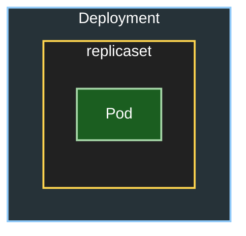

## Kubernetes 리소스
- pod : 컨테이너와 볼륨을 세트로 구성
- replicaset : Pod의 수를 관리하는 리소스
- service : Pod에 접근하기 위한 네트워크 엔드포인트
- daemonset : 워크노드별로 1개의 Pod를 작성
- deployment : replicaset과 pod를 포함하는 상위 리소스. pod의 디플로이를 관리
- statefulset : Pod의 디플로이 상태를 관리.
- cron jobs: 주기적으로 pod을 실행
- job : 일회성 pod을 실행
- load balancer : 외부에서 접근할 수 있는 IP를 할당받아 Pod에 접근할 수 있도록 하는 리소스
- clusterIP : service에서 정의. 클러스터 내부에서 Pod에 접근할 수 있는 IP를 할당받아 Pod에 접근할 수 있도록 하는 리소스
- ingress : HTTP/HTTPS 트래픽을 Pod로 라우팅하는 리소스

## 오브젝트와 인스턴스
Kubernetes의 정의내용은 etcd에서 등록되어 관리됨.
Kubernetes는 etcd에 등록되어있는 내용에 따라서 Pod을 작성하는데, etcd의 데이터베이스에 오브젝트(Object) 정보로써 등록되어있는것을, 인스턴스(Instance)로 리소스를 작성한다는 의미로 오브젝트와 인스턴스라는 용어를 쓰기도 한다.


## kubeadm
Kubernetes 클러스터를 설치하고 관리하기 위한 도구로, 클러스터의 초기화, 노드 추가, 업그레이드 등을 지원합니다. kubeadm은 Kubernetes의 공식 설치 도구 중 하나로, 클러스터를 쉽게 설정할 수 있도록 도와줍니다.

본격적으로 Kubernetes를 구축할경우에는 물리적인 머신 혹은 가상머신을 필요한 만큼 준비하여 Ubuntu등 Linux 배포판을 설치한 후, Master node에는 kubernetes와 CNI, etcd를, Worker node에는 Docker등 컨테이너엔진과 Kubernetes, CNI를 설치할 필요가 있으나, 이것을 kubeadm을 사용하여 자동화할 수 있음.

## Manifest
Kubernetes에서 리소스를 정의하는 YAML 파일.
Manifest는 리소스단위로 기재하는 것이 일반적임.

```yaml
apiVersion: #API Group, API version
kind: # 리소스 종류 (예: Pod, Service, Deployment 등)
metadata: # 리소스의 메타데이터
    name: # 리소스의 이름
    namespace: # 리소스가 세분화된 DNS 호환 레이블
    labels: # Pod의 경우 label을 지정해두는 것으로 Deployment에서 Pod을 선택할 수 있음
spec: # 리소스의 사양
```

- Pod Manifest 예시
```yaml
apiVersion: v1
kind: Pod
metadata:
    name: my-pod
    labels:
        app: my-app
spec:
    containers:
        - name: my-container
          image: nginx:latest
          ports:
            - containerPort: 80
```

- Deployment Manifest 예시
```yaml
apiVersion: apps/v1
kind: Deployment
metadata:
    name: my-deployment
spec:
    selector:
      matchLabels: # Pod을 선택하기 위한 레이블
          app: my-app
    replicas: 3
    template:
      metadata:
        labels: # Pod에 적용할 레이블
          app: my-app
        spec:
          containers:
            - name: my-container
              image: nginx:latest
              ports:
              - containerPort: 80
```


    - Deployment의 경우 Replicaset과 Pod를 포함하는 상위 리소스이므로, Deployment를 Manifest로 작성할 경우에는 Deployment 리소스만 기재하면 됨.



- Service Manifest 예시


```yaml
apiVersion: v1
kind: Service
metadata:
  name: my-service
spec:
    type: ClusterIP # Service의 유형 (옵션: ClusterIP, NodePort, LoadBalancer, ExternalName)
    selector:
        app: my-app # Pod을 선택하기 위한 레이블
    ports:
      - port: 80 #Service 포트
        targetPort: 80 # 컨테이너 포트
        protocol: TCP # 프로토콜 (옵션: TCP, UDP)
        nodePort: 30000 # 워커노드의 포트

```

    - Cluser IP: Cluster IP로 Service에 엑세스 가능하도록 함(외부에서는 접근 불가)
    - Node Port: 워커노드의 IP로 Service에 엑세스 할 수 있도록
    - Load Balancer: 로드밸런서 IP로 Service 에 액세스 할수있도록함
    - ExternalName: Pod에서 Service를 통하여 외부에 나갈 때의 설정