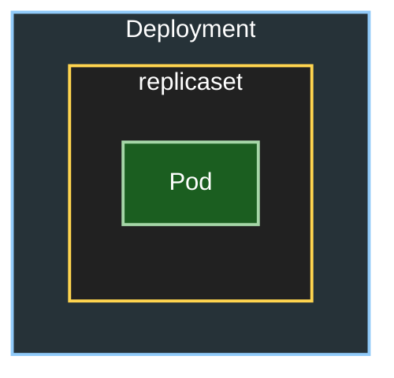

# Kubernetes Terminology

## Kubernetes 아키텍쳐


1. Low Level Container Runtime
   - runC : 컨테이너 런타임. 컨테이너를 실행하는데 필요한 기능을 제공. 리눅스의 컴포넌트와 상호작용(namespace, cgroup 등). Docker Inc에서 OCI (Open Container Initiative)라는 컨테이너 기술표준화 프로젝트 커뮤니티에 기부함. (비슷한 기술 C run, Kata Containers, gVisor 등)


2. High Level Container Runtime(Container Engine)
   - containerd : Docker내에서 사용됨. CNCF에 기부된 graduated project. 전체의 컨테이너 라이프사이클 운영, 컨테이너 이미지 pull과 저장 관리. runC와 상호작용.
   - cri-o : Kubernetes에서 사용되는 컨테이너 런타임 인터페이스(CRI) 구현체. containerd와 유사한 기능을 제공하며, Kubernetes와의 통합을 위해 설계됨. 쿠버네티스에 특화된 경량 컨테이너 런타임.runc와 같은 저수준 런타임을 사용해 컨테이너를 실행.

3. kubelet
    - Kubernetes의 컴포넌트로, 워커 노드에서 컨테이너를 실행하고 관리하는 역할을 함(실제로는 Control Plane에도 상호작용을 위해 존재하고 있음) kubelet은 컨테이너 런타임과 상호작용하여 Pod을 생성, 업데이트, 삭제함. kubelet은 Kubernetes API 서버와 통신하여 클러스터 상태를 보고함. Pod의 Spec을 기반.
    - /etc/kubernetes/manifests디렉토리를 모니터링하여 request를 받을수있음
    - Static Pod: kubelet이 관리하는 Pod.API를 통하여 생성되는 것이 아니라 kubelet이 파일을 읽어 Pod을 생성함. Static Pod은 kubelet이 시작될 때 자동으로 생성됨. 


flowchart LR
 file["/etc/kubernetes/manifests"]
 file --> kubectl
 kubectl --> containerd
 containerd --> runc["runc"]
 runc --> staticPod["static Pod"]



1. etcd(Control Plane>Static Pod)
    - Kubernetes의 분산 키-값 저장소로, 클러스터의 상태 정보를 저장함. Source of Truth. etcd는 클러스터의 모든 리소스 상태를 저장하고, 이를 통해 클러스터의 일관성을 유지함. Production setup으로써 홀수의 노드로, 5개를 권장함.RAFT(Reliable Asynchronous Fault Tolerance) 합의 프로토콜을 사용하여 일관성을 유지하도록함.


5. kubernetes api(Control Plane>Static Pod)
    - Kubernetes의 API 서버. RESTful API를 통해 클러스터의 리소스를 관리함. kubectl, kubelet, kube-proxy 등과 상호작용함. API 서버는 etcd와 통신하여 클러스터 상태를 읽고 쓰는 역할을 함. API 서버는 인증, 권한 부여, 감사 로깅 등의 기능을 제공함.etcd에 데이터를 저장하는 역할.

6. kube-scheduler(Control Plane>Static Pod)
    - Kubernetes의 스케줄러로, Static Pod를 시작(/etc/kubernets/manifests) etcd를 참조하여 Pod을 워커 노드에 할당하는 역할을 함. Pod의 리소스 요구사항, 노드의 상태, 정책 등을 고려하여 최적의 노드를 선택함. 스케줄링 알고리즘을 사용하여 클러스터의 리소스를 효율적으로 활용함.

7. kube-proxy
    - DaemonSet로써 모든 클러스터의 인스턴스로써 존재(Static Pod제외) Normal Pod로 시작함(Static Pod로 시작하지 않음)Kubernetes의 네트워크 프록시로, 클러스터 내에서 Pod 간의 네트워크 통신을 관리함. 
    - TCP, UDP, SCTP 프로토콜을 지원하며, Service의 IP와 포트를 Pod의 IP와 포트로 매핑함. 

7. coreDNS(Control Plane)
    - Kubernetes의 DNS 서버로, 클러스터 내에서 서비스 디스커버리와 DNS 해석을 제공함. Pod과 Service의 DNS 이름을 관리하고, 클러스터 내에서 네트워크 요청을 올바른 Pod으로 라우팅함. CoreDNS는 kubelet과 통신하여 DNS 레코드를 업데이트함. CoreDNS는 플러그인 기반으로 확장 가능함.

8. kube-controller-manager(Control Plane>Static Pod)
    - Kubernetes의 컨트롤러 매니저로, 클러스터의 상태를 유지하고 관리하는 역할을 함. 여러 컨트롤러(예: ReplicaSet, Deployment, Node 등)를 실행하여 클러스터의 상태를 지속적으로 모니터링하고 조정함. 각 컨트롤러는 특정 리소스 유형에 대한 상태를 관리함.

9. cloud-controller-manager(Control Plane)
    - 클라우드 제공업체와 통합하기 위한 컨트롤러 매니저로, 클라우드 환경에서 Kubernetes 클러스터를 운영할 때 사용됨. 클라우드 리소스(예: LoadBalancer 등)를 관리하고, 클라우드 API와 상호작용함.


## Kubernetes 리소스
- pod : 컨테이너와 볼륨을 세트로 구성
- replicaset : Pod의 수를 관리하는 리소스
- service : Pod에 접근하기 위한 네트워크 엔드포인트
- daemonset : 워크노드별로 1개의 Pod를 작성
- deployment : replicaset과 pod를 포함하는 상위 리소스. pod의 디플로이를 관리
- statefulset : Pod의 디플로이 상태를 관리.
- cron jobs: 주기적으로 pod을 실행
- job : 일회성 pod을 실행
- load balancer : 외부에서 접근할 수 있는 IP를 할당받아 Pod에 접근할 수 있도록 하는 리소스
- clusterIP : service에서 정의. 클러스터 내부에서 Pod에 접근할 수 있는 IP를 할당받아 Pod에 접근할 수 있도록 하는 리소스
- ingress : HTTP/HTTPS 트래픽을 Pod로 라우팅하는 리소스

## 오브젝트와 인스턴스
Kubernetes의 정의내용은 etcd에서 등록되어 관리됨.
Kubernetes는 etcd에 등록되어있는 내용에 따라서 Pod을 작성하는데, etcd의 데이터베이스에 오브젝트(Object) 정보로써 등록되어있는것을, 인스턴스(Instance)로 리소스를 작성한다는 의미로 오브젝트와 인스턴스라는 용어를 쓰기도 한다.


## kubeadm
Kubernetes 클러스터를 설치하고 관리하기 위한 도구로, 클러스터의 초기화, 노드 추가, 업그레이드 등을 지원합니다. kubeadm은 Kubernetes의 공식 설치 도구 중 하나로, 클러스터를 쉽게 설정할 수 있도록 도와줍니다.

본격적으로 Kubernetes를 구축할경우에는 물리적인 머신 혹은 가상머신을 필요한 만큼 준비하여 Ubuntu등 Linux 배포판을 설치한 후, Master node에는 kubernetes와 CNI, etcd를, Worker node에는 Docker등 컨테이너엔진과 Kubernetes, CNI를 설치할 필요가 있으나, 이것을 kubeadm을 사용하여 자동화할 수 있음.

## Manifest
Kubernetes에서 리소스를 정의하는 YAML 파일.
Manifest는 리소스단위로 기재하는 것이 일반적임.

```yaml
apiVersion: #API Group, API version
kind: # 리소스 종류 (예: Pod, Service, Deployment 등)
metadata: # 리소스의 메타데이터
    name: # 리소스의 이름
    namespace: # 리소스가 세분화된 DNS 호환 레이블
    labels: # Pod의 경우 label을 지정해두는 것으로 Deployment에서 Pod을 선택할 수 있음
spec: # 리소스의 사양
```

- Pod Manifest 예시
```yaml
apiVersion: v1
kind: Pod
metadata:
    name: my-pod
    labels:
        app: my-app
spec:
    containers:
        - name: my-container
          image: nginx:latest
          ports:
            - containerPort: 80
```

- Deployment Manifest 예시
```yaml
apiVersion: apps/v1
kind: Deployment
metadata:
    name: my-deployment
spec:
    selector:
      matchLabels: # Pod을 선택하기 위한 레이블
          app: my-app
    replicas: 3
    template:
      metadata:
        labels: # Pod에 적용할 레이블
          app: my-app
        spec:
          containers:
            - name: my-container
              image: nginx:latest
              ports:
              - containerPort: 80
```


    - Deployment의 경우 Replicaset과 Pod를 포함하는 상위 리소스이므로, Deployment를 Manifest로 작성할 경우에는 Deployment 리소스만 기재하면 됨.



- Service Manifest 예시


```yaml
apiVersion: v1
kind: Service
metadata:
  name: my-service
spec:
    type: ClusterIP # Service의 유형 (옵션: ClusterIP, NodePort, LoadBalancer, ExternalName)
    selector:
        app: my-app # Pod을 선택하기 위한 레이블
    ports:
      - port: 80 #Service 포트
        targetPort: 80 # 컨테이너 포트
        protocol: TCP # 프로토콜 (옵션: TCP, UDP)
        nodePort: 30000 # 워커노드의 포트

```

    - Cluser IP: Cluster IP로 Service에 엑세스 가능하도록 함(외부에서는 접근 불가)
    - Node Port: 워커노드의 IP로 Service에 엑세스 할 수 있도록
    - Load Balancer: 로드밸런서 IP로 Service 에 액세스 할수있도록함
    - ExternalName: Pod에서 Service를 통하여 외부에 나갈 때의 설정


## CRDs (Custom Resource Definitions)
Kubernetes에서 기본적으로 제공하지 않는 리소스를 정의할 수 있는 방법입니다. CRD를 사용하면 Kubernetes API에 새로운 리소스 유형을 추가할 수 있습니다. 이를 통해 사용자 정의 리소스를 생성하고 관리할 수 있습니다.

mysql CRD 예시:
```yaml
apiVersion: mysql.oracle.com/v1
kind: InnoDBCluster
metadata:
  name: my-cluster
```
