## 1. 기본 네트워크 개념

> "데이터는 어떻게 이동하는가?"

## 웹 페이지 요청부터 응답까지의 전체 과정

| 단계                       | 구성요소       | 세부 과정              | 상세 설명                                                                                                                                                                         |
| -------------------------- | -------------- | ---------------------- | --------------------------------------------------------------------------------------------------------------------------------------------------------------------------------- |
| **1. 사용자 요청 단계**    | 브라우저       | URL 입력 및 파싱       | • 사용자가 주소창에 `https://example.com` 입력<br>• 브라우저가 URL을 파싱하여 프로토콜, 도메인, 경로 분석                                                                         |
|                            |                | 쿠키 처리              | • 🍪 브라우저가 해당 도메인 쿠키 조회<br>• 🍪 Cookie 헤더에 추가하여 HTTP 요청 생성<br>`GET / HTTP/1.1`<br>`Host: example.com`<br>`Cookie: sessionid=abc123; user_pref=dark_mode` |
| **2. DNS 해석 과정**       | DNS 서버       | 도메인 → IP 변환       | • 브라우저 캐시 → OS 캐시 → 로컬 DNS 서버 순으로 조회<br>• 없으면 루트 DNS → TLD DNS → 권한 있는 DNS 서버 순으로 질의<br>• 최종적으로 도메인에 해당하는 IP 주소 획득              |
| **3. 로컬 네트워크 처리**  | 네트워크 스택  | 패킷 생성 및 라우팅    | • TCP/IP 프로토콜 스택에서 HTTP 요청을 TCP 세그먼트로 캡슐화<br>• 네트워크 카드를 통해 이더넷 프레임으로 변환<br>• 홈 라우터(게이트웨이)를 거쳐 ISP 네트워크로 전송               |
| **4. 인터넷 구간 통과**    | ISP & 백본망   | 네트워크 라우팅        | • ISP(인터넷 서비스 제공자) 네트워크 진입<br>• 여러 라우터를 거쳐 최적 경로로 라우팅<br>• 인터넷 백본망을 통해 목적지 네트워크 방향으로 전달                                      |
| **5. CDN 처리**            | 엣지 서버      | 콘텐츠 캐시 확인       | • 지리적으로 가까운 CDN 엣지 서버에서 캐시된 콘텐츠 확인<br>• 캐시 HIT: 즉시 응답 반환<br>• 캐시 MISS: 오리진 서버로 요청 전달                                                    |
| **6. 로드 밸런서 처리**    | Load Balancer  | 트래픽 분산            | • L4/L7 로드 밸런서가 요청을 적절한 웹서버로 분배<br>• 서버 상태, 부하를 고려한 라우팅 결정                                                                                       |
| **7. 방화벽 및 보안 검사** | WAF & Firewall | 보안 필터링            | • WAF(Web Application Firewall)에서 악성 트래픽 차단<br>• DDoS 보호, SQL 인젝션 등 공격 패턴 탐지<br>• 허용된 트래픽만 내부 네트워크로 전달                                       |
| **8. 웹서버 처리**         | Web Server     | 요청 처리 및 응답 생성 | • 웹서버(Apache, Nginx 등)가 HTTP 요청 수신<br>• 정적 파일은 직접 응답, 동적 콘텐츠는 애플리케이션 서버로 전달<br>• 필요시 데이터베이스 조회<br>• HTTP 응답 메시지 생성           |
|                            |                | 쿠키 처리              | • 🍪 Cookie 헤더 파싱 및 세션 조회<br>`HTTP/1.1 200 OK`<br>`Set-Cookie: sessionid=xyz789; Path=/; HttpOnly; Secure`<br>`Set-Cookie: last_visit=2025-09-23; Max-Age=86400`         |

## 브라우저에 접속하는 과정

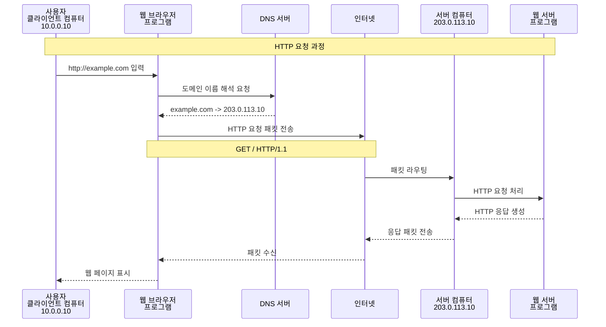

## 용어정리

| 용어                               | 설명                                                                                                   |
| ---------------------------------- | ------------------------------------------------------------------------------------------------------ |
| IP 주소                            | 네트워크 상에서 장치를 식별하는 고유한 숫자자 주소                                                     |
| IPv4                               | 32비트 주소 체계로, 약 42억 개의 고유 주소 제공 <br> 예, '192.168.0.1'                                 |
| IPv6                               | 128비트 주소 체계로, 거의 무한대에 가까운 주소 제공 <br> 예, '2001:0db8:85a3:0000:0000:8a2e:0370:7334' |
| 도메인 이름                        | 사람이 읽을 수 있는 형태의 웹사이트 주소 (예: example.com)                                             |
| DNS (Domain Name System)           | 도메인 이름을 IP 주소로 변환하는 시스템                                                                |
| HTTP (Hypertext Transfer Protocol) | 웹 브라우저와 웹 서버 간의 통신 프로토콜                                                               |
| HTTPS (HTTP Secure)                | HTTP에 보안 기능을 추가한 프로토콜 (SSL/TLS 사용)                                                      |
| 웹 브라우저                        | 사용자가 웹 페이지를 요청하고 표시하는 프로그램 (예: Chrome, Firefox)                                  |
| NIC (Network Interface Card)       | 컴퓨터를 네트워크에 연결하는 하드웨어 장치.IP어디레스는 이 NIC에 대하여 붙이는것임                     |
| Packet                             | 네트워크를 통해 전송되는 데이터의 작은 단위                                                            |

## TCPI/IP 4계층 모델

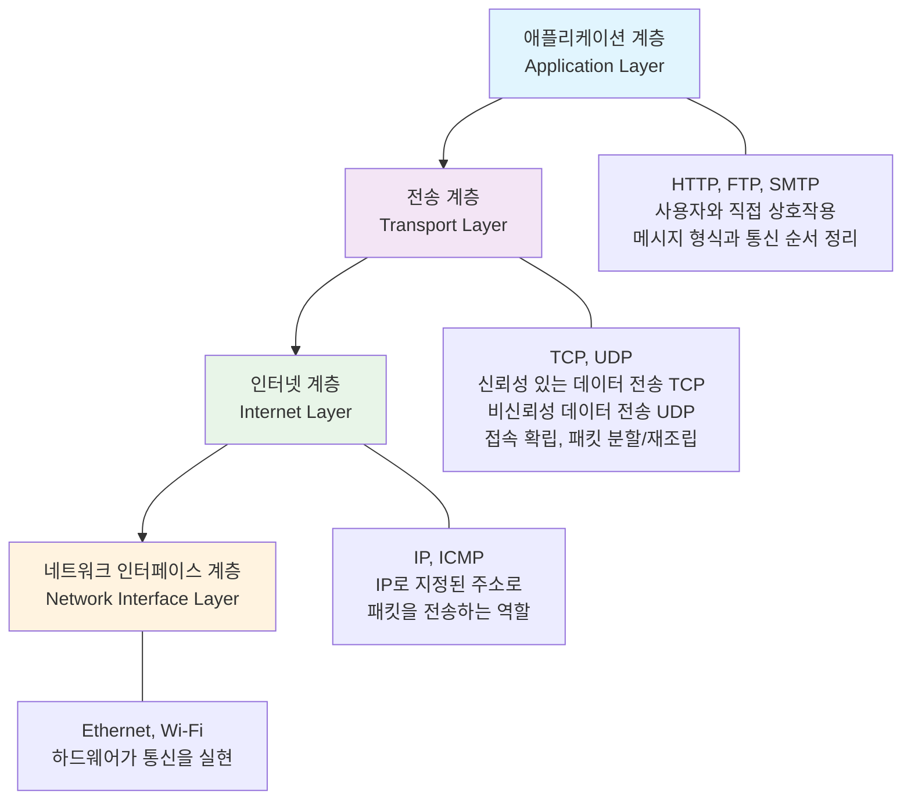

[참고] 예를들어, Packet가 안도착 한다면 인터넷 계층에 문제를 생각할 수있음 통신은 되고 있으나
메시지가 이상하다면 어플리케이션 층에 문제를 생각할 수 있음

## OSI 7계층 모델

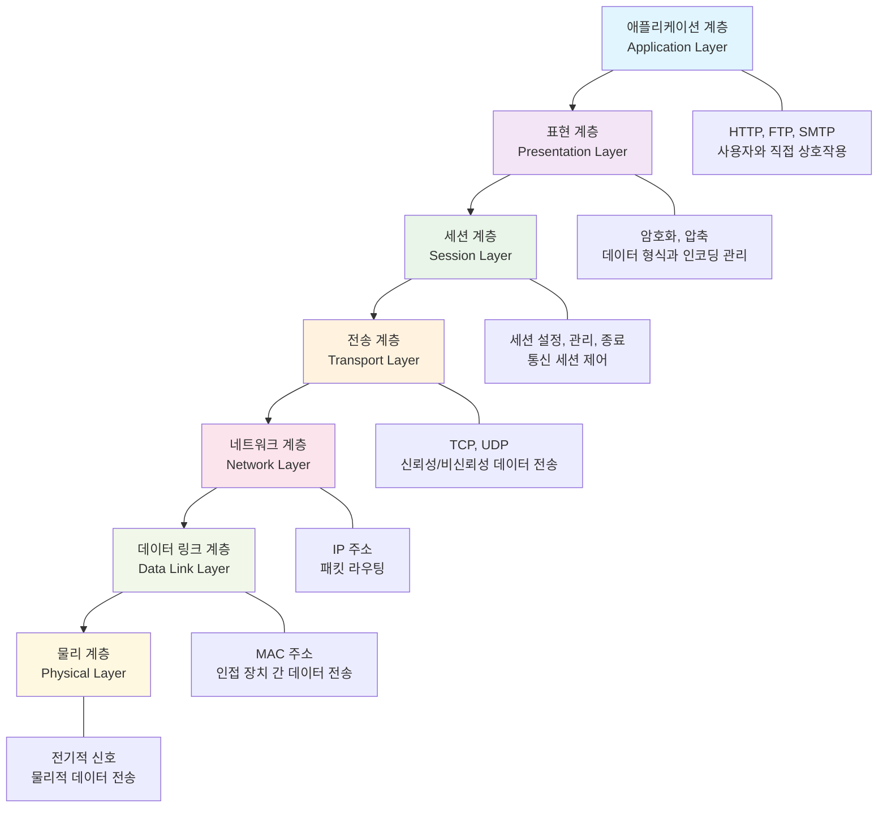

### IP 주소와 서브넷

#### IP address

- 0 ~ 255 (총 256개)로 구성하여 10진수로 표기. 전부 약 43억개 존재.
- IPv4: 32비트 주소 체계로, 약 42억 개의 고유 주소 제공
- IPv6: 128비트 주소 체계로, 거의 무한대에 가까운 주소 제공
- IP 어드레스는, 네트워크부 와 호스트부로 나눌 수 있습니다.
  - 10.0.0.10 에서 예를들어 10.0.0 은 네트워크부, 10은 호스트부일 수 있습니다.
  - 같은 네트워크에 속하는 컴퓨터들에 대하여, 네트워크부는 같이하며 호스트부는 다르게 하여 주소를
    부여하는 것이 가능.
  - **서브넷 마스크**란 어디까지가 네트워크부이고 어디부터가 호스트부인지를 나타내는 값입니다.
- IP 어드레스를 설정할 때는, 10.0.0.10과 같은 값과 같이, 추가로 서브넷 마스크(Subnet Mask)도
  설정해야 합니다.
- 실제로 Windows, Mac에서도 수동으로 IP 어드레스를 설정할 때, 서브넷 마스크도 같이 설정합니다.
- IANA(Internet Assigned Numbers Authority)에서, 사설 IP 어드레스 대역을 다음과 같이 정하고
  있습니다.

#### Public IP address vs Private IP address

##### Public IP address (퍼블릭 IP 주소)

- **정의**: 인터넷 상에서 전 세계적으로 고유한 주소
- **특징**:
  - 인터넷을 통해 직접 접근 가능
  - IANA 및 지역 인터넷 등록기관(RIR)에 의해 할당
  - 전 세계에서 유일해야 함 (중복 불가)
  - 유료로 구매하거나 ISP로부터 할당받음
- **사용 사례**:
  - 웹 서버, 메일 서버 등 인터넷에서 직접 접근해야 하는 서버
  - 클라우드 인스턴스의 외부 접근용 IP
  - 홈 네트워크의 라우터(게이트웨이)가 인터넷과 통신할 때 사용

##### Private IP address (프라이빗 IP 주소)

- **정의**: 사설 네트워크 내에서만 유효한 주소
- **특징**:
  - 인터넷에서 직접 접근 불가능
  - 여러 네트워크에서 동일한 주소를 재사용 가능 (NAT를 통해 구분)
  - 무료로 사용 가능
  - 라우터나 NAT Gateway를 통해서만 인터넷과 통신 가능
- **사용 사례**:
  - 가정 내부 네트워크 (PC, 스마트폰, IoT 기기 등)
  - 회사 내부 네트워크
  - 클라우드 VPC 내부의 인스턴스
  - 데이터베이스 서버 등 외부 노출이 불필요한 서버

##### IANA에서 정의한 프라이빗 IP 주소 대역

| 대역        | CIDR 표기      | 주소 범위                     | 설명                                   |
| ----------- | -------------- | ----------------------------- | -------------------------------------- |
| **Class A** | 10.0.0.0/8     | 10.0.0.0 ~ 10.255.255.255     | 대규모 네트워크용 (약 1,677만 개 주소) |
| **Class B** | 172.16.0.0/12  | 172.16.0.0 ~ 172.31.255.255   | 중규모 네트워크용 (약 104만 개 주소)   |
| **Class C** | 192.168.0.0/16 | 192.168.0.0 ~ 192.168.255.255 | 소규모 네트워크용 (약 6.5만 개 주소)   |

- 가장 많이 사용되는 대역: `192.168.0.0/16` (가정용 라우터 기본값)
- 대규모 기업/클라우드: `10.0.0.0/8` 사용

##### 퍼블릭 IP와 프라이빗 IP 비교

| 구분            | Public IP                                    | Private IP                                         |
| --------------- | -------------------------------------------- | -------------------------------------------------- |
| **고유성**      | 전 세계에서 유일해야 함                      | 네트워크 내에서만 유일 (다른 네트워크와 중복 가능) |
| **인터넷 접근** | 직접 접근 가능                               | NAT Gateway/라우터를 통해서만 접근 가능            |
| **비용**        | 유료 (ISP 또는 클라우드 제공자로부터)        | 무료                                               |
| **할당 기관**   | IANA → RIR → ISP/기업                        | 네트워크 관리자가 자유롭게 할당                    |
| **보안**        | 외부에서 직접 접근 가능하므로 보안 설정 필요 | 기본적으로 외부 접근 차단됨                        |
| **사용 예시**   | 웹 서버 (203.0.113.10)                       | 내부 PC (192.168.0.10)                             |

##### NAT (Network Address Translation)의 역할

프라이빗 IP 주소를 사용하는 장치가 인터넷과 통신하려면 **NAT**가 필요합니다:

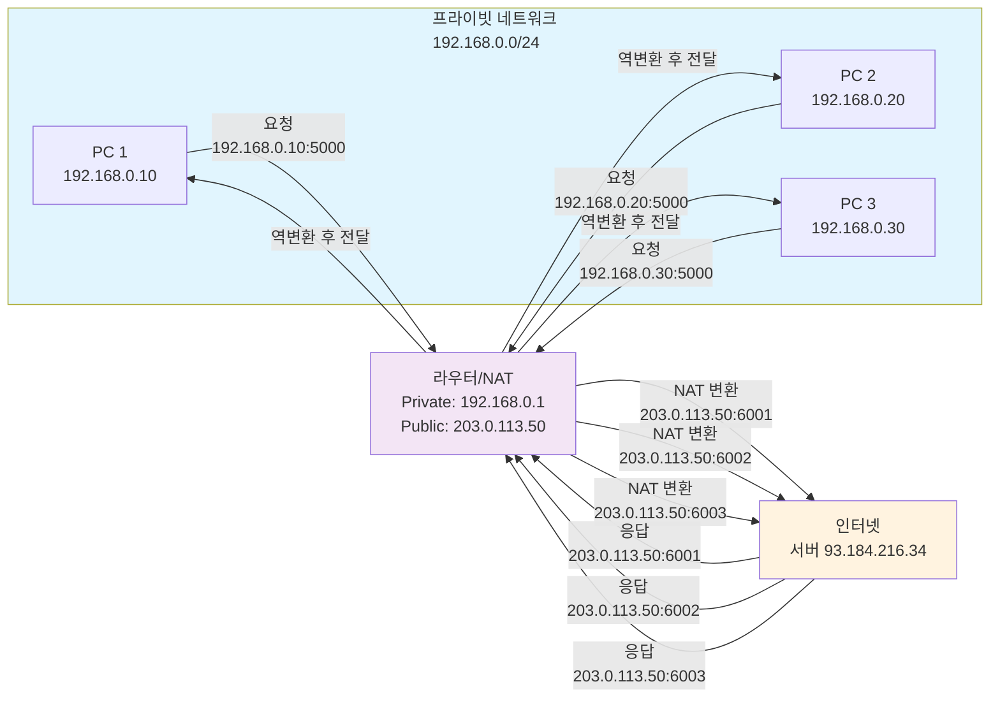

**NAT 동작 과정**:

1. 프라이빗 IP 장치가 인터넷으로 요청 전송
2. 라우터/NAT Gateway가 프라이빗 IP를 퍼블릭 IP로 변환
3. 인터넷 서버는 퍼블릭 IP로 응답
4. 라우터가 응답을 받아 원래의 프라이빗 IP로 역변환하여 전달

**NAT의 장점**:

- IPv4 주소 부족 문제 완화 (여러 장치가 하나의 퍼블릭 IP 공유)
- 보안 강화 (내부 네트워크 구조를 외부에 노출하지 않음)
- 비용 절감 (프라이빗 IP는 무료)

##### 클라우드 환경에서의 활용

**AWS/GCP 예시**:

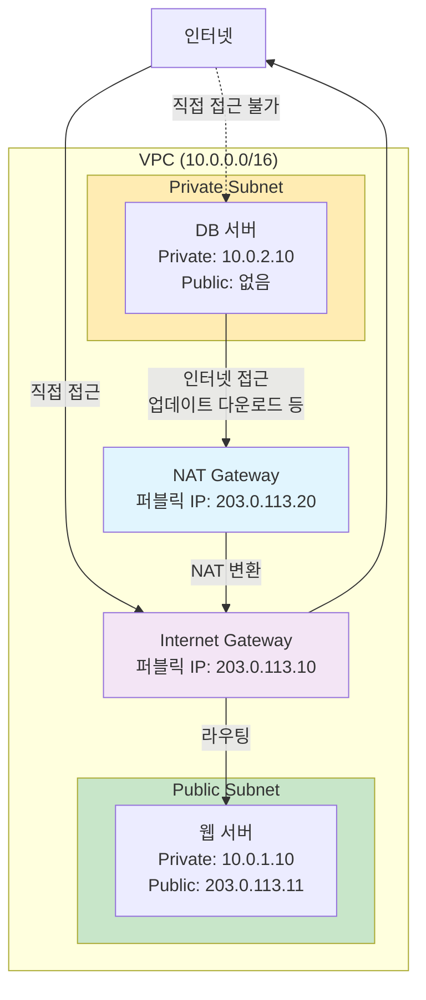

- **Public Subnet의 인스턴스**: 퍼블릭 IP 할당 가능, 인터넷에서 직접 접근 가능
- **Private Subnet의 인스턴스**: 프라이빗 IP만 사용, NAT Gateway를 통해서만 인터넷 접근 가능

- IP로 지역을 추정하는 원리
  - IP는 지역 인터넷 등록기관(RIR: ARIN, RIPE, APNIC 등)에 의해 통신사·기업 단위로 할당됩니다.
  - 예: 203.0.113.x 대역이 일본 도쿄의 한 통신사에 할당되어 있다면, 해당 IP를 쓰는 사용자는 일본
    도쿄 근처일 가능성이 큽니다.

#### 서브넷 마스크

- 서브넷 마스크는, IP 어드레스의 네트워크부와 호스트부를 구분하는 역할을 합니다.
- 서브넷 마스크는, IP 어드레스와 같은 4개의 옥텟으로 구성되며, 각 옥텟은 0~255의 값을 가집니다.
- **CIDR(Classless Inter-Domain Routing)** 표기법
  - 서브넷 마스크를 간단하게 표현하는 방법
  - 예를들어, 255.255.255.0 은 /24로 표현할 수 있습니다.
  - /8, /16, /24, /32 등이 자주 사용됩니다.

예시 표

| IP 어드레스 | 서브넷 마스크   | CIDR 표기법 | 네트워크부 | 호스트부  |
| ----------- | --------------- | ----------- | ---------- | --------- |
| 10.0.0.10   | 255.255.255.255 | /32         |            | 10.0.0.10 |
| 10.0.0.10   | 255.255.240.0   | /20         | 10.0.0     | 0.10      |
| 10.0.0.10   | 255.255.255.0   | /24         | 10.0.0     | 10        |
| 10.0.1.10   | 255.255.0.0     | /16         | 10.0       | 1.10      |
| 10.0.2.10   | 255.0.0.0       | /8          | 10         | 0.2.10    |

- 예를들어 10.0.0.0/16 이라는 네트워크로 부터 서브넷을 작성하는 경우, 예를들어 서브넷은 10.0.0.0/24,
  10.0.1.0/24, 10.0.2.0/24로 나눌 수 있습니다.

## 웹 서버 접속

- curl : HTTP 요청 테스트 (`curl -v http://localhost`)
- telnet : 원격 서버 접속 (`telnet localhost 80`)

1. 클라이언트에서 보내는 request 메시지

```bash
GET / HTTP/1.1
Host: localhost
User-Agent: curl/8.12.1
Accept: */*
```

1. 웹서버에서 보내는 response 메시지

```bash
HTTP/1.1 200 OK
Server: nginx/1.26.3 (Ubuntu)
Date: Sat, 20 Sep 2025 13:04:40 GMT
Content-Type: text/html

<!DOCTYPE html>
<html>
..
</html>
```

## 프로토콜 레벨

### UDP,TCP와의 차이점, 실시간 통신에서의 활용

- TCP: 연결 지향적, 신뢰성 있는 데이터 전송, 순서 보장, 오류 검출 및 수정
- UDP: 비연결 지향적, 빠른 전송 속도, 순서 보장 없음, 오류 검출 없음
- 실시간 통신(예: VoIP, 온라인 게임)에서는 지연 시간이 중요하므로 UDP가 선호됨

### HTTP/HTTPS

- HTTP(HyperText Transfer Protocol): 웹에서 브라우저(클라이언트)와 서버 간 데이터를 주고받는
  애플리케이션 계층 프로토콜.
- 주로 **요청(Request)**과 응답(Response) 형태로 작동.
- HTTP: 비연결 지향적, 상태 비저장, 텍스트 기반
- HTTPS: HTTP에 보안 기능을 추가한 프로토콜 (SSL/TLS 사용)

#### HTTP 버전별 채택 현황

- HTTP/1.1: 여전히 많은 서버와 CDN에서 기본 지원.
- HTTP/2: 주요 브라우저·서버(Chrome, Firefox, Apache, Nginx)에서 널리 사용.
- HTTP/3: 초기 단계였지만, Google, Cloudflare, Meta 등 대형 플랫폼에서 빠르게 채택 중. 모바일 환경과
  스트리밍 서비스에서 사용 확대.

| 구분               | HTTP/1.1                                              | HTTP/2                                                 | HTTP/3                                   |
| ------------------ | ----------------------------------------------------- | ------------------------------------------------------ | ---------------------------------------- |
| **도입 시기**      | 1997                                                  | 2015                                                   | 2022 (IETF 표준화)                       |
| **기반 프로토콜**  | TCP                                                   | TCP                                                    | **QUIC** (UDP 기반)                      |
| **요청 처리 방식** | 요청당 하나의 연결, 순차적 처리(Pipelining 문제 존재) | **멀티플렉싱**: 단일 연결에서 여러 요청/응답 동시 처리 | 멀티플렉싱 + **빠른 연결 설정(0-RTT)**   |
| **헤더 처리**      | 헤더 중복 많음, 압축 없음                             | **HPACK** 압축으로 헤더 크기 감소                      | **QPACK** 압축                           |
| **추가 기능**      | Keep-Alive                                            | **서버 푸시(Server Push)**, 우선순위 제어              | QUIC 기반 혼잡 제어, 연결 이동성 지원    |
| **성능/지연**      | 지연(latency) 큼, HOL Blocking 발생                   | HOL Blocking 감소, 성능 향상                           | 네트워크 지연 최소화, 모바일 환경 최적화 |

### WebSocket

- WebSocket: 클라이언트와 서버 간의 양방향 통신을 가능하게 하는 프로토콜
- HTTP와의 차이점: 초기 핸드셰이크 후 지속적인 연결 유지
- 활용 예시: 실시간 채팅 애플리케이션, 실시간 알림 시스템
  - WebSocket 통신 과정 1. 클라이언트가 HTTP 요청을 통해 WebSocket 연결 요청 2. 서버가 WebSocket
    프로토콜로 업그레이드 응답 3. 양방향 통신 시작

### DNS(Domain Name System)

- DNS Contents Server: 도메인 이름과 IP 주소 매핑 정보 저장
- DNS Cache Server: 자주 조회되는 DNS 정보를 임시 저장하여 응답 속도 향상

- A : 도메인 이름을 IPv4 주소로 매핑 example.com → 93.184.216.34
- AAAA : 도메인 이름을 IPv6 주소로 매핑 example.com → 2606:2800:220:1:248:1893:25c8:1946
- CNAME : 도메인 이름을 다른 도메인 이름으로 매핑 (별칭) example2.com → example.com

### ISP와 인터넷 구조

- ISP (Internet Service Provider)
  - 인터넷 서비스 제공자
  - 가정이나 회사에서 가입한 통신사 (예: KT, SK브로드밴드, NTT, Comcast 등).
  - 사용자의 로컬 라우터에서 나간 패킷은 먼저 ISP의 네트워크로 전달됩니다.
  - ISP는 자신의 백본 네트워크와 상위 통신망을 이용해 더 큰 인터넷으로 패킷을 전달합니다.

### VPN (Virtual Private Network)

- VPN (Virtual Private Network) : 공용 네트워크(인터넷)를 통해 사설 네트워크에 안전하게 접속하는
  기술 - VPN 서버를 경유해 인터넷에 접속하기 때문에, 외부에서 보면 사용자의 실제 IP가 아닌 VPN
  서버의 IP로 보입니다. - 지역 제한(Geo-blocking) 콘텐츠 접근 등에 활용될 수 있습니다.
  - 암호화된 터널을 통해 데이터를 전송하여 보안성을 높임
    - 제3자가 패킷을 가로채더라도 내용을 이해할 수 없습니다.
  - 원격 근무, 지사 연결 등에 활용

```text
사용자 PC/스마트폰
  │ (암호화)
  ▼
[로컬 라우터/게이트웨이]
  │
  ▼
[ISP → 공용 인터넷]
  │
  ▼
[VPN 서버]
  │ (복호화, 목적지 라우팅)
  ▼
[목적지 서버(웹사이트)]
  │ (응답)
  ▲
  │
[VPN 서버] --(암호화)--> [공용 인터넷] -- [ISP] -- [로컬 라우터]
  ▲
  │ (복호화)
사용자 PC/스마트폰
```

## DNS, NAT, DHCP와 네트워크 흐름의 통합 이해

> "DNS, NAT, DHCP가 어떻게 협력하여 네트워크 통신을 가능하게 하는가?"

### 핵심 개념들의 역할

#### DNS (Domain Name System)

- **역할**: 사람이 읽을 수 있는 도메인 이름(example.com)을 컴퓨터가 이해하는 IP
  주소(93.184.216.34)로 변환
- **작동 위치**: 애플리케이션 계층 (OSI 7계층)
- **필요한 이유**: IP 주소는 기억하기 어렵고 변경될 수 있지만, 도메인 이름은 의미 있고 기억하기 쉬움

#### NAT (Network Address Translation)

- **역할**: 프라이빗 IP 주소를 퍼블릭 IP 주소로 변환하여 인터넷 통신 가능하게 함
- **작동 위치**: 네트워크 계층 (OSI 3계층)
- **필요한 이유**: IPv4 주소 부족 문제 해결, 보안 강화, 비용 절감

#### DHCP (Dynamic Host Configuration Protocol)

- **역할**: 네트워크에 연결된 장치에 자동으로 IP 주소, 서브넷 마스크, 게이트웨이, DNS 서버 정보 할당
- **작동 위치**: 애플리케이션 계층 (OSI 7계층)
- **필요한 이유**: 수동 IP 설정의 번거로움 제거, IP 충돌 방지, 네트워크 관리 자동화

#### 라우팅 (Routing)

- **역할**: 패킷을 목적지까지 전달하기 위한 최적 경로 결정
- **작동 위치**: 네트워크 계층 (OSI 3계층)
- **필요한 이유**: 인터넷은 수많은 네트워크로 구성되어 있으며, 패킷이 올바른 경로로 전달되어야 함

### 전체 네트워크 흐름: 사용자가 웹사이트에 접속하는 과정

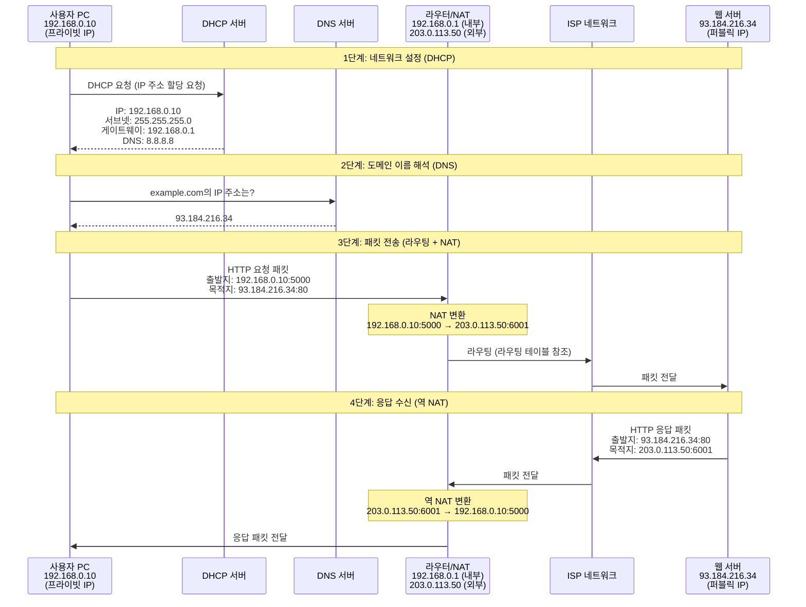

### 단계별 상세 설명

#### 1단계: 네트워크 초기화 (DHCP)

**사용자 PC가 네트워크에 연결될 때**:

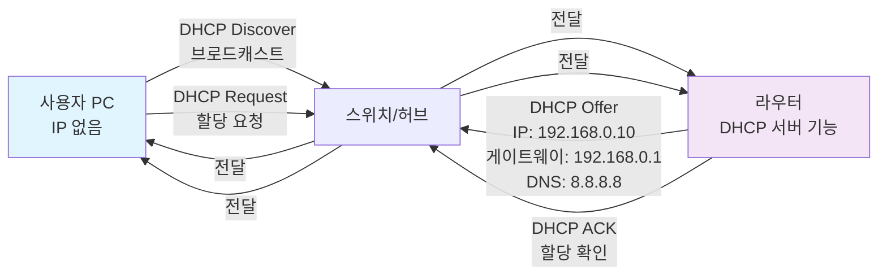

**DHCP 과정**:

1. **DHCP Discover**: PC가 네트워크에 연결되면 브로드캐스트로 IP 주소 할당 요청
2. **DHCP Offer**: DHCP 서버가 사용 가능한 IP 주소와 네트워크 설정 정보 제안
3. **DHCP Request**: PC가 제안받은 IP 주소 사용 요청
4. **DHCP ACK**: DHCP 서버가 최종 확인 및 IP 주소 할당

**할당되는 정보**:

- IP 주소: `192.168.0.10` (프라이빗 IP)
- 서브넷 마스크: `255.255.255.0` (`/24`)
- 기본 게이트웨이: `192.168.0.1` (라우터의 내부 IP)
- DNS 서버: `8.8.8.8` (Google DNS) 또는 ISP 제공 DNS

#### 2단계: 도메인 이름 해석 (DNS)

**사용자가 `https://example.com` 입력 시**:

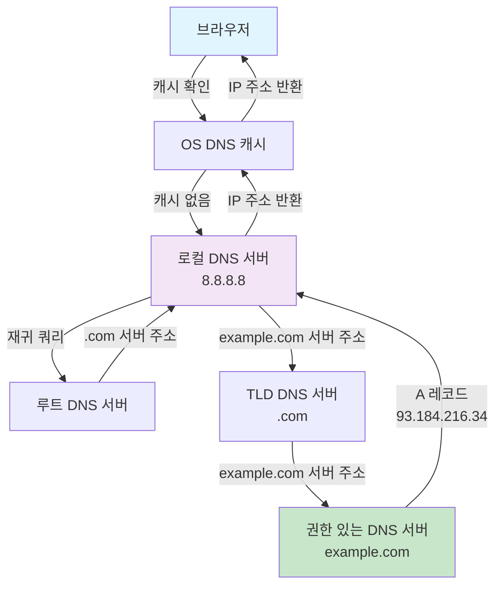

**DNS 해석 과정**:

1. **브라우저 캐시 확인**: 이전에 조회한 도메인 정보가 있는지 확인
2. **OS 캐시 확인**: 운영체제 레벨의 DNS 캐시 확인
3. **로컬 DNS 서버 조회**: `/etc/resolv.conf`에 설정된 DNS 서버에 질의
4. **재귀적 DNS 조회** (캐시에 없을 경우):
   - 루트 DNS 서버 → TLD DNS 서버(.com) → 권한 있는 DNS 서버(example.com)
5. **IP 주소 획득**: `example.com` → `93.184.216.34`

**DNS 레코드 타입**:

- **A 레코드**: 도메인 → IPv4 주소 (`example.com` → `93.184.216.34`)
- **AAAA 레코드**: 도메인 → IPv6 주소
- **CNAME 레코드**: 도메인 → 다른 도메인 (`www.example.com` → `example.com`)

#### 3단계: 패킷 전송 (라우팅 + NAT)

**HTTP 요청 패킷이 인터넷을 통해 전달되는 과정**:

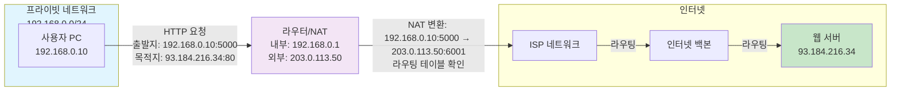

**패킷 전송 과정**:

1. **애플리케이션 계층**: 브라우저가 HTTP 요청 생성

   ```
   GET / HTTP/1.1
   Host: example.com
   ```

2. **전송 계층**: TCP 세그먼트로 캡슐화
   - 출발지 포트: `5000` (임시 포트)
   - 목적지 포트: `80` (HTTP)

3. **네트워크 계층**: IP 패킷으로 캡슐화
   - 출발지 IP: `192.168.0.10` (프라이빗 IP)
   - 목적지 IP: `93.184.216.34` (DNS에서 획득한 퍼블릭 IP)

4. **데이터 링크 계층**: 이더넷 프레임으로 캡슐화
   - 출발지 MAC: PC의 MAC 주소
   - 목적지 MAC: 라우터의 내부 인터페이스 MAC 주소

5. **라우터에서의 처리**:
   - **라우팅 테이블 확인**: 목적지 IP(`93.184.216.34`)가 로컬 네트워크에 없으므로 기본 게이트웨이로
     전달
   - **NAT 변환**:
     - 출발지 IP: `192.168.0.10:5000` → `203.0.113.50:6001`
     - NAT 테이블에 매핑 정보 저장
   - **외부 인터페이스로 전송**: 퍼블릭 IP로 변환된 패킷을 ISP 네트워크로 전송

6. **인터넷 라우팅**:
   - ISP 네트워크의 라우터들이 목적지 IP를 기반으로 최적 경로 결정
   - 여러 라우터를 거쳐 목적지 네트워크로 전달
   - 각 라우터는 자신의 라우팅 테이블을 참조하여 다음 홉(Next Hop) 결정

#### 4단계: 응답 수신 (역 NAT)

**웹 서버의 응답이 사용자 PC로 돌아오는 과정**:

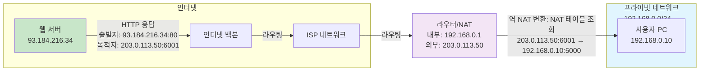

**응답 수신 과정**:

1. **웹 서버 응답**: HTTP 응답 패킷 생성
   - 출발지 IP: `93.184.216.34:80`
   - 목적지 IP: `203.0.113.50:6001` (NAT 변환된 주소)

2. **인터넷 라우팅**: 응답 패킷이 역방향으로 라우팅되어 사용자의 ISP 네트워크로 전달

3. **라우터에서의 역 NAT**:
   - NAT 테이블에서 `203.0.113.50:6001`에 해당하는 원래 주소 조회
   - 역변환: `203.0.113.50:6001` → `192.168.0.10:5000`
   - 프라이빗 네트워크로 패킷 전달

4. **사용자 PC 수신**: 브라우저가 HTTP 응답을 받아 웹 페이지 렌더링

### 핵심 개념들의 상호 연결

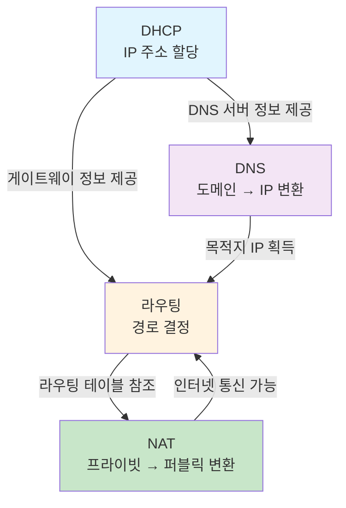

**상호 의존 관계**:

1. **DHCP → DNS**: DHCP가 DNS 서버 주소를 할당하므로, DNS 조회가 가능해짐
2. **DHCP → 라우팅**: DHCP가 기본 게이트웨이를 할당하므로, 외부 네트워크로의 라우팅이 가능해짐
3. **DNS → 라우팅**: DNS가 목적지 IP를 제공하므로, 라우팅 테이블을 참조하여 패킷 전달 가능
4. **라우팅 → NAT**: 외부 네트워크로 패킷을 전달할 때 NAT가 프라이빗 IP를 퍼블릭 IP로 변환
5. **NAT → 라우팅**: NAT 변환 후 라우팅을 통해 인터넷으로 패킷 전달

### 실제 시나리오: 클라우드 환경에서의 네트워크 흐름

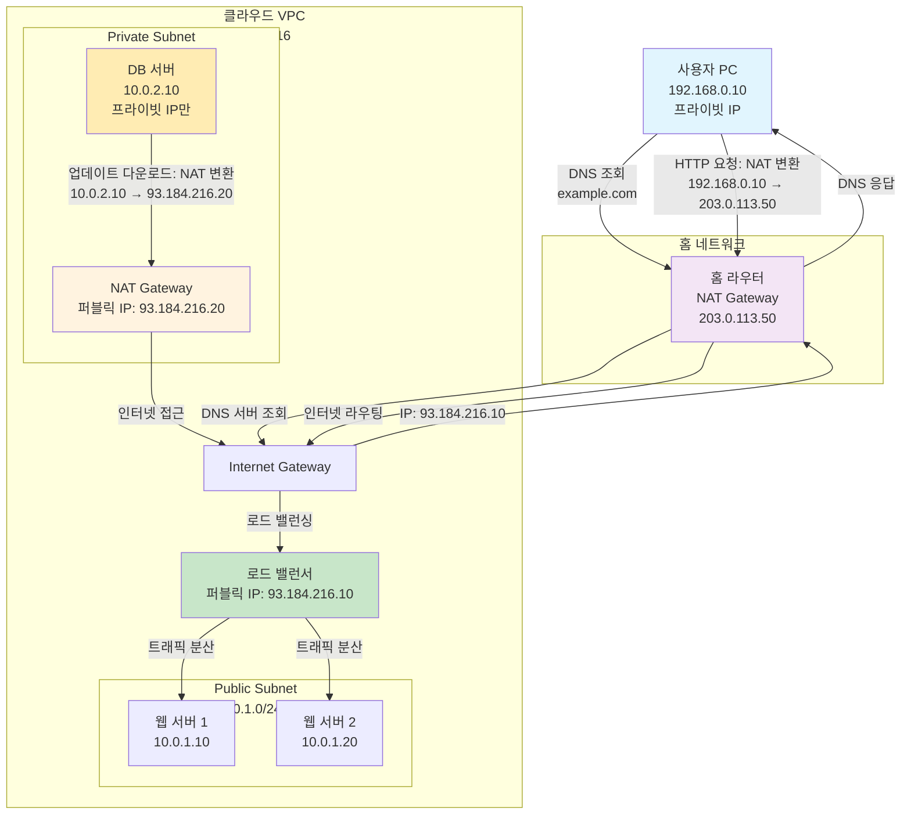

**클라우드 환경의 특징**:

1. **사용자 측**: 홈 라우터가 NAT 역할 수행
2. **클라우드 측**:
   - **Internet Gateway**: VPC와 인터넷 간 통신 게이트웨이
   - **로드 밸런서**: 여러 웹 서버로 트래픽 분산
   - **NAT Gateway**: 프라이빗 서브넷의 인스턴스가 인터넷 접근 시 사용
3. **이중 NAT**: 사용자 측 NAT + 클라우드 NAT Gateway

### 요약: 네트워크 통신의 핵심 흐름

| 단계                 | 구성 요소  | 역할                                    | 프로토콜/기술            |
| -------------------- | ---------- | --------------------------------------- | ------------------------ |
| **1. 네트워크 설정** | DHCP       | IP 주소, 게이트웨이, DNS 서버 자동 할당 | DHCP (UDP 67/68)         |
| **2. 도메인 해석**   | DNS        | 도메인 이름을 IP 주소로 변환            | DNS (UDP 53)             |
| **3. 패킷 전송**     | 라우팅     | 목적지까지 최적 경로 결정               | IP, 라우팅 프로토콜      |
| **4. 주소 변환**     | NAT        | 프라이빗 IP를 퍼블릭 IP로 변환          | NAT (네트워크 계층)      |
| **5. 데이터 전송**   | TCP/IP     | 신뢰성 있는 데이터 전송                 | TCP (전송 계층)          |
| **6. 응용 통신**     | HTTP/HTTPS | 웹 페이지 요청/응답                     | HTTP (애플리케이션 계층) |

**핵심 포인트**:

- **DHCP**는 네트워크의 시작점: IP 주소 없이는 통신 불가
- **DNS**는 사람 친화적 인터페이스: 도메인 이름을 IP로 변환
- **라우팅**은 패킷의 길잡이: 목적지까지의 경로 결정
- **NAT**는 주소 변환기: 프라이빗 네트워크를 인터넷에 연결
- 이들이 **협력**하여 전체 네트워크 통신이 가능해짐

## 2. 네트워크 인프라 & 라우팅

> "데이터가 목적지를 찾아가는 방식"

## 네트워크 장비와 라우팅

### 네트워크 연결 장치

- Ethernet : 간단한게 랜케이블로 접속하여 연결. 10.0.0.10/24 - 10.0.0.20/24
  - 각 컴퓨터가 같은 네트워크에 소속하도록 설정하는것으로 상호 네트워크 통신이 가능해짐
- Hub : 여러 컴퓨터를 연결하는 장치. 단순히 신호를 증폭하여 전달 ( 10.0.0.10/24, 10.0.0.20/24,
  10.0.0.30/24)
- Router : 서로 다른 네트워크를 연결하는 장치. 패킷을 목적지에 맞게 라우팅 (10.0.0.0/24,
  192.168.0.0/24, 172.16.0.0/24)

### Route Table

네트워크 안에서 패킷이 어디로 가야 하는지 알려주는 지도 역할 라우트 테이블 자체는 연결을 만들지
않습니다. 규칙만 정의합니다.

- Route Table : 라우터가 패킷을 어디로 보낼지 결정하는 규칙 집합
  - 목적지 네트워크 (Destination)
  - 넥스트 홉 (Next Hop) : 패킷을 보낼 다음 라우터 또는 게이트웨이
  - 인터페이스 (Interface) : 패킷을 보낼 네트워크 인터페이스
- Router를 통해서 세계의 네트워크가 연결된것이 바로 인터넷.

### NIC (Network Interface Card)

- NIC (Network Interface Card) : 컴퓨터를 네트워크에 연결하는 하드웨어 장치
  - IP 주소: NIC에 할당된 네트워크 주소 (예: 192.168.0.10, fe80::1)
- 주소 관련
  - IP 주소 (논리 주소):
    - 네트워크 계층(L3)에서 사용
    - 네트워크 내에서 장치를 식별하는 데 사용
    - 예: 192.168.0.10 (IPv4), fe80::1 (IPv6)
    - 라우터와 통신할 때 필요
    - 동적으로 변경 가능 (DHCP 사용)
  - MAC 주소 (물리 주소):
    - 데이터 링크 계층(L2)에서 사용
    - 예: 00:1A:2B:3C:4D:5E
    - 제조사에서 고유하게 부여하며, 네트워크 내에서 NIC를 식별하는 데 사용
- 작동 계층
  - OSI 7계층 모델: 물리 계층(1) + 데이터 링크 계층(2)

### DNS 설정과 hosts 파일

- `/etc/hosts`　: 도메인 이름과 IP 주소 매핑 설정 파일
- `/etc/resolv.conf` : DNS서버 캐쉬서버의 IP주소 설정 파일
- `/etc/nsswitch.conf` : 호스트 이름 해석 순서 설정 파일

```text
127.0.0.1   localhost
192.168.0.10  example.com
```

### DHCP (Dynamic Host Configuration Protocol)

- DHCP: 네트워크 장치에 IP 주소, 서브넷 마스크, 게이트웨이 등 네트워크 설정을 자동으로 할당하는
  프로토콜
- 각 컴퓨터의 네트워크 설정을 수동으로 지정할 필요 없이, 네트워크에 접속할 때 DHCP 서버가 자동으로
  설정을 제공합니다.
- `/etc/resolv.conf`는 DHCP 에 따라서 자동으로 변경 될 때가 있음

### UNIX 도메인 소켓

- UNIX 도메인 소켓: 동일한 호스트 내의 프로세스 간 통신(IPC)방법 중의 하나
  - TCP/IP 소켓과 유사하지만, 네트워크 스택을 거치지 않고 파일 시스템을 통해 통신하기때문에 훨씬
    빠름
  - `/tmp/mysocket.sock`와 같은 파일 시스템 경로를 통해 소켓을 식별
  - MySQL, PostgreSQL 등 데이터베이스 서버에서 localhost 접속 시 자주 사용(`/tmp/mysql.sock`)
  - `/var/run/docker.sock` : dbt command는 기본적으로 이 소켓을 통해 Docker 데몬과 통신

## 3. 서비스 레이어 & 최적화

> "사용자가 서비스에 접근하고 최적화되는 방식"

## 로드 밸런싱과 프록시

### 로드 밸런서

- 로드 밸런서: L4/L7 차이점, 알고리즘 종류
  - TCP/UDP 레벨(L4) : IP, Port 기반 트래픽 분산. 패킷 단위로 빠르게 처리. HTTP 헤더를 확인하지 않음
  - HTTP/HTTPS 등 애플리케이션 레벨(L7) : URL, 쿠키, 헤더, 세션 등 내용을 기반으로 트래픽 분산 가능.
    세밀한 라우팅 가능
- 여러 서버에 트래픽을 분산하여 성능과 가용성을 향상시키는 장치


### 프록시 서버

- Forward Proxy: 클라이언트를 대신하여 서버에 요청을 전달
  - 내부 네트워크에서 외부 인터넷 접근 통제
  - 캐싱, 필터링, 익명화 등 기능 제공
- Reverse Proxy: 서버를 대신하여 클라이언트의 요청을 처리
  - 로드 밸런싱, SSL 종료, 캐싱 등 기능 제공

## 글로벌 서비스 최적화

### CDN (Content Delivery Network)

- CDN: 전세계에 분산된 서버를 통해 콘텐츠를 빠르게 제공하는 서비스
- 사용자와 지리적으로 가까운 서버에서 콘텐츠를 제공하여 지연 시간 감소
- 캐싱: 정적 콘텐츠를 CDN 엣지 서버에 캐싱하여 빠른 응답 제공
- 보안 기능:
  - DDoS 방어
  - WAF(Web Application Firewall)
  - Bot Management → 악성 봇 탐지 및 차단
- 예: Cloudflare, Akamai, AWS CloudFront

#### CDN의 동작 방식

1. 사용자가 요청 → DNS가 가까운 엣지 서버로 연결
2. 엣지 서버에 캐시된 콘텐츠 있으면 바로 전달
3. 엣지 서버에 캐시된 콘텐츠 없으면 → 오리진 서버에서 가져와 엣지 서버에 저장 후 사용자에게 전달
4. Bot Management, WAF, DDoS 방어 등의 부가 기능 적용 가능

### 로드 밸런서 vs CDN

로드 밸런서와 CDN은 모두 트래픽 분산과 성능 최적화를 목적으로 하지만, 그 역할과 동작 방식에서 중요한
차이가 있습니다.

| 구분               | 로드 밸런서 (Load Balancer)                            | CDN (Content Delivery Network)                                  |
| ------------------ | ------------------------------------------------------ | --------------------------------------------------------------- |
| **주요 목적**      | 여러 서버 간 트래픽 분산 및 고가용성 제공              | 지리적으로 분산된 엣지 서버를 통한 콘텐츠 전송 최적화           |
| **동작 위치**      | 데이터 센터 내부 또는 리전 내                          | 전 세계에 분산된 엣지 서버 (사용자와 가까운 위치)               |
| **캐싱 기능**      | 일반적으로 캐싱 없음 (L7 로드 밸런서는 일부 지원 가능) | 정적 콘텐츠를 엣지 서버에 캐싱하여 빠른 응답 제공               |
| **지리적 분산**    | 단일 리전 또는 멀티 리전 내에서 동작                   | 전 세계 수백 개의 엣지 서버에 분산                              |
| **주요 사용 사례** | 애플리케이션 서버 부하 분산, 고가용성 확보             | 정적 파일(이미지, CSS, JS), 동영상 스트리밍, 웹사이트 가속화    |
| **트래픽 처리**    | 동적 콘텐츠 요청을 여러 백엔드 서버로 라우팅           | 정적 콘텐츠는 엣지에서 직접 제공, 동적 콘텐츠는 오리진으로 전달 |
| **지연 시간**      | 리전 내 네트워크 지연 (수 ms ~ 수십 ms)                | 사용자와 가장 가까운 엣지 서버에서 제공 (수십 ms)               |
| **설정 복잡도**    | 상대적으로 간단 (서버 목록, 알고리즘 설정)             | 캐시 정책, TTL, 오리진 설정 등 세밀한 구성 필요                 |

#### 함께 사용하는 경우

대부분의 대규모 웹 서비스에서는 로드 밸런서와 CDN을 함께 사용합니다:

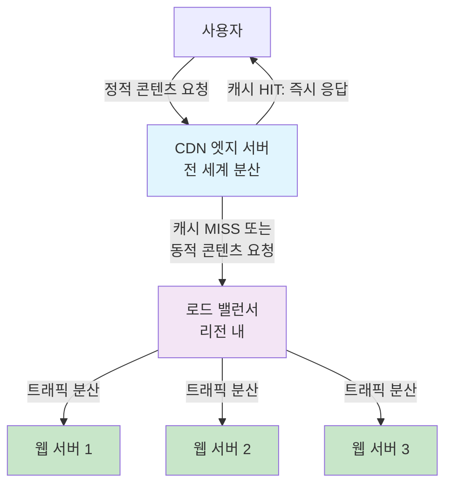

- **CDN**: 정적 콘텐츠(이미지, CSS, JavaScript 등)를 사용자와 가까운 엣지 서버에서 제공
- **로드 밸런서**: 동적 콘텐츠 요청을 여러 웹 서버/애플리케이션 서버로 분산

이러한 조합을 통해 **전 세계 사용자에게 빠른 응답 속도**와 **백엔드 서버의 안정적인 부하 분산**을
동시에 달성할 수 있습니다.

## 4. 클라우드 네트워킹 & 운영

> "실제 환경에서 구현·관리하는 방법"

## Cloud Networking 용어정리

| 용어                                  | 설명                                                               |
| ------------------------------------- | ------------------------------------------------------------------ |
| VPC (Virtual Private Cloud)           | 클라우드 내에서 격리된 가상 네트워크 환경                          |
| 서브넷 (Subnet)                       | VPC 내에서 IP 주소 범위를 나눈 작은 네트워크                       |
| CIDR (Classless Inter-Domain Routing) | IP 주소를 효율적으로 할당하고 관리하는 방법                        |
| 라우팅 테이블                         | 네트워크 트래픽의 경로를 정의하는 규칙 집합                        |
| IGW (Internet Gateway)                | VPC와 인터넷 간의 통신을 가능하게 하는 게이트웨이                  |
| NAT GW (NAT Gateway)                  | 프라이빗 서브넷의 인스턴스가 인터넷에 접근할 수 있도록 하는 서비스 |

### VPC

#### Region

<https://cloud.google.com/compute/docs/regions-zones#available>

- 지리적으로 분리된 위치
- 각 리전은 여러 개의 가용 영역(Availability Zone, AZ)으로 구성
- 각 AZ는 독립적인 전원, 냉각 및 물리적 보안을 갖춘 데이터 센터 그룹(재해, 장애 방지목적)
- VPC는 네트워크 그 자체의 설계도예요. 이 설계도 안에서 서브넷, 라우팅 테이블, 방화벽 규칙 등을
  정의하게 됩니다.

#### Subnet

- VPC 내에서 IP 주소 범위를 나눈 작은 네트워크. 이 서브넷 안에 Compute Engine 같은 인스턴스들을
  배포하게 됩니다.

- Public Subnet: 인터넷과 직접 통신 가능 (0.0.0.0/0이 IGW에 대하여 연결되어 있는)
- Private Subnet: IGW를 타겟으로 인터넷과 0.0.0.0/0이 설정되어 있지 않기 때문에 개방되어 있지
  않음.직접 통신 불가 (NAT GW 통해 간접 통신 가능)

##### Private Subnet 접속 방법

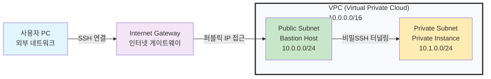

| 특징             | AWS VPC                                                                                          | GCP VPC                                                                                  |
| ---------------- | ------------------------------------------------------------------------------------------------ | ---------------------------------------------------------------------------------------- |
| **범위**         | **리전(Region)**에 종속된 **지역 리소스**입니다.                                                 | **전역(Global)**에 걸쳐 있는 **전역 리소스**입니다.                                      |
| **생성 시점**    | VPC를 만들 때 특정 리전을 지정해야 합니다.                                                       | VPC는 리전을 지정하지 않고 생성하며, 그 안에 여러 리전의 서브넷을 추가합니다.            |
| **서브넷 위치**  | VPC 내에서 특정 **가용 영역(Availability Zone)**에 속해야 합니다.                                | VPC 내에서 특정 **리전(Region)**에 속하며, 해당 리전의 모든 AZ에 걸쳐 배포 가능합니다.   |
| **리전 간 통신** | 동일 리전 내 VPC 간: **VPC 피어링**<br>다른 리전 VPC 간: **VPC 피어링** 또는 **Transit Gateway** | 동일 VPC 내의 다른 리전 서브넷 간: **기본적으로 내부 IP를 통해 가능** (별도 설정 불필요) |
| **주요 철학**    | **"리전 단위의 완벽한 격리"**                                                                    | **"전역 네트워크의 단순성"**                                                             |

한 마디로 정리하면, AWS는 **"하나의 VPC는 하나의 리전에만 존재"**하고, GCP는 **"하나의 VPC가 여러
리전에 걸쳐 존재"**할 수 있습니다. 이 차이점 때문에 두 클라우드에서 멀티 리전(multi-region)
아키텍처를 설계하는 방식이 완전히 달라집니다.

### NAT

- NAT (Network Address Translation): 프라이빗 네트워크의 IP 주소를 퍼블릭 IP 주소로 변환하여
  인터넷과 통신할 수 있도록 하는 기술
  - 송신 할 때 : 프라이빗 IP → 퍼블릭 IP로 변환
  - 수신 할 때 : 퍼블릭 IP → 프라이빗 IP로 변환
- Nat GateWay : 프라이빗 서브넷의 인스턴스가 인터넷에 접근할 수 있도록 하는 서비스
  - NAT Gateway를 통해 프라이빗 서브넷의 인스턴스가 인터넷에 나갈 수 있지만, 외부에서 직접 접근할
    수는 없습니다.
  - NAT Gateway는 퍼블릭 서브넷에 배치되어야 합니다.
  - NAT Gateway를 통해 프라이빗 서브넷의 인스턴스가 인터넷에 나갈 수 있지만, 외부에서 직접 접근할
    수는 없습니다.

### Internet Gateway vs NAT Gateway

Internet Gateway와 NAT Gateway는 모두 VPC와 인터넷 간 통신을 가능하게 하지만, 그 역할과 사용 목적이
다릅니다.

#### Internet Gateway (IGW)

- **역할**: VPC와 인터넷 간의 양방향 통신 게이트웨이
- **특징**:
  - IP 주소 변환 없이 1:1 매핑 (퍼블릭 IP ↔ 프라이빗 IP 직접 연결)
  - 양방향 통신: 인터넷 → VPC, VPC → 인터넷 모두 가능
  - 퍼블릭 IP가 할당된 인스턴스가 필요
- **사용 사례**:
  - 웹 서버, 로드 밸런서 등 외부에서 직접 접근해야 하는 리소스
  - 퍼블릭 서브넷의 인스턴스
- **보안**: 외부에서 직접 접근 가능하므로 보안 그룹 설정 필수

#### NAT Gateway

- **역할**: 프라이빗 서브넷의 인스턴스가 인터넷에 접근할 수 있도록 하는 서비스
- **특징**:
  - IP 주소 변환 수행 (NAT: Network Address Translation)
  - 단방향 통신: VPC → 인터넷만 가능 (아웃바운드만 허용)
  - 프라이빗 IP만 있어도 인터넷 접근 가능
  - 퍼블릭 서브넷에 배치되어야 함
- **사용 사례**:
  - 데이터베이스 서버, 백엔드 서버 등 외부 노출이 불필요한 리소스
  - 프라이빗 서브넷의 인스턴스가 업데이트 다운로드, 외부 API 호출 등
- **보안**: 외부에서 직접 접근 불가능 (인바운드 차단)

#### 비교표

| 구분            | Internet Gateway (IGW)                 | NAT Gateway                                     |
| --------------- | -------------------------------------- | ----------------------------------------------- |
| **주요 역할**   | VPC와 인터넷 간 양방향 통신 게이트웨이 | 프라이빗 서브넷의 인터넷 접근 (아웃바운드)      |
| **IP 변환**     | 없음 (1:1 매핑)                        | 있음 (NAT 변환)                                 |
| **통신 방향**   | 양방향 (인바운드 + 아웃바운드)         | 단방향 (아웃바운드만)                           |
| **필요한 IP**   | 퍼블릭 IP 필요                         | 프라이빗 IP만으로 가능                          |
| **서브넷 위치** | 퍼블릭 서브넷                          | 퍼블릭 서브넷에 배치 (프라이빗 서브넷에서 사용) |
| **외부 접근**   | 가능 (인바운드 허용)                   | 불가능 (인바운드 차단)                          |
| **비용**        | 무료                                   | 유료 (트래픽 및 시간당 요금)                    |
| **사용 사례**   | 웹 서버, 로드 밸런서                   | DB 서버, 백엔드 서버                            |

#### 실제 사용 예시

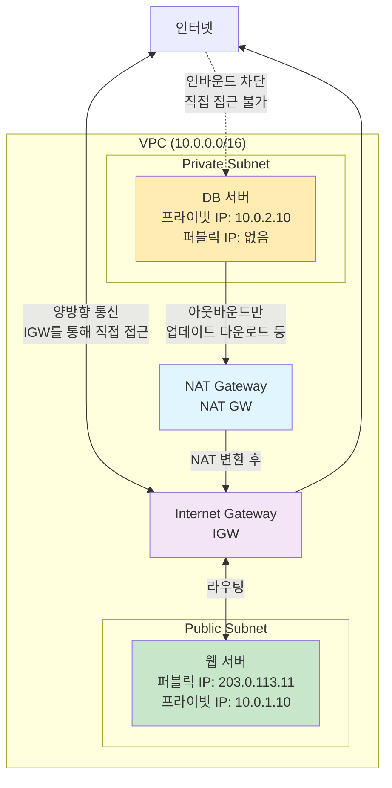

**시나리오 설명**:

1. **웹 서버 (Public Subnet)**:
   - Internet Gateway를 통해 인터넷과 양방향 통신
   - 외부에서 `203.0.113.11`로 직접 접근 가능
   - 사용자가 웹사이트에 접속할 수 있음

2. **DB 서버 (Private Subnet)**:
   - NAT Gateway를 통해서만 인터넷 접근 가능
   - 외부에서 직접 접근 불가능 (보안 강화)
   - 업데이트 다운로드, 외부 API 호출 등 아웃바운드 통신만 가능

#### 함께 사용하는 경우

대부분의 프로덕션 환경에서는 **두 Gateway를 함께 사용**합니다:

- **Internet Gateway**: 퍼블릭 서브넷의 웹 서버, 로드 밸런서 등
- **NAT Gateway**: 프라이빗 서브넷의 데이터베이스, 백엔드 서버 등

이렇게 구성하면:

- 외부 접근이 필요한 리소스는 Internet Gateway로 직접 노출
- 보안이 중요한 리소스는 NAT Gateway로만 인터넷 접근 (외부 접근 차단)

### VPC Peering

VPC 피어링은 서로 다른 VPC 간에 프라이빗 IP 주소를 사용하여 통신할 수 있도록 연결하는 기능입니다.
이를 통해 두 VPC 간에 안전하고 효율적인 네트워크 통신이 가능합니다. 피어링 자체만으로는 트래픽
전달이 되지 않음 → Route Table에 피어링 경로 추가 필요

- VPC Peering = 연결, Route Table = 연결된 경로를 안내

### Security Group & NACL

- **Security Group**: 인스턴스 수준에서 트래픽을 제어하는 가상 방화벽입니다. 인바운드 및 아웃바운드
  규칙을 설정하여 특정 IP 주소나 포트에 대한 접근을 허용하거나 차단할 수 있습니다.
  - 0.0.0.0/0 : 모든 IP 주소를 의미
- **NACL (Network Access Control List)**: 서브넷 수준에서 트래픽을 제어하는 방화벽입니다. 인바운드
  및 아웃바운드 규칙을 설정하여 서브넷에 대한 접근을 허용하거나 차단할 수 있습니다. NACL은 상태
  비저장(stateless) 방식으로 작동합니다.

### 방화벽(FireWall)

- 전형적으로는 IP address, Port번호를 지정하여 허용 및 거부를 하여 Packet필터형 방화벽이 많음
- Bot Management: 악의적인 봇 트래픽을 탐지하고 차단하는 기술
  - 평판 기반 필터링 : 알려진 악성 IP 주소 차단 Akamai Bot Manager, Cloudflare Bot Management
  - 챌린지/응답 방식 : reCAPTCHA 의심 요청에 대해 퍼즐, JavaScript 챌린지 제시
  - 트래픽 분석 기반 : 비정상적인 트래픽 패턴 탐지 및 차단, User-Agent 분석
  - 행동 분석 : 사용자의 마우스 움직임, 스크롤, 키 입력 등 휴먼 시그널을 분석.
- WAF
  - 최근에는 애플리케이션 레벨에서 동작하는 방화벽이 많아지고 있음 (예: WAF, Web Application
    Firewall)
  - Web Application Firewall: 웹 애플리케이션을 보호하는 방화벽으로, HTTP/HTTPS 트래픽을 분석하여
    SQL 인젝션, XSS(크로스 사이트 스크립팅) 등 웹 공격을 차단합니다. OSLI 7계층에서
    동작합니다.(HTTP/HTTPS)

## 5. 트러블슈팅

> "네트워크 문제를 진단하고 해결하는 방법"

## Network Troubleshooting

### ifconfig / ip a

- ifconfig : 네트워크 인터페이스 설정 및 상태 확인 명령어 (구버전)
- ip a : 네트워크 인터페이스 설정 및 상태 확인 명령어 (신버전, iproute2 패키지의 일부)
  - 네트워크 인터페이스의 IP 어드레스, 서브넷 마스크, MAC 어드레스, 상태(up/down) 등을 확인할 수
    있습니다.
  - `ip a` 명령어로 IP 어드레스와 서브넷 마스크를 확인할 수 있습니다.

### ping

- ping : 네트워크 연결 상태를 확인하는 명령어
- ICMP(Internet Control Message Protocol) 에코 요청을 보내고 응답 시간을 측정합니다.

```bash
ping 35.217.178.38
PING 35.217.178.38 (35.217.178.38) 56(84) bytes of data.
^C
--- 35.217.178.38 ping statistics ---
10 packets transmitted, 10 received, 0% packet loss, time 9215ms
rtt min/avg/max/mdev = 0.589/0.747/1.506/0.259 ms
```

```bash
ping 10.0.0.2
PING 10.0.0.2 (10.0.0.2) 56(84) bytes of data.
^C
--- 10.0.0.2 ping statistics ---
11 packets transmitted, 0 received, 100% packet loss, time 10260ms
```

### tracert / traceroute

- **tracert** (Windows) / **traceroute** (Linux, macOS): 패킷이 목적지까지 도달하는 경로를 추적하는
  명령어
- 각 홉(hop)을 거치면서 지연 시간과 라우터 정보를 표시
- 네트워크 경로상 어디서 문제가 발생하는지 확인할 수 있음

**작동 원리**:

- TTL(Time To Live) 값을 점진적으로 증가시키며 ICMP 패킷 전송
- 각 라우터에서 TTL이 0이 되면 "Time Exceeded" 메시지를 반환
- 이를 통해 패킷이 거쳐가는 각 라우터의 IP 주소와 응답 시간 확인

**Windows (tracert)**:

```bash
tracert google.com
tracert 8.8.8.8
```

**Linux/macOS (traceroute)**:

```bash
traceroute google.com
traceroute 8.8.8.8
```

**출력 예시**:

```bash
traceroute to google.com (142.250.191.14), 30 hops max, 60 byte packets
 1  192.168.0.1 (192.168.0.1)  1.234 ms  1.456 ms  1.678 ms
 2  203.0.113.1 (203.0.113.1)  5.123 ms  5.234 ms  5.345 ms
 3  10.0.0.1 (10.0.0.1)  10.456 ms  10.567 ms  10.678 ms
 4  * * *
 5  142.250.191.14 (142.250.191.14)  15.789 ms  15.890 ms  16.001 ms
```

**출력 해석**:

- 각 줄은 하나의 홉(라우터)을 나타냄
- `* * *`: 해당 홉에서 응답이 없음 (방화벽이나 라우터 설정 문제 가능)
- 세 개의 시간 값: 각 패킷의 응답 시간 (RTT: Round Trip Time)
- 마지막 홉이 목적지 서버

**사용 사례**:

- 특정 서버에 접속이 안 될 때 어느 구간에서 문제가 발생하는지 확인
- 네트워크 지연이 발생할 때 병목 구간 파악
- 라우팅 경로 확인 및 최적화

**ping vs tracert/traceroute**:

- **ping**: 목적지까지 연결 가능 여부와 전체 지연 시간 확인
- **tracert/traceroute**: 목적지까지의 경로와 각 구간별 지연 시간 확인

### sudo tcpdump -n icmp

- tcpdump : 네트워크 트래픽을 캡처하고 분석하는 명령어
- -n : IP 주소와 포트를 숫자 형태로 표시 (호스트명 해석 안함)
- icmp : ICMP 프로토콜 패킷만 캡처

```bash
sudo tcpdump -n icmp
tcpdump: verbose output suppressed, use -v[v]... for full protocol decode
listening on ens4, link-type EN10MB (Ethernet), snapshot length 262144 bytes
```

### 대기상태의 IP어드레스와 포트번호확인

- sudo ss -antup
  - ss : 소켓 통계를 표시하는 명령어 (netstat 대체)
  - -a : 모든 소켓 표시 (리스닝 및 비리스닝)
  - -n : IP 주소와 포트를 숫자 형태로 표시 (호스트명 해석 안함)
  - -t : TCP 소켓만 표시
  - -u : UDP 소켓만 표시
  - -p : 소켓을 사용하는 프로세스 정보 표시

- sudo netstat -antup

- sudo lsof -i -n -P: 네트워크 연결을 사용하는 파일 목록 표시

### 커넥션통신 확립을 확인 (nc)

- nc -vz <IP address> <Port> : 특정 IP 주소와 포트에 대한 연결 테스트
  - -v : 상세 모드 (verbose)
  - -z : 포트 스캔 모드 (데이터 전송 없이 포트 상태 확인)

- nc -l <Port> : 특정 포트에서 수신 대기 (리스닝) 모드
  - -l : 리스닝 모드
  - <Port> : 수신 대기할 포트 번호

```bash
nc -vz 34.97.62.252 80
Connection to 34.97.62.252 80 port [tcp/http] succeeded!
```

```bash
nc -l 0.0.0.0 8080
```

### 프로세스의 확인

- ps aux : 현재 실행 중인 프로세스 목록 표시
  - a : 모든 사용자의 프로세스 표시
  - u : 사용자 중심의 형식으로 표시
  - x : 터미널에 종속되지 않은 프로세스도 표시

- systemctl status <service> : 특정 서비스의 상태 확인 (예: nginx, apache, mysql 등)
  - 서비스가 실행 중인지, 중지되었는지, 최근 로그 메시지 등을 확인할 수 있습니다.

### DNS Trouble Shooting

- dig <도메인 이름> : DNS 조회 도구
  - A, AAAA, CNAME, MX 등 다양한 레코드 타입 조회 가능
  - 예: `dig example.com`

- nslookup <도메인 이름> : DNS 조회 도구
  - 간단한 인터페이스로 DNS 레코드 조회 가능
  - 예: `nslookup example.com`

- host <도메인 이름> : 도메인 이름과 IP 주소 간의 매핑 정보 조회
  - 예: `host example.com`

### HTTP Response

- 100번대 : 정보 응답
  - 100 Continue : 클라이언트가 요청을 계속 진행해도 됨을 나타냄
  - 101 Switching Protocols : 서버가 프로토콜 전환을 수락했음을 나타냄
- 200번대 : 성공 응답
  - 200 OK : 요청이 성공적으로 처리되었음을 나타냄
  - 201 Created : 요청이 성공적으로 처리되었으며, 새로운 리소스
  - 202 Accepted : 요청이 접수되었으나, 아직 처리되지 않았음을 나타냄
- 300번대 : 리다이렉션 응답
  - 301 Moved Permanently : 요청한 리소스가 영구적으로 다른 위치로 이동했음을 나타냄
  - 302 Found : 요청한 리소스가 일시적으로 다른 위치에 있음을 나타냄
  - 304 Not Modified : 클라이언트가 캐시한 리소스가
- 400번대 : 클라이언트 오류 응답
  - 400 Bad Request : 잘못된 요청으로 인해 서버가 요청을 이해하지 못함을 나타냄
  - 401 Unauthorized : 인증이 필요함을 나타냄
  - 403 Forbidden : 서버가 요청을 거부했음을 나타냄
  - 404 Not Found : 요청한 리소스를 찾을 수 없음을 나타냄
- 500번대 : 서버 오류 응답
  - 500 Internal Server Error : 서버 내부 오류로 인해 요청을 처리할 수 없음을 나타냄
  - 502 Bad Gateway : 서버가 게이트웨이 또는 프록시 역할을 할 때, 상위 서버로부터 잘못된 응답을
    받았음을 나타냄
  - 503 Service Unavailable : 서버가 일시적으로 과부하 상태이거나 유지보수 중임을 나타냄
  - 504 Gateway Timeout : 서버가 게이트웨이 또는 프록시 역할을 할 때, 상위 서버로
