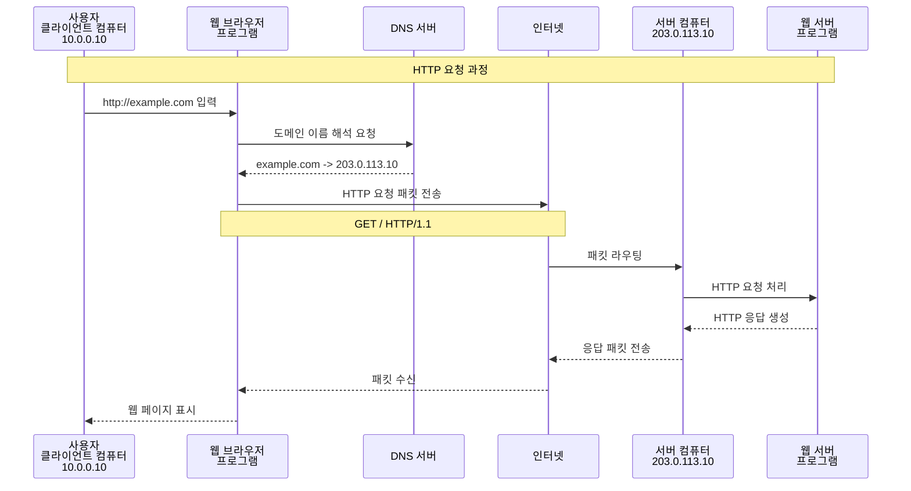
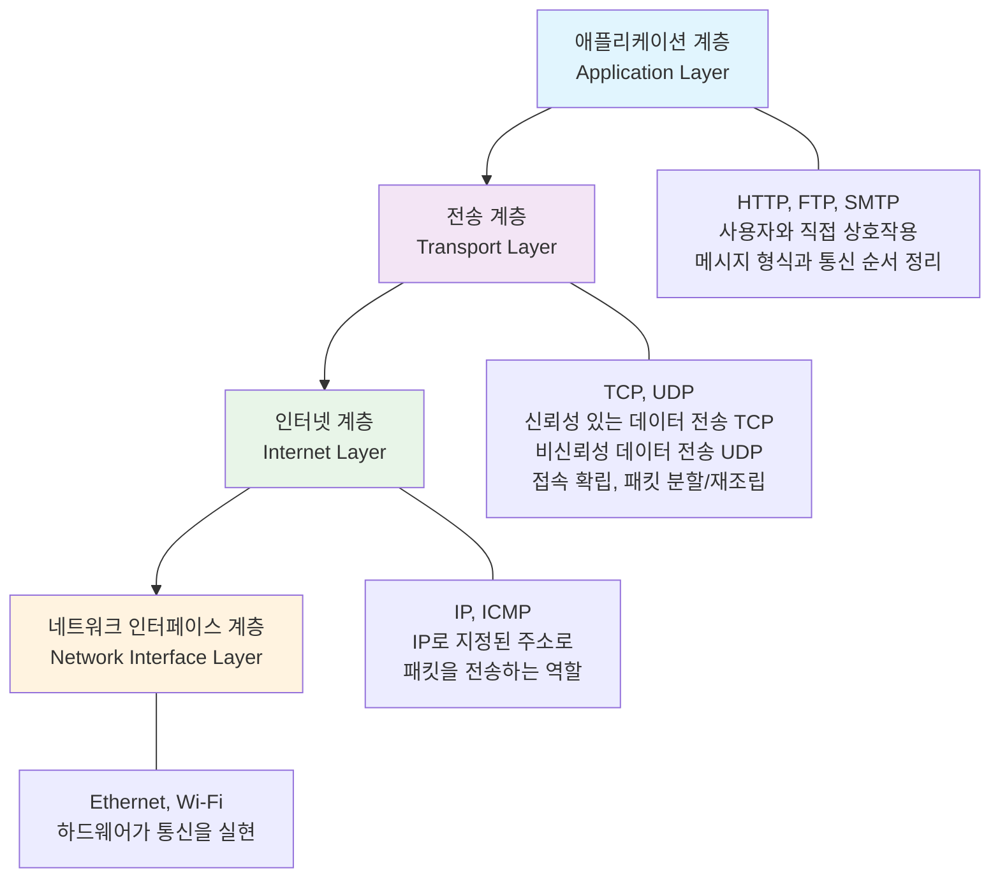
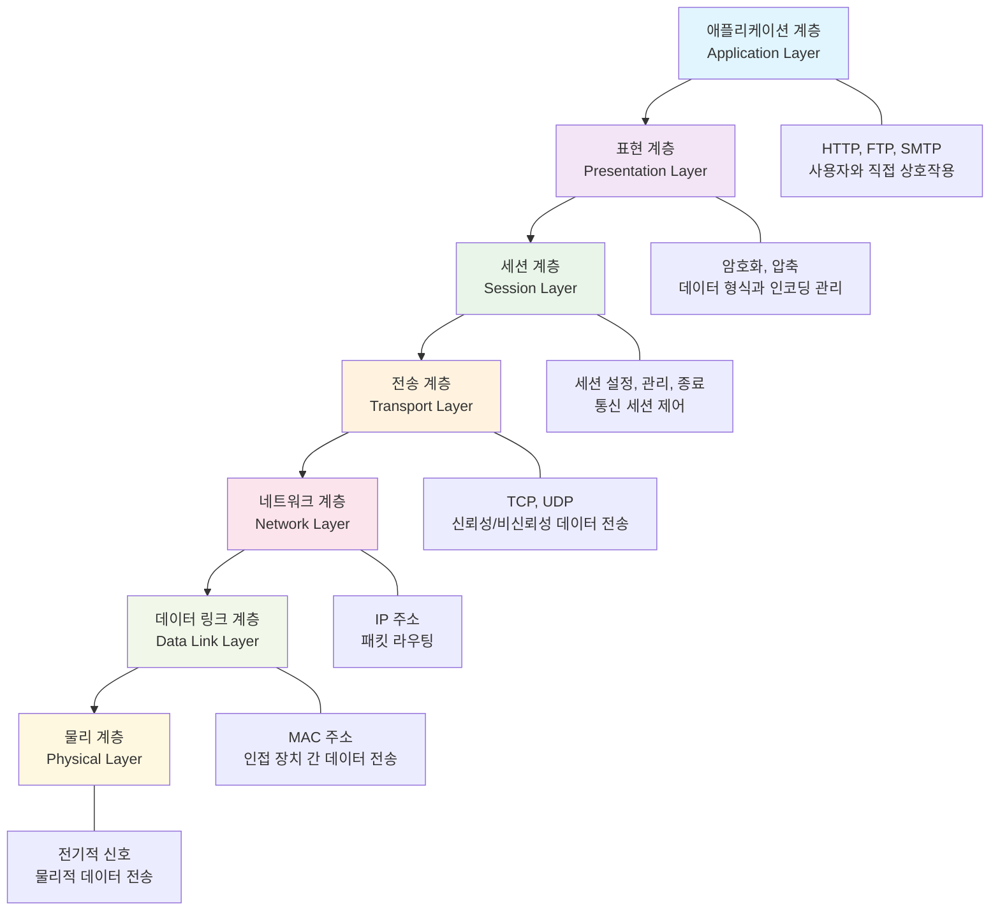

# Network

## 브라우저에 접속하는 과정


## 용어정리
| 용어 | 설명 |
|---|---|
| IP 주소 | 네트워크 상에서 장치를 식별하는 고유한 숫자자 주소 |
| IPv4 | 32비트 주소 체계로, 약 42억 개의 고유 주소 제공  <br> 예, '192.168.0.1' |
| IPv6 | 128비트 주소 체계로, 거의 무한대에 가까운 주소 제공 <br> 예, '2001:0db8:85a3:0000:0000:8a2e:0370:7334' |
| 도메인 이름 | 사람이 읽을 수 있는 형태의 웹사이트 주소 (예: example.com) |
| DNS (Domain Name System) | 도메인 이름을 IP 주소로 변환하는 시스템 |
| HTTP (Hypertext Transfer Protocol) | 웹 브라우저와 웹 서버 간의 통신 프로토콜 |
| HTTPS (HTTP Secure) | HTTP에 보안 기능을 추가한 프로토콜 (SSL/TLS 사용) |
| 웹 브라우저 | 사용자가 웹 페이지를 요청하고 표시하는 프로그램 (예: Chrome, Firefox) |
| NIC (Network Interface Card) | 컴퓨터를 네트워크에 연결하는 하드웨어 장치 |
| Packet | 네트워크를 통해 전송되는 데이터의 작은 단위 |

## TCPI/IP 4계층 모델


[참고] 예를들어, Packet가 안도착 한다면 인터넷 계층에 문제를 생각할 수있음
통신은 되고 있으나 메시지가 이상하다면 어플리케이션 층에 문제를 생각할 수 있음 


## OSI 7계층 모델



## 웹 서버 접속
- curl : HTTP 요청 테스트 (`curl -v http://localhost`)
- telnet : 원격 서버 접속 (`telnet localhost 80`)

1. 클라이언트에서 보내는 request 메시지
```
GET / HTTP/1.1
Host: localhost
User-Agent: curl/8.12.1
Accept: */*
```

2. 웹서버에서 보내는 response 메시지

```
HTTP/1.1 200 OK
Server: nginx/1.26.3 (Ubuntu)
Date: Sat, 20 Sep 2025 13:04:40 GMT
Content-Type: text/html

<!DOCTYPE html>
<html>
..
</html>
```


---------


# AWS로배우는 네트워크의 기초


1. 네트워크 아키텍처 & 프로토콜 스택
"데이터가 어떻게 구조화되고 전송되는가"
- TCP/IP 모델, IP, TCP, HTTP의 요소

2. 네트워크 인프라 & 라우팅
"데이터가 어떻게 목적지를 찾아가는가"
- IPv4, 루팅, NAT
- 방화벽, Bot Management

3. 서비스 레이어 & 최적화
"사용자가 어떻게 서비스에 접근하고 최적화되는가"
- DNS, CDN, VPN
- 글로벌 로드 밸런싱
- 아카마이가 CDN임


4. 클라우드 네트워킹 & 운영
"실제 환경에서 어떻게 구현하고 관리하는가"
- AWS VPC, 서브넷, 라우팅 테이블, IGW, NAT GW

## 프로토콜 레벨

- HTTPS/TLS/SSL: 보안 통신의 핵심
- UDP: TCP와의 차이점, 실시간 통신에서의 활용
- HTTP/2, HTTP/3: 성능 최적화 프로토콜
- WebSocket: 실시간 양방향 통신

## 네트워크 인프라

- 로드 밸런서: L4/L7 차이점, 알고리즘 종류
- 프록시 서버: Forward/Reverse 프록시
- GSLB (Global Server Load Balancing): 지역별 트래픽 분산
- BGP (Border Gateway Protocol): 인터넷 라우팅의 핵심
