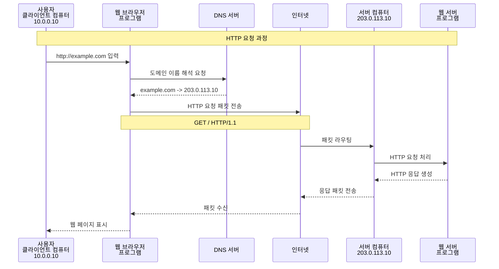
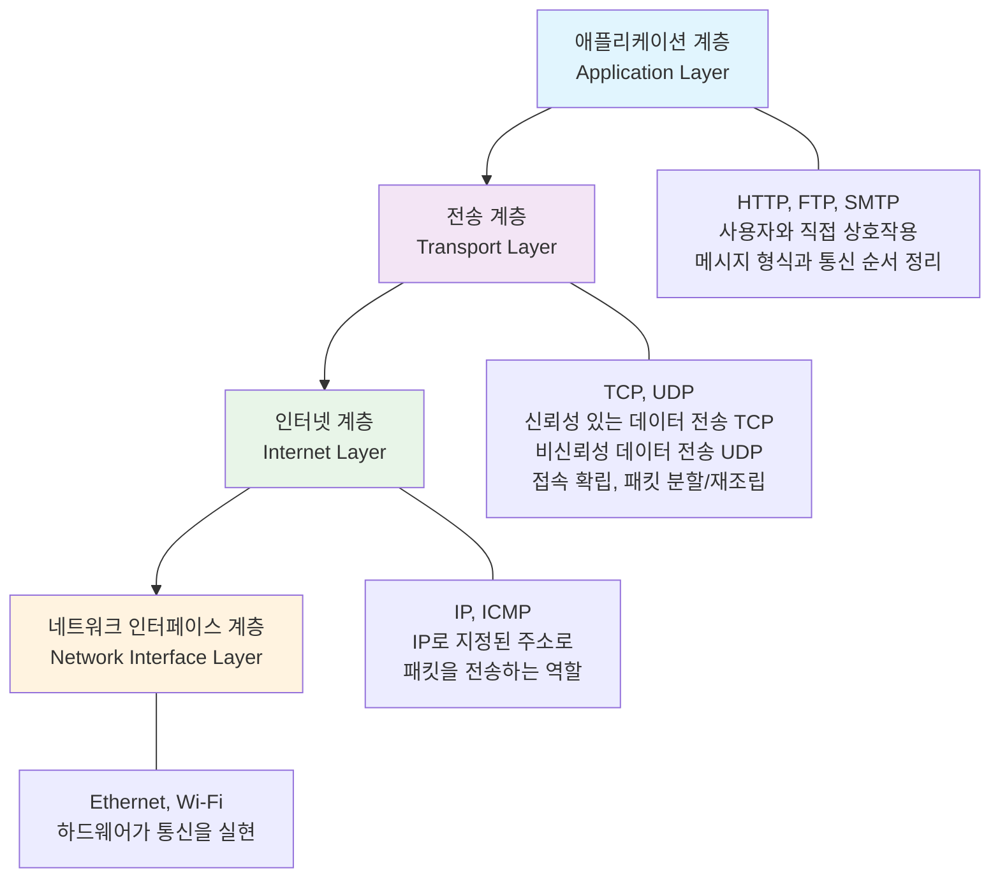
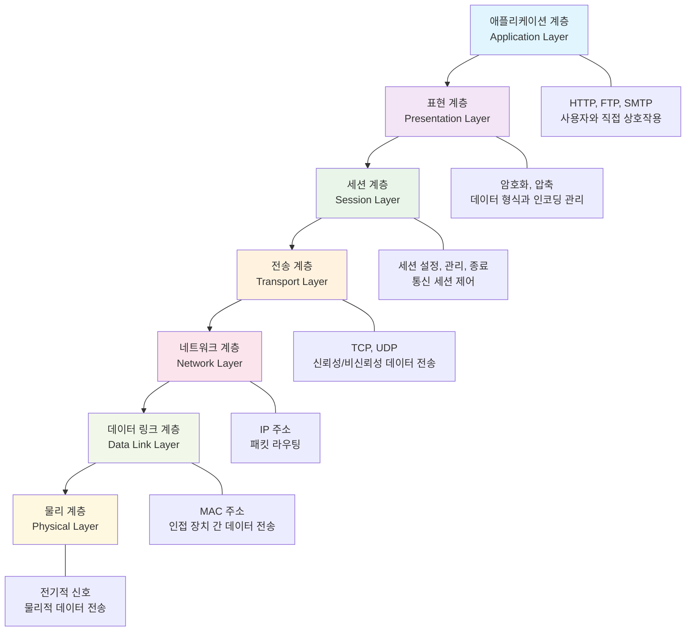

# 1. 기본 네트워크 개념
> "데이터는 어떻게 이동하는가?"

## 브라우저에 접속하는 과정


## 용어정리

| 용어 | 설명 |
|---|---|
| IP 주소 | 네트워크 상에서 장치를 식별하는 고유한 숫자자 주소 |
| IPv4 | 32비트 주소 체계로, 약 42억 개의 고유 주소 제공  <br> 예, '192.168.0.1' |
| IPv6 | 128비트 주소 체계로, 거의 무한대에 가까운 주소 제공 <br> 예, '2001:0db8:85a3:0000:0000:8a2e:0370:7334' |
| 도메인 이름 | 사람이 읽을 수 있는 형태의 웹사이트 주소 (예: example.com) |
| DNS (Domain Name System) | 도메인 이름을 IP 주소로 변환하는 시스템 |
| HTTP (Hypertext Transfer Protocol) | 웹 브라우저와 웹 서버 간의 통신 프로토콜 |
| HTTPS (HTTP Secure) | HTTP에 보안 기능을 추가한 프로토콜 (SSL/TLS 사용) |
| 웹 브라우저 | 사용자가 웹 페이지를 요청하고 표시하는 프로그램 (예: Chrome, Firefox) |
| NIC (Network Interface Card) | 컴퓨터를 네트워크에 연결하는 하드웨어 장치 |
| Packet | 네트워크를 통해 전송되는 데이터의 작은 단위 |

## TCPI/IP 4계층 모델


[참고] 예를들어, Packet가 안도착 한다면 인터넷 계층에 문제를 생각할 수있음
통신은 되고 있으나 메시지가 이상하다면 어플리케이션 층에 문제를 생각할 수 있음 


## OSI 7계층 모델


### IP 주소와 서브넷

#### IP address
- 0 ~ 255 (총 256개)로 구성하여 10진수로 표기. 전부 약 43억개 존재.
- IPv4: 32비트 주소 체계로, 약 42억 개의 고유 주소 제공 
- IPv6: 128비트 주소 체계로, 거의 무한대에 가까운 주소 제공
- IP 어드레스는, 네트워크부 와 호스트부로 나눌 수 있습니다.
    - 10.0.0.10 에서 예를들어 10.0.0 은 네트워크부, 10은 호스트부일 수 있습니다.
    - 같은 네트워크에 속하는 컴퓨터들에 대하여, 네트워크부는 같이하며 호스트부는 다르게 하여 주소를 부여하는 것이 가능.
    - **서브넷 마스크**란 어디까지가 네트워크부이고 어디부터가 호스트부인지를 나타내는 값입니다.
- IP 어드레스를 설정할 때는, 10.0.0.10과 같은 값과 같이, 추가로 서브넷 마스크(Subnet Mask)도 설정해야 합니다.
- 실제로 Windows, Mac에서도 수동으로 IP 어드레스를 설정할 때, 서브넷 마스크도 같이 설정합니다.
- IANA(Internet Assigned Numbers Authority)에서, 사설 IP 어드레스 대역을 다음과 같이 정하고 있습니다.

- Public IP address: 인터넷 상에서 고유한 주소
- Private IP address: 사설 네트워크 내에서만 유효한 주소. 자택 및 회사등 네트워크내에서 IP가 통용되면 충분한 경우 Private IP address를 사용합니다.
   - 10.0.0.0/8
   - 172.16.0.0/12
   - 192.168.0.0/16

- IP로 지역을 추정하는 원리
    - IP는 지역 인터넷 등록기관(RIR: ARIN, RIPE, APNIC 등)에 의해 통신사·기업 단위로 할당됩니다.
    - 예: 203.0.113.x 대역이 일본 도쿄의 한 통신사에 할당되어 있다면, 해당 IP를 쓰는 사용자는 일본 도쿄 근처일 가능성이 큽니다.

#### 서브넷 마스크
- 서브넷 마스크는, IP 어드레스의 네트워크부와 호스트부를 구분하는 역할을 합니다.
- 서브넷 마스크는, IP 어드레스와 같은 4개의 옥텟으로 구성되며, 각 옥텟은 0~255의 값을 가집니다.
- **CIDR(Classless Inter-Domain Routing)** 표기법
    - 서브넷 마스크를 간단하게 표현하는 방법
    - 예를들어, 255.255.255.0 은 /24로 표현할 수 있습니다.
    - /8, /16, /24, /32 등이 자주 사용됩니다.

예시 표

| IP 어드레스 | 서브넷 마스크 | CIDR 표기법 | 네트워크부 | 호스트부 |
|---|---|---|---|---|
| 10.0.0.10 | 255.255.255.255 | /32 | | 10.0.0.10 |
| 10.0.0.10 | 255.255.240.0 | /20 | 10.0.0 | 0.10 |
| 10.0.0.10 | 255.255.255.0 | /24 | 10.0.0 | 10 |
| 10.0.1.10 | 255.255.0.0 | /16 | 10.0 | 1.10 |
| 10.0.2.10 | 255.0.0.0 | /8 | 10 | 0.2.10 |

- 예를들어 10.0.0.0/16 이라는 네트워크로 부터 서브넷을 작성하는 경우,
예를들어 서브넷은 10.0.0.0/24, 10.0.1.0/24, 10.0.2.0/24로 나눌 수 있습니다.

## 웹 서버 접속
- curl : HTTP 요청 테스트 (`curl -v http://localhost`)
- telnet : 원격 서버 접속 (`telnet localhost 80`)

1. 클라이언트에서 보내는 request 메시지
```bash
GET / HTTP/1.1
Host: localhost
User-Agent: curl/8.12.1
Accept: */*
```

2. 웹서버에서 보내는 response 메시지

```bash
HTTP/1.1 200 OK
Server: nginx/1.26.3 (Ubuntu)
Date: Sat, 20 Sep 2025 13:04:40 GMT
Content-Type: text/html

<!DOCTYPE html>
<html>
..
</html>
```

## 프로토콜 레벨

### UDP,TCP와의 차이점, 실시간 통신에서의 활용

- TCP: 연결 지향적, 신뢰성 있는 데이터 전송, 순서 보장, 오류 검출 및 수정
- UDP: 비연결 지향적, 빠른 전송 속도, 순서 보장 없음, 오류 검출 없음
- 실시간 통신(예: VoIP, 온라인 게임)에서는 지연 시간이 중요하므로 UDP가 선호됨

### HTTP/HTTPS

- HTTP(HyperText Transfer Protocol): 웹에서 브라우저(클라이언트)와 서버 간 데이터를 주고받는 애플리케이션 계층 프로토콜.
- 주로 **요청(Request)**과 응답(Response) 형태로 작동.
- HTTP: 비연결 지향적, 상태 비저장, 텍스트 기반
- HTTPS: HTTP에 보안 기능을 추가한 프로토콜 (SSL/TLS 사용)

#### HTTP 버전별 채택 현황
- HTTP/1.1: 여전히 많은 서버와 CDN에서 기본 지원.
- HTTP/2: 주요 브라우저·서버(Chrome, Firefox, Apache, Nginx)에서 널리 사용.
- HTTP/3: 초기 단계였지만, Google, Cloudflare, Meta 등 대형 플랫폼에서 빠르게 채택 중. 모바일 환경과 스트리밍 서비스에서 사용 확대.


| 구분           | HTTP/1.1                             | HTTP/2                            | HTTP/3                      |
| ------------ | ------------------------------------ | --------------------------------- | --------------------------- |
| **도입 시기**    | 1997                                 | 2015                              | 2022 (IETF 표준화)             |
| **기반 프로토콜**  | TCP                                  | TCP                               | **QUIC** (UDP 기반)           |
| **요청 처리 방식** | 요청당 하나의 연결, 순차적 처리(Pipelining 문제 존재) | **멀티플렉싱**: 단일 연결에서 여러 요청/응답 동시 처리 | 멀티플렉싱 + **빠른 연결 설정(0-RTT)** |
| **헤더 처리**    | 헤더 중복 많음, 압축 없음                      | **HPACK** 압축으로 헤더 크기 감소           | **QPACK** 압축                |
| **추가 기능**    | Keep-Alive                           | **서버 푸시(Server Push)**, 우선순위 제어   | QUIC 기반 혼잡 제어, 연결 이동성 지원    |
| **성능/지연**    | 지연(latency) 큼, HOL Blocking 발생       | HOL Blocking 감소, 성능 향상            | 네트워크 지연 최소화, 모바일 환경 최적화     |


### WebSocket

- WebSocket: 클라이언트와 서버 간의 양방향 통신을 가능하게 하는 프로토콜
- HTTP와의 차이점: 초기 핸드셰이크 후 지속적인 연결 유지
- 활용 예시: 실시간 채팅 애플리케이션, 실시간 알림 시스템
    - WebSocket 통신 과정
        1. 클라이언트가 HTTP 요청을 통해 WebSocket 연결 요청
        2. 서버가 WebSocket 프로토콜로 업그레이드 응답
        3. 양방향 통신 시작

---


### ISP와 인터넷 구조
- ISP (Internet Service Provider)
  - 인터넷 서비스 제공자
  - 가정이나 회사에서 가입한 통신사 (예: KT, SK브로드밴드, NTT, Comcast 등).
  - 사용자의 로컬 라우터에서 나간 패킷은 먼저 ISP의 네트워크로 전달됩니다.
  - ISP는 자신의 백본 네트워크와 상위 통신망을 이용해 더 큰 인터넷으로 패킷을 전달합니다.


### VPN (Virtual Private Network)
- VPN (Virtual Private Network) : 공용 네트워크(인터넷)를 통해 사설 네트워크에 안전하게 접속하는 기술
      - VPN 서버를 경유해 인터넷에 접속하기 때문에, 외부에서 보면 사용자의 실제 IP가 아닌 VPN 서버의 IP로 보입니다.
      - 지역 제한(Geo-blocking) 콘텐츠 접근 등에 활용될 수 있습니다.
    - 암호화된 터널을 통해 데이터를 전송하여 보안성을 높임
      - 제3자가 패킷을 가로채더라도 내용을 이해할 수 없습니다.
    - 원격 근무, 지사 연결 등에 활용

```
사용자 PC/스마트폰
  │ (암호화)
  ▼
[로컬 라우터/게이트웨이]
  │
  ▼
[ISP → 공용 인터넷]
  │
  ▼
[VPN 서버]
  │ (복호화, 목적지 라우팅)
  ▼
[목적지 서버(웹사이트)]
  │ (응답)
  ▲
  │
[VPN 서버] --(암호화)--> [공용 인터넷] -- [ISP] -- [로컬 라우터]
  ▲
  │ (복호화)
사용자 PC/스마트폰
```

# 2. 네트워크 인프라 & 라우팅
> "데이터가 목적지를 찾아가는 방식"

## 네트워크 장비와 라우팅

### 네트워크 연결 장치
- Ethernet : 간단한게 랜케이블로 접속하여 연결. 10.0.0.10/24 - 10.0.0.20/24
  - 각 컴퓨터가 같은 네트워크에 소속하도록 설정하는것으로 상호 네트워크 통신이 가능해짐
- Hub : 여러 컴퓨터를 연결하는 장치. 단순히 신호를 증폭하여 전달 ( 10.0.0.10/24, 10.0.0.20/24, 10.0.0.30/24)
- Router : 서로 다른 네트워크를 연결하는 장치. 패킷을 목적지에 맞게 라우팅 (10.0.0.0/24, 192.168.0.0/24, 172.16.0.0/24)

### Route Table
- Route Table : 라우터가 패킷을 어디로 보낼지 결정하는 규칙 집합
    - 목적지 네트워크 (Destination)
    - 넥스트 홉 (Next Hop) : 패킷을 보낼 다음 라우터 또는 게이트웨이
    - 인터페이스 (Interface) : 패킷을 보낼 네트워크 인터페이스
- Router를 통해서 세계의 네트워크가 연결된것이 바로 인터넷.


### 방화벽과 보안
- 방화벽: 네트워크 트래픽을 감시하고 제어하는 보안 시스템
- Bot Management: 악의적인 봇 트래픽을 탐지하고 차단하는 기술

---

# 3. 서비스 레이어 & 최적화
> "사용자가 서비스에 접근하고 최적화되는 방식"

## 로드 밸런싱과 프록시

### 로드 밸런서
- 로드 밸런서: L4/L7 차이점, 알고리즘 종류
- 여러 서버에 트래픽을 분산하여 성능과 가용성을 향상시키는 장치

### 프록시 서버
- Forward Proxy: 클라이언트를 대신하여 서버에 요청을 전달
- Reverse Proxy: 서버를 대신하여 클라이언트의 요청을 처리

## 글로벌 서비스 최적화

### DNS와 도메인 관리
- DNS (Domain Name System): 도메인 이름을 IP 주소로 변환하는 시스템 (기존 용어정리에서 이미 정의됨)

### CDN (Content Delivery Network)
- CDN: 전세계에 분산된 서버를 통해 콘텐츠를 빠르게 제공하는 서비스
- 아카마이가 대표적인 CDN 제공업체

### GSLB (Global Server Load Balancing)
- GSLB: 지역별 트래픽 분산을 통해 글로벌 서비스 최적화
- 사용자 위치에 따라 가장 가까운 서버로 트래픽 라우팅

### BGP (Border Gateway Protocol)
- BGP: 인터넷 라우팅의 핵심 프로토콜
- 서로 다른 자율 시스템(AS) 간의 라우팅 정보 교환

---

# 4. 클라우드 네트워킹 & 운영
> "실제 환경에서 구현·관리하는 방법"

## Cloud Networking 용어정리

| 용어 | 설명 |
|---|---|
| VPC (Virtual Private Cloud) | 클라우드 내에서 격리된 가상 네트워크 환경 |
| 서브넷 (Subnet) | VPC 내에서 IP 주소 범위를 나눈 작은 네트워크 |
| CIDR (Classless Inter-Domain Routing) | IP 주소를 효율적으로 할당하고 관리하는 방법 |
| 라우팅 테이블 | 네트워크 트래픽의 경로를 정의하는 규칙 집합 |
| IGW (Internet Gateway) | VPC와 인터넷 간의 통신을 가능하게 하는 게이트웨이 |
| NAT GW (NAT Gateway) | 프라이빗 서브넷의 인스턴스가 인터넷에 접근할 수 있도록 하는 서비스 |

### VPC

#### Region
https://cloud.google.com/compute/docs/regions-zones#available
- 지리적으로 분리된 위치
- 각 리전은 여러 개의 가용 영역(Availability Zone, AZ)으로 구성
- 각 AZ는 독립적인 전원, 냉각 및 물리적 보안을 갖춘 데이터 센터 그룹(재해, 장애 방지목적)
- VPC는 네트워크 그 자체의 설계도예요. 이 설계도 안에서 서브넷, 라우팅 테이블, 방화벽 규칙 등을 정의하게 됩니다.

#### Subnet
- VPC 내에서 IP 주소 범위를 나눈 작은 네트워크. 이 서브넷 안에 Compute Engine 같은 인스턴스들을 배포하게 됩니다.

- Public Subnet: 인터넷과 직접 통신 가능 (0.0.0.0/0이 IGW에 대하여 연결되어 있는)
- Private Subnet: IGW를 타겟으로 인터넷과 0.0.0.0/0이 설정되어 있지 않기 때문에 개방되어 있지 않음.직접 통신 불가 (NAT GW 통해 간접 통신 가능)


| 특징 | AWS VPC | GCP VPC |
|---|---|---|
| **범위** | **리전(Region)**에 종속된 **지역 리소스**입니다. | **전역(Global)**에 걸쳐 있는 **전역 리소스**입니다. |
| **생성 시점** | VPC를 만들 때 특정 리전을 지정해야 합니다. | VPC는 리전을 지정하지 않고 생성하며, 그 안에 여러 리전의 서브넷을 추가합니다. |
| **서브넷 위치** | VPC 내에서 특정 **가용 영역(Availability Zone)**에 속해야 합니다. | VPC 내에서 특정 **리전(Region)**에 속하며, 해당 리전의 모든 AZ에 걸쳐 배포 가능합니다. |
| **리전 간 통신** | 동일 리전 내 VPC 간: **VPC 피어링**<br>다른 리전 VPC 간: **VPC 피어링** 또는 **Transit Gateway** | 동일 VPC 내의 다른 리전 서브넷 간: **기본적으로 내부 IP를 통해 가능** (별도 설정 불필요) |
| **주요 철학** | **"리전 단위의 완벽한 격리"** | **"전역 네트워크의 단순성"** |

한 마디로 정리하면, AWS는 **"하나의 VPC는 하나의 리전에만 존재"**하고, GCP는 **"하나의 VPC가 여러 리전에 걸쳐 존재"**할 수 있습니다. 이 차이점 때문에 두 클라우드에서 멀티 리전(multi-region) 아키텍처를 설계하는 방식이 완전히 달라집니다.


### Security Group & NACL

- **Security Group**: 인스턴스 수준에서 트래픽을 제어하는 가상 방화벽입니다. 인바운드 및 아웃바운드 규칙을 설정하여 특정 IP 주소나 포트에 대한 접근을 허용하거나 차단할 수 있습니다.
  - 0.0.0.0/0 : 모든 IP 주소를 의미
- **NACL (Network Access Control List)**: 서브넷 수준에서 트래픽을 제어하는 방화벽입니다. 인바운드 및 아웃바운드 규칙을 설정하여 서브넷에 대한 접근을 허용하거나 차단할 수 있습니다. NACL은 상태 비저장(stateless) 방식으로 작동합니다.


### Route Table

네트워크 안에서 패킷이 어디로 가야 하는지 알려주는 지도 역할
라우트 테이블 자체는 연결을 만들지 않습니다. 규칙만 정의합니다.

### VPC Peering

VPC 피어링은 서로 다른 VPC 간에 프라이빗 IP 주소를 사용하여 통신할 수 있도록 연결하는 기능입니다. 이를 통해 두 VPC 간에 안전하고 효율적인 네트워크 통신이 가능합니다.
피어링 자체만으로는 트래픽 전달이 되지 않음 → Route Table에 피어링 경로 추가 필요
- VPC Peering = 연결, Route Table = 연결된 경로를 안내


### NAT Gateway
- NAT Gateway: 프라이빗 서브넷의 인스턴스가 인터넷에 접근할 수 있도록 하는 서비스
- NAT Gateway를 통해 프라이빗 서브넷의 인스턴스가 인터넷에 나갈 수 있지만, 외부에서 직접 접근할 수는 없습니다.
- NAT Gateway는 퍼블릭 서브넷에 배치되어야 합니다.


---

# 5. 트러블슈팅
> "네트워크 문제를 진단하고 해결하는 방법"

## Network Troubleshooting


### ifconfig / ip a
- ifconfig : 네트워크 인터페이스 설정 및 상태 확인 명령어 (구버전)
- ip a : 네트워크 인터페이스 설정 및 상태 확인 명령어 (신버전, iproute2 패키지의 일부)
  - 네트워크 인터페이스의 IP 어드레스, 서브넷 마스크, MAC 어드레스, 상태(up/down) 등을 확인할 수 있습니다.
  - `ip a` 명령어로 IP 어드레스와 서브넷 마스크를 확인할 수 있습니다.


### ping

- ping : 네트워크 연결 상태를 확인하는 명령어
- ICMP(Internet Control Message Protocol) 에코 요청을 보내고 응답 시간을 측정합니다.

```
ping 35.217.178.38
PING 35.217.178.38 (35.217.178.38) 56(84) bytes of data.
^C
--- 35.217.178.38 ping statistics ---
10 packets transmitted, 10 received, 0% packet loss, time 9215ms
rtt min/avg/max/mdev = 0.589/0.747/1.506/0.259 ms
```

```
ping 10.0.0.2
PING 10.0.0.2 (10.0.0.2) 56(84) bytes of data.
^C
--- 10.0.0.2 ping statistics ---
11 packets transmitted, 0 received, 100% packet loss, time 10260ms
```

###  sudo tcpdump -n icmp
- tcpdump : 네트워크 트래픽을 캡처하고 분석하는 명령어
- -n : IP 주소와 포트를 숫자 형태로 표시 (호스트명 해석 안함)
- icmp : ICMP 프로토콜 패킷만 캡처
```
 sudo tcpdump -n icmp
tcpdump: verbose output suppressed, use -v[v]... for full protocol decode
listening on ens4, link-type EN10MB (Ethernet), snapshot length 262144 bytes
```


--------

`gcloud compute ssh <인스턴스명> --zone=asia-northeast2-a`

